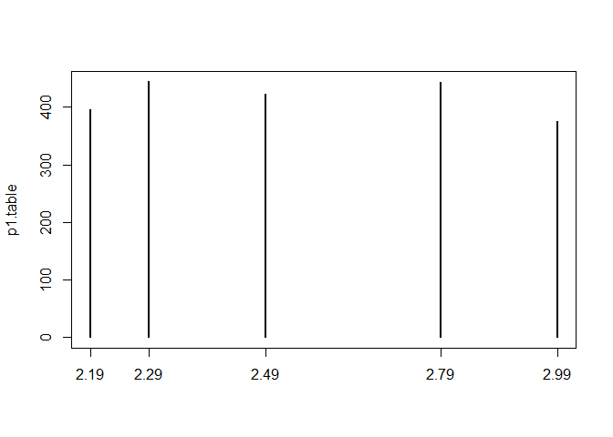
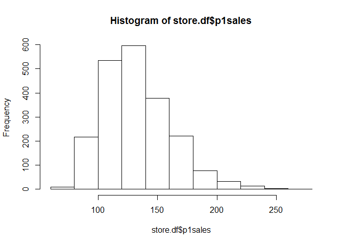
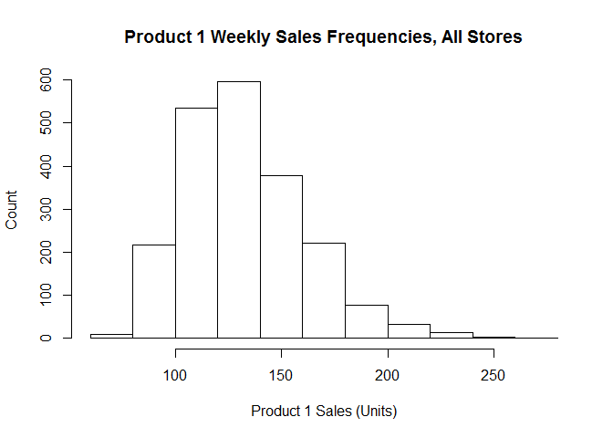
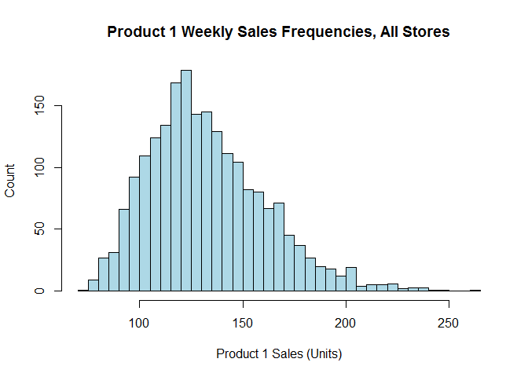
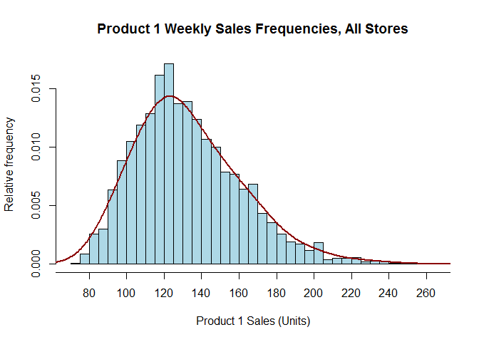
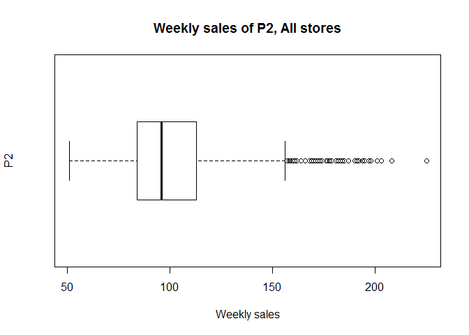
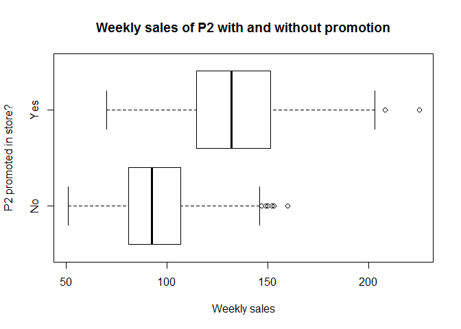
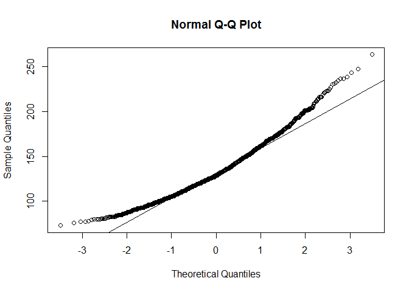
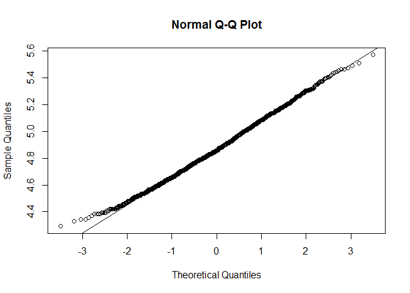
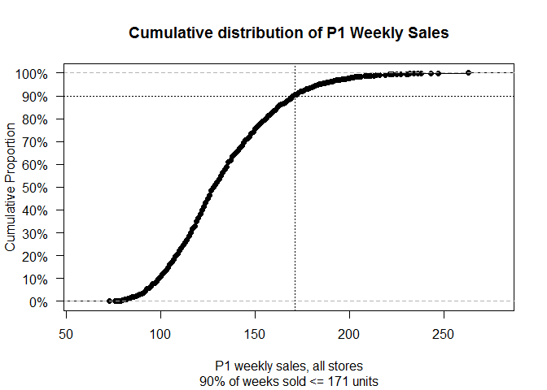

# consumer_ch3
ksg  
2015년 7월 24일  
### 3.1 Simulating Data

```r
store.df <- read.csv("http://goo.gl/QPDdMl")
head(store.df,5)
```

```
##   storeNum Year Week p1sales p2sales p1price p2price p1prom p2prom country
## 1      101    1    1     127     106    2.29    2.29      0      0      US
## 2      101    1    2     137     105    2.49    2.49      0      0      US
## 3      101    1    3     156      97    2.99    2.99      1      0      US
## 4      101    1    4     117     106    2.99    3.19      0      0      US
## 5      101    1    5     138     100    2.49    2.59      0      1      US
```


```r
k.stores <- 20 # 20 stores, using "k." for "constant"
k.weeks <- 104 # 2 years of data each
```

  - create a data frame of initially missing values to hold the data

```r
store.df <- data.frame(matrix(NA, ncol=10, nrow=k.stores*k.weeks))
head(store.df)
```

```
##   X1 X2 X3 X4 X5 X6 X7 X8 X9 X10
## 1 NA NA NA NA NA NA NA NA NA  NA
## 2 NA NA NA NA NA NA NA NA NA  NA
## 3 NA NA NA NA NA NA NA NA NA  NA
## 4 NA NA NA NA NA NA NA NA NA  NA
## 5 NA NA NA NA NA NA NA NA NA  NA
## 6 NA NA NA NA NA NA NA NA NA  NA
```

```r
names(store.df) <- c("storeNum", "Year", "Week", "p1sales", "p2sales",
                     "p1price", "p2price", "p1prom", "p2prom", "country")
head(store.df)
```

```
##   storeNum Year Week p1sales p2sales p1price p2price p1prom p2prom country
## 1       NA   NA   NA      NA      NA      NA      NA     NA     NA      NA
## 2       NA   NA   NA      NA      NA      NA      NA     NA     NA      NA
## 3       NA   NA   NA      NA      NA      NA      NA     NA     NA      NA
## 4       NA   NA   NA      NA      NA      NA      NA     NA     NA      NA
## 5       NA   NA   NA      NA      NA      NA      NA     NA     NA      NA
## 6       NA   NA   NA      NA      NA      NA      NA     NA     NA      NA
```

```r
dim(store.df)
```

```
## [1] 2080   10
```


```r
store.num <- 101:(100+k.stores)
store.cty <- c(rep("US", 3), rep("DE", 5), rep("GB", 3), rep("BR", 2),
               rep("JP", 4), rep("AU", 1), rep("CN", 2))

length(store.cty) # make sure the country list is the right length
```

```
## [1] 20
```

```r
head(store.df,5)
```

```
##   storeNum Year Week p1sales p2sales p1price p2price p1prom p2prom country
## 1       NA   NA   NA      NA      NA      NA      NA     NA     NA      NA
## 2       NA   NA   NA      NA      NA      NA      NA     NA     NA      NA
## 3       NA   NA   NA      NA      NA      NA      NA     NA     NA      NA
## 4       NA   NA   NA      NA      NA      NA      NA     NA     NA      NA
## 5       NA   NA   NA      NA      NA      NA      NA     NA     NA      NA
```


```r
store.df$storeNum <- rep(store.num, each=k.weeks)
store.df$country <- rep(store.cty, each=k.weeks)
head(store.df,5)
```

```
##   storeNum Year Week p1sales p2sales p1price p2price p1prom p2prom country
## 1      101   NA   NA      NA      NA      NA      NA     NA     NA      US
## 2      101   NA   NA      NA      NA      NA      NA     NA     NA      US
## 3      101   NA   NA      NA      NA      NA      NA     NA     NA      US
## 4      101   NA   NA      NA      NA      NA      NA     NA     NA      US
## 5      101   NA   NA      NA      NA      NA      NA     NA     NA      US
```

```r
rm(store.num, store.cty) # clean up

store.df$Week <- rep(1:52, times=k.stores*2)
store.df$Year <- rep(rep(1:2, each=k.weeks/2), times=k.stores)
head(store.df,5)
```

```
##   storeNum Year Week p1sales p2sales p1price p2price p1prom p2prom country
## 1      101    1    1      NA      NA      NA      NA     NA     NA      US
## 2      101    1    2      NA      NA      NA      NA     NA     NA      US
## 3      101    1    3      NA      NA      NA      NA     NA     NA      US
## 4      101    1    4      NA      NA      NA      NA     NA     NA      US
## 5      101    1    5      NA      NA      NA      NA     NA     NA      US
```

```r
str(store.df)
```

```
## 'data.frame':	2080 obs. of  10 variables:
##  $ storeNum: int  101 101 101 101 101 101 101 101 101 101 ...
##  $ Year    : int  1 1 1 1 1 1 1 1 1 1 ...
##  $ Week    : int  1 2 3 4 5 6 7 8 9 10 ...
##  $ p1sales : logi  NA NA NA NA NA NA ...
##  $ p2sales : logi  NA NA NA NA NA NA ...
##  $ p1price : logi  NA NA NA NA NA NA ...
##  $ p2price : logi  NA NA NA NA NA NA ...
##  $ p1prom  : logi  NA NA NA NA NA NA ...
##  $ p2prom  : logi  NA NA NA NA NA NA ...
##  $ country : chr  "US" "US" "US" "US" ...
```


```r
store.df$storeNum <- factor(store.df$storeNum)
store.df$country <- factor(store.df$country)
str(store.df)
```

```
## 'data.frame':	2080 obs. of  10 variables:
##  $ storeNum: Factor w/ 20 levels "101","102","103",..: 1 1 1 1 1 1 1 1 1 1 ...
##  $ Year    : int  1 1 1 1 1 1 1 1 1 1 ...
##  $ Week    : int  1 2 3 4 5 6 7 8 9 10 ...
##  $ p1sales : logi  NA NA NA NA NA NA ...
##  $ p2sales : logi  NA NA NA NA NA NA ...
##  $ p1price : logi  NA NA NA NA NA NA ...
##  $ p2price : logi  NA NA NA NA NA NA ...
##  $ p1prom  : logi  NA NA NA NA NA NA ...
##  $ p2prom  : logi  NA NA NA NA NA NA ...
##  $ country : Factor w/ 7 levels "AU","BR","CN",..: 7 7 7 7 7 7 7 7 7 7 ...
```

```r
head(store.df) # defaults to 6 rows
```

```
##   storeNum Year Week p1sales p2sales p1price p2price p1prom p2prom country
## 1      101    1    1      NA      NA      NA      NA     NA     NA      US
## 2      101    1    2      NA      NA      NA      NA     NA     NA      US
## 3      101    1    3      NA      NA      NA      NA     NA     NA      US
## 4      101    1    4      NA      NA      NA      NA     NA     NA      US
## 5      101    1    5      NA      NA      NA      NA     NA     NA      US
## 6      101    1    6      NA      NA      NA      NA     NA     NA      US
```


```r
head(store.df, 120) # 120 rows is enough to check 2 stores; not shown
```

```
##     storeNum Year Week p1sales p2sales p1price p2price p1prom p2prom
## 1        101    1    1      NA      NA      NA      NA     NA     NA
## 2        101    1    2      NA      NA      NA      NA     NA     NA
## 3        101    1    3      NA      NA      NA      NA     NA     NA
## 4        101    1    4      NA      NA      NA      NA     NA     NA
## 5        101    1    5      NA      NA      NA      NA     NA     NA
## 6        101    1    6      NA      NA      NA      NA     NA     NA
## 7        101    1    7      NA      NA      NA      NA     NA     NA
## 8        101    1    8      NA      NA      NA      NA     NA     NA
## 9        101    1    9      NA      NA      NA      NA     NA     NA
## 10       101    1   10      NA      NA      NA      NA     NA     NA
## 11       101    1   11      NA      NA      NA      NA     NA     NA
## 12       101    1   12      NA      NA      NA      NA     NA     NA
## 13       101    1   13      NA      NA      NA      NA     NA     NA
## 14       101    1   14      NA      NA      NA      NA     NA     NA
## 15       101    1   15      NA      NA      NA      NA     NA     NA
## 16       101    1   16      NA      NA      NA      NA     NA     NA
## 17       101    1   17      NA      NA      NA      NA     NA     NA
## 18       101    1   18      NA      NA      NA      NA     NA     NA
## 19       101    1   19      NA      NA      NA      NA     NA     NA
## 20       101    1   20      NA      NA      NA      NA     NA     NA
## 21       101    1   21      NA      NA      NA      NA     NA     NA
## 22       101    1   22      NA      NA      NA      NA     NA     NA
## 23       101    1   23      NA      NA      NA      NA     NA     NA
## 24       101    1   24      NA      NA      NA      NA     NA     NA
## 25       101    1   25      NA      NA      NA      NA     NA     NA
## 26       101    1   26      NA      NA      NA      NA     NA     NA
## 27       101    1   27      NA      NA      NA      NA     NA     NA
## 28       101    1   28      NA      NA      NA      NA     NA     NA
## 29       101    1   29      NA      NA      NA      NA     NA     NA
## 30       101    1   30      NA      NA      NA      NA     NA     NA
## 31       101    1   31      NA      NA      NA      NA     NA     NA
## 32       101    1   32      NA      NA      NA      NA     NA     NA
## 33       101    1   33      NA      NA      NA      NA     NA     NA
## 34       101    1   34      NA      NA      NA      NA     NA     NA
## 35       101    1   35      NA      NA      NA      NA     NA     NA
## 36       101    1   36      NA      NA      NA      NA     NA     NA
## 37       101    1   37      NA      NA      NA      NA     NA     NA
## 38       101    1   38      NA      NA      NA      NA     NA     NA
## 39       101    1   39      NA      NA      NA      NA     NA     NA
## 40       101    1   40      NA      NA      NA      NA     NA     NA
## 41       101    1   41      NA      NA      NA      NA     NA     NA
## 42       101    1   42      NA      NA      NA      NA     NA     NA
## 43       101    1   43      NA      NA      NA      NA     NA     NA
## 44       101    1   44      NA      NA      NA      NA     NA     NA
## 45       101    1   45      NA      NA      NA      NA     NA     NA
## 46       101    1   46      NA      NA      NA      NA     NA     NA
## 47       101    1   47      NA      NA      NA      NA     NA     NA
## 48       101    1   48      NA      NA      NA      NA     NA     NA
## 49       101    1   49      NA      NA      NA      NA     NA     NA
## 50       101    1   50      NA      NA      NA      NA     NA     NA
## 51       101    1   51      NA      NA      NA      NA     NA     NA
## 52       101    1   52      NA      NA      NA      NA     NA     NA
## 53       101    2    1      NA      NA      NA      NA     NA     NA
## 54       101    2    2      NA      NA      NA      NA     NA     NA
## 55       101    2    3      NA      NA      NA      NA     NA     NA
## 56       101    2    4      NA      NA      NA      NA     NA     NA
## 57       101    2    5      NA      NA      NA      NA     NA     NA
## 58       101    2    6      NA      NA      NA      NA     NA     NA
## 59       101    2    7      NA      NA      NA      NA     NA     NA
## 60       101    2    8      NA      NA      NA      NA     NA     NA
## 61       101    2    9      NA      NA      NA      NA     NA     NA
## 62       101    2   10      NA      NA      NA      NA     NA     NA
## 63       101    2   11      NA      NA      NA      NA     NA     NA
## 64       101    2   12      NA      NA      NA      NA     NA     NA
## 65       101    2   13      NA      NA      NA      NA     NA     NA
## 66       101    2   14      NA      NA      NA      NA     NA     NA
## 67       101    2   15      NA      NA      NA      NA     NA     NA
## 68       101    2   16      NA      NA      NA      NA     NA     NA
## 69       101    2   17      NA      NA      NA      NA     NA     NA
## 70       101    2   18      NA      NA      NA      NA     NA     NA
## 71       101    2   19      NA      NA      NA      NA     NA     NA
## 72       101    2   20      NA      NA      NA      NA     NA     NA
## 73       101    2   21      NA      NA      NA      NA     NA     NA
## 74       101    2   22      NA      NA      NA      NA     NA     NA
## 75       101    2   23      NA      NA      NA      NA     NA     NA
## 76       101    2   24      NA      NA      NA      NA     NA     NA
## 77       101    2   25      NA      NA      NA      NA     NA     NA
## 78       101    2   26      NA      NA      NA      NA     NA     NA
## 79       101    2   27      NA      NA      NA      NA     NA     NA
## 80       101    2   28      NA      NA      NA      NA     NA     NA
## 81       101    2   29      NA      NA      NA      NA     NA     NA
## 82       101    2   30      NA      NA      NA      NA     NA     NA
## 83       101    2   31      NA      NA      NA      NA     NA     NA
## 84       101    2   32      NA      NA      NA      NA     NA     NA
## 85       101    2   33      NA      NA      NA      NA     NA     NA
## 86       101    2   34      NA      NA      NA      NA     NA     NA
## 87       101    2   35      NA      NA      NA      NA     NA     NA
## 88       101    2   36      NA      NA      NA      NA     NA     NA
## 89       101    2   37      NA      NA      NA      NA     NA     NA
## 90       101    2   38      NA      NA      NA      NA     NA     NA
## 91       101    2   39      NA      NA      NA      NA     NA     NA
## 92       101    2   40      NA      NA      NA      NA     NA     NA
## 93       101    2   41      NA      NA      NA      NA     NA     NA
## 94       101    2   42      NA      NA      NA      NA     NA     NA
## 95       101    2   43      NA      NA      NA      NA     NA     NA
## 96       101    2   44      NA      NA      NA      NA     NA     NA
## 97       101    2   45      NA      NA      NA      NA     NA     NA
## 98       101    2   46      NA      NA      NA      NA     NA     NA
## 99       101    2   47      NA      NA      NA      NA     NA     NA
## 100      101    2   48      NA      NA      NA      NA     NA     NA
## 101      101    2   49      NA      NA      NA      NA     NA     NA
## 102      101    2   50      NA      NA      NA      NA     NA     NA
## 103      101    2   51      NA      NA      NA      NA     NA     NA
## 104      101    2   52      NA      NA      NA      NA     NA     NA
## 105      102    1    1      NA      NA      NA      NA     NA     NA
## 106      102    1    2      NA      NA      NA      NA     NA     NA
## 107      102    1    3      NA      NA      NA      NA     NA     NA
## 108      102    1    4      NA      NA      NA      NA     NA     NA
## 109      102    1    5      NA      NA      NA      NA     NA     NA
## 110      102    1    6      NA      NA      NA      NA     NA     NA
## 111      102    1    7      NA      NA      NA      NA     NA     NA
## 112      102    1    8      NA      NA      NA      NA     NA     NA
## 113      102    1    9      NA      NA      NA      NA     NA     NA
## 114      102    1   10      NA      NA      NA      NA     NA     NA
## 115      102    1   11      NA      NA      NA      NA     NA     NA
## 116      102    1   12      NA      NA      NA      NA     NA     NA
## 117      102    1   13      NA      NA      NA      NA     NA     NA
## 118      102    1   14      NA      NA      NA      NA     NA     NA
## 119      102    1   15      NA      NA      NA      NA     NA     NA
## 120      102    1   16      NA      NA      NA      NA     NA     NA
##     country
## 1        US
## 2        US
## 3        US
## 4        US
## 5        US
## 6        US
## 7        US
## 8        US
## 9        US
## 10       US
## 11       US
## 12       US
## 13       US
## 14       US
## 15       US
## 16       US
## 17       US
## 18       US
## 19       US
## 20       US
## 21       US
## 22       US
## 23       US
## 24       US
## 25       US
## 26       US
## 27       US
## 28       US
## 29       US
## 30       US
## 31       US
## 32       US
## 33       US
## 34       US
## 35       US
## 36       US
## 37       US
## 38       US
## 39       US
## 40       US
## 41       US
## 42       US
## 43       US
## 44       US
## 45       US
## 46       US
## 47       US
## 48       US
## 49       US
## 50       US
## 51       US
## 52       US
## 53       US
## 54       US
## 55       US
## 56       US
## 57       US
## 58       US
## 59       US
## 60       US
## 61       US
## 62       US
## 63       US
## 64       US
## 65       US
## 66       US
## 67       US
## 68       US
## 69       US
## 70       US
## 71       US
## 72       US
## 73       US
## 74       US
## 75       US
## 76       US
## 77       US
## 78       US
## 79       US
## 80       US
## 81       US
## 82       US
## 83       US
## 84       US
## 85       US
## 86       US
## 87       US
## 88       US
## 89       US
## 90       US
## 91       US
## 92       US
## 93       US
## 94       US
## 95       US
## 96       US
## 97       US
## 98       US
## 99       US
## 100      US
## 101      US
## 102      US
## 103      US
## 104      US
## 105      US
## 106      US
## 107      US
## 108      US
## 109      US
## 110      US
## 111      US
## 112      US
## 113      US
## 114      US
## 115      US
## 116      US
## 117      US
## 118      US
## 119      US
## 120      US
```

```r
tail(store.df, 120) # make sure end looks OK too; not shown
```

```
##      storeNum Year Week p1sales p2sales p1price p2price p1prom p2prom
## 1961      119    2   37      NA      NA      NA      NA     NA     NA
## 1962      119    2   38      NA      NA      NA      NA     NA     NA
## 1963      119    2   39      NA      NA      NA      NA     NA     NA
## 1964      119    2   40      NA      NA      NA      NA     NA     NA
## 1965      119    2   41      NA      NA      NA      NA     NA     NA
## 1966      119    2   42      NA      NA      NA      NA     NA     NA
## 1967      119    2   43      NA      NA      NA      NA     NA     NA
## 1968      119    2   44      NA      NA      NA      NA     NA     NA
## 1969      119    2   45      NA      NA      NA      NA     NA     NA
## 1970      119    2   46      NA      NA      NA      NA     NA     NA
## 1971      119    2   47      NA      NA      NA      NA     NA     NA
## 1972      119    2   48      NA      NA      NA      NA     NA     NA
## 1973      119    2   49      NA      NA      NA      NA     NA     NA
## 1974      119    2   50      NA      NA      NA      NA     NA     NA
## 1975      119    2   51      NA      NA      NA      NA     NA     NA
## 1976      119    2   52      NA      NA      NA      NA     NA     NA
## 1977      120    1    1      NA      NA      NA      NA     NA     NA
## 1978      120    1    2      NA      NA      NA      NA     NA     NA
## 1979      120    1    3      NA      NA      NA      NA     NA     NA
## 1980      120    1    4      NA      NA      NA      NA     NA     NA
## 1981      120    1    5      NA      NA      NA      NA     NA     NA
## 1982      120    1    6      NA      NA      NA      NA     NA     NA
## 1983      120    1    7      NA      NA      NA      NA     NA     NA
## 1984      120    1    8      NA      NA      NA      NA     NA     NA
## 1985      120    1    9      NA      NA      NA      NA     NA     NA
## 1986      120    1   10      NA      NA      NA      NA     NA     NA
## 1987      120    1   11      NA      NA      NA      NA     NA     NA
## 1988      120    1   12      NA      NA      NA      NA     NA     NA
## 1989      120    1   13      NA      NA      NA      NA     NA     NA
## 1990      120    1   14      NA      NA      NA      NA     NA     NA
## 1991      120    1   15      NA      NA      NA      NA     NA     NA
## 1992      120    1   16      NA      NA      NA      NA     NA     NA
## 1993      120    1   17      NA      NA      NA      NA     NA     NA
## 1994      120    1   18      NA      NA      NA      NA     NA     NA
## 1995      120    1   19      NA      NA      NA      NA     NA     NA
## 1996      120    1   20      NA      NA      NA      NA     NA     NA
## 1997      120    1   21      NA      NA      NA      NA     NA     NA
## 1998      120    1   22      NA      NA      NA      NA     NA     NA
## 1999      120    1   23      NA      NA      NA      NA     NA     NA
## 2000      120    1   24      NA      NA      NA      NA     NA     NA
## 2001      120    1   25      NA      NA      NA      NA     NA     NA
## 2002      120    1   26      NA      NA      NA      NA     NA     NA
## 2003      120    1   27      NA      NA      NA      NA     NA     NA
## 2004      120    1   28      NA      NA      NA      NA     NA     NA
## 2005      120    1   29      NA      NA      NA      NA     NA     NA
## 2006      120    1   30      NA      NA      NA      NA     NA     NA
## 2007      120    1   31      NA      NA      NA      NA     NA     NA
## 2008      120    1   32      NA      NA      NA      NA     NA     NA
## 2009      120    1   33      NA      NA      NA      NA     NA     NA
## 2010      120    1   34      NA      NA      NA      NA     NA     NA
## 2011      120    1   35      NA      NA      NA      NA     NA     NA
## 2012      120    1   36      NA      NA      NA      NA     NA     NA
## 2013      120    1   37      NA      NA      NA      NA     NA     NA
## 2014      120    1   38      NA      NA      NA      NA     NA     NA
## 2015      120    1   39      NA      NA      NA      NA     NA     NA
## 2016      120    1   40      NA      NA      NA      NA     NA     NA
## 2017      120    1   41      NA      NA      NA      NA     NA     NA
## 2018      120    1   42      NA      NA      NA      NA     NA     NA
## 2019      120    1   43      NA      NA      NA      NA     NA     NA
## 2020      120    1   44      NA      NA      NA      NA     NA     NA
## 2021      120    1   45      NA      NA      NA      NA     NA     NA
## 2022      120    1   46      NA      NA      NA      NA     NA     NA
## 2023      120    1   47      NA      NA      NA      NA     NA     NA
## 2024      120    1   48      NA      NA      NA      NA     NA     NA
## 2025      120    1   49      NA      NA      NA      NA     NA     NA
## 2026      120    1   50      NA      NA      NA      NA     NA     NA
## 2027      120    1   51      NA      NA      NA      NA     NA     NA
## 2028      120    1   52      NA      NA      NA      NA     NA     NA
## 2029      120    2    1      NA      NA      NA      NA     NA     NA
## 2030      120    2    2      NA      NA      NA      NA     NA     NA
## 2031      120    2    3      NA      NA      NA      NA     NA     NA
## 2032      120    2    4      NA      NA      NA      NA     NA     NA
## 2033      120    2    5      NA      NA      NA      NA     NA     NA
## 2034      120    2    6      NA      NA      NA      NA     NA     NA
## 2035      120    2    7      NA      NA      NA      NA     NA     NA
## 2036      120    2    8      NA      NA      NA      NA     NA     NA
## 2037      120    2    9      NA      NA      NA      NA     NA     NA
## 2038      120    2   10      NA      NA      NA      NA     NA     NA
## 2039      120    2   11      NA      NA      NA      NA     NA     NA
## 2040      120    2   12      NA      NA      NA      NA     NA     NA
## 2041      120    2   13      NA      NA      NA      NA     NA     NA
## 2042      120    2   14      NA      NA      NA      NA     NA     NA
## 2043      120    2   15      NA      NA      NA      NA     NA     NA
## 2044      120    2   16      NA      NA      NA      NA     NA     NA
## 2045      120    2   17      NA      NA      NA      NA     NA     NA
## 2046      120    2   18      NA      NA      NA      NA     NA     NA
## 2047      120    2   19      NA      NA      NA      NA     NA     NA
## 2048      120    2   20      NA      NA      NA      NA     NA     NA
## 2049      120    2   21      NA      NA      NA      NA     NA     NA
## 2050      120    2   22      NA      NA      NA      NA     NA     NA
## 2051      120    2   23      NA      NA      NA      NA     NA     NA
## 2052      120    2   24      NA      NA      NA      NA     NA     NA
## 2053      120    2   25      NA      NA      NA      NA     NA     NA
## 2054      120    2   26      NA      NA      NA      NA     NA     NA
## 2055      120    2   27      NA      NA      NA      NA     NA     NA
## 2056      120    2   28      NA      NA      NA      NA     NA     NA
## 2057      120    2   29      NA      NA      NA      NA     NA     NA
## 2058      120    2   30      NA      NA      NA      NA     NA     NA
## 2059      120    2   31      NA      NA      NA      NA     NA     NA
## 2060      120    2   32      NA      NA      NA      NA     NA     NA
## 2061      120    2   33      NA      NA      NA      NA     NA     NA
## 2062      120    2   34      NA      NA      NA      NA     NA     NA
## 2063      120    2   35      NA      NA      NA      NA     NA     NA
## 2064      120    2   36      NA      NA      NA      NA     NA     NA
## 2065      120    2   37      NA      NA      NA      NA     NA     NA
## 2066      120    2   38      NA      NA      NA      NA     NA     NA
## 2067      120    2   39      NA      NA      NA      NA     NA     NA
## 2068      120    2   40      NA      NA      NA      NA     NA     NA
## 2069      120    2   41      NA      NA      NA      NA     NA     NA
## 2070      120    2   42      NA      NA      NA      NA     NA     NA
## 2071      120    2   43      NA      NA      NA      NA     NA     NA
## 2072      120    2   44      NA      NA      NA      NA     NA     NA
## 2073      120    2   45      NA      NA      NA      NA     NA     NA
## 2074      120    2   46      NA      NA      NA      NA     NA     NA
## 2075      120    2   47      NA      NA      NA      NA     NA     NA
## 2076      120    2   48      NA      NA      NA      NA     NA     NA
## 2077      120    2   49      NA      NA      NA      NA     NA     NA
## 2078      120    2   50      NA      NA      NA      NA     NA     NA
## 2079      120    2   51      NA      NA      NA      NA     NA     NA
## 2080      120    2   52      NA      NA      NA      NA     NA     NA
##      country
## 1961      CN
## 1962      CN
## 1963      CN
## 1964      CN
## 1965      CN
## 1966      CN
## 1967      CN
## 1968      CN
## 1969      CN
## 1970      CN
## 1971      CN
## 1972      CN
## 1973      CN
## 1974      CN
## 1975      CN
## 1976      CN
## 1977      CN
## 1978      CN
## 1979      CN
## 1980      CN
## 1981      CN
## 1982      CN
## 1983      CN
## 1984      CN
## 1985      CN
## 1986      CN
## 1987      CN
## 1988      CN
## 1989      CN
## 1990      CN
## 1991      CN
## 1992      CN
## 1993      CN
## 1994      CN
## 1995      CN
## 1996      CN
## 1997      CN
## 1998      CN
## 1999      CN
## 2000      CN
## 2001      CN
## 2002      CN
## 2003      CN
## 2004      CN
## 2005      CN
## 2006      CN
## 2007      CN
## 2008      CN
## 2009      CN
## 2010      CN
## 2011      CN
## 2012      CN
## 2013      CN
## 2014      CN
## 2015      CN
## 2016      CN
## 2017      CN
## 2018      CN
## 2019      CN
## 2020      CN
## 2021      CN
## 2022      CN
## 2023      CN
## 2024      CN
## 2025      CN
## 2026      CN
## 2027      CN
## 2028      CN
## 2029      CN
## 2030      CN
## 2031      CN
## 2032      CN
## 2033      CN
## 2034      CN
## 2035      CN
## 2036      CN
## 2037      CN
## 2038      CN
## 2039      CN
## 2040      CN
## 2041      CN
## 2042      CN
## 2043      CN
## 2044      CN
## 2045      CN
## 2046      CN
## 2047      CN
## 2048      CN
## 2049      CN
## 2050      CN
## 2051      CN
## 2052      CN
## 2053      CN
## 2054      CN
## 2055      CN
## 2056      CN
## 2057      CN
## 2058      CN
## 2059      CN
## 2060      CN
## 2061      CN
## 2062      CN
## 2063      CN
## 2064      CN
## 2065      CN
## 2066      CN
## 2067      CN
## 2068      CN
## 2069      CN
## 2070      CN
## 2071      CN
## 2072      CN
## 2073      CN
## 2074      CN
## 2075      CN
## 2076      CN
## 2077      CN
## 2078      CN
## 2079      CN
## 2080      CN
```

```r
set.seed(98250) # a favorite US postal code
store.df$p1prom <- rbinom(n=nrow(store.df), size=1, p=0.1) # 10% promoted
store.df$p2prom <- rbinom(n=nrow(store.df), size=1, p=0.15) # 15% promoted
head(store.df) # how does it look so far? (not shown)
```

```
##   storeNum Year Week p1sales p2sales p1price p2price p1prom p2prom country
## 1      101    1    1      NA      NA      NA      NA      0      0      US
## 2      101    1    2      NA      NA      NA      NA      0      0      US
## 3      101    1    3      NA      NA      NA      NA      1      0      US
## 4      101    1    4      NA      NA      NA      NA      0      0      US
## 5      101    1    5      NA      NA      NA      NA      0      1      US
## 6      101    1    6      NA      NA      NA      NA      0      0      US
```


```r
store.df$p1price <- sample(x=c(2.19, 2.29, 2.49, 2.79, 2.99),
                           size=nrow(store.df), replace=TRUE)
store.df$p2price <- sample(x=c(2.29, 2.49, 2.59, 2.99, 3.19),
                             size=nrow(store.df), replace=TRUE)
head(store.df) # now how does it look?
```

```
##   storeNum Year Week p1sales p2sales p1price p2price p1prom p2prom country
## 1      101    1    1      NA      NA    2.29    2.29      0      0      US
## 2      101    1    2      NA      NA    2.49    2.49      0      0      US
## 3      101    1    3      NA      NA    2.99    2.99      1      0      US
## 4      101    1    4      NA      NA    2.99    3.19      0      0      US
## 5      101    1    5      NA      NA    2.49    2.59      0      1      US
## 6      101    1    6      NA      NA    2.79    2.49      0      0      US
```


```r
# sales data, using poisson (counts) distribution, rpois()
# first, the default sales in the absence of promotion
tmp.sales1 <- rpois(nrow(store.df), lambda=120)
tmp.sales2 <- rpois(nrow(store.df), lambda=100)

# scale sales according to the ratio of log(price)
tmp.sales1 <- tmp.sales1 * log(store.df$p2price) / log(store.df$p1price)
tmp.sales2 <- tmp.sales2 * log(store.df$p1price) / log(store.df$p2price)

# final sales get a 30% or 40% lift when promoted
store.df$p1sales <- floor(tmp.sales1 * (1 + store.df$p1prom*0.3))
store.df$p2sales <- floor(tmp.sales2 * (1 + store.df$p2prom*0.4))
head(store.df)
```

```
##   storeNum Year Week p1sales p2sales p1price p2price p1prom p2prom country
## 1      101    1    1     127     106    2.29    2.29      0      0      US
## 2      101    1    2     137     105    2.49    2.49      0      0      US
## 3      101    1    3     156      97    2.99    2.99      1      0      US
## 4      101    1    4     117     106    2.99    3.19      0      0      US
## 5      101    1    5     138     100    2.49    2.59      0      1      US
## 6      101    1    6     115     127    2.79    2.49      0      0      US
```


```r
#install.packages("car") # if needed
library(car)
some(store.df, 10) #데이터프레임이나 매트릭스에 일부데이터를 랜덤으로 출력
```

```
##      storeNum Year Week p1sales p2sales p1price p2price p1prom p2prom
## 27        101    1   27     135      99    2.29    2.49      0      0
## 144       102    1   40     123     113    2.79    2.59      0      0
## 474       105    2    6     114      98    2.49    2.49      0      0
## 488       105    2   20      92     127    2.79    2.29      0      0
## 1036      110    2   48     134     109    2.99    2.29      1      0
## 1554      115    2   46     142      87    2.29    2.59      0      0
## 1565      116    1    5     186      63    2.19    3.19      0      0
## 1585      116    1   25     121     124    2.49    2.29      0      0
## 1944      119    2   20     150      90    2.19    2.29      0      0
## 1966      119    2   42     167      80    2.19    2.49      0      0
##      country
## 27        US
## 144       US
## 474       DE
## 488       DE
## 1036      GB
## 1554      JP
## 1565      JP
## 1585      JP
## 1944      CN
## 1966      CN
```


###3.2 Functions to Summarize a Variable

  - Discrete Variables

```r
table(store.df$p1price)
```

```
## 
## 2.19 2.29 2.49 2.79 2.99 
##  395  444  423  443  375
```

```r
p1.table <- table(store.df$p1price)
p1.table
```

```
## 
## 2.19 2.29 2.49 2.79 2.99 
##  395  444  423  443  375
```

```r
str(p1.table)
```

```
##  'table' int [1:5(1d)] 395 444 423 443 375
##  - attr(*, "dimnames")=List of 1
##   ..$ : chr [1:5] "2.19" "2.29" "2.49" "2.79" ...
```

```r
plot(p1.table)
```

 


```r
table(store.df$p1price, store.df$p1prom)
```

```
##       
##          0   1
##   2.19 354  41
##   2.29 398  46
##   2.49 381  42
##   2.79 396  47
##   2.99 343  32
```

```r
p1.table2 <- table(store.df$p1price, store.df$p1prom)
p1.table2[, 2] / (p1.table2[, 1] + p1.table2[, 2])
```

```
##       2.19       2.29       2.49       2.79       2.99 
## 0.10379747 0.10360360 0.09929078 0.10609481 0.08533333
```


  - Continuous Variables

```r
min(store.df$p1sales)
```

```
## [1] 73
```

```r
max(store.df$p2sales)
```

```
## [1] 225
```

```r
mean(store.df$p1prom)
```

```
## [1] 0.1
```

```r
median(store.df$p2sales)
```

```
## [1] 96
```

```r
var(store.df$p1sales)
```

```
## [1] 805.0044
```

```r
sd(store.df$p1sales)
```

```
## [1] 28.3726
```

```r
IQR(store.df$p1sales)
```

```
## [1] 37
```

```r
mad(store.df$p1sales)
```

```
## [1] 26.6868
```


  - central 90% of data


```r
quantile(store.df$p1sales, probs=c(0.05, 0.95))
```

```
##  5% 95% 
##  93 184
```

```r
quantile(store.df$p1sales, probs=0:10/10)
```

```
##    0%   10%   20%   30%   40%   50%   60%   70%   80%   90%  100% 
##  73.0 100.0 109.0 117.0 122.6 129.0 136.0 145.0 156.0 171.0 263.0
```

```r
mysummary.df <- data.frame(matrix(NA, nrow=2, ncol=2))
names(mysummary.df) <- c("Median Sales", "IQR")
rownames(mysummary.df) <- c("Product 1", "Product 2")
mysummary.df
```

```
##           Median Sales IQR
## Product 1           NA  NA
## Product 2           NA  NA
```


```r
mysummary.df["Product 1", "Median Sales"] <- median(store.df$p1sales)
mysummary.df["Product 2", "Median Sales"] <- median(store.df$p2sales)
mysummary.df["Product 1", "IQR"] <- IQR(store.df$p1sales)
mysummary.df["Product 2", "IQR"] <- IQR(store.df$p2sales)
mysummary.df
```

```
##           Median Sales IQR
## Product 1          129  37
## Product 2           96  29
```


### 3.3 Summarizing Data Frames

```r
summary(store.df)
```

```
##     storeNum         Year          Week          p1sales   
##  101    : 104   Min.   :1.0   Min.   : 1.00   Min.   : 73  
##  102    : 104   1st Qu.:1.0   1st Qu.:13.75   1st Qu.:113  
##  103    : 104   Median :1.5   Median :26.50   Median :129  
##  104    : 104   Mean   :1.5   Mean   :26.50   Mean   :133  
##  105    : 104   3rd Qu.:2.0   3rd Qu.:39.25   3rd Qu.:150  
##  106    : 104   Max.   :2.0   Max.   :52.00   Max.   :263  
##  (Other):1456                                              
##     p2sales         p1price         p2price         p1prom   
##  Min.   : 51.0   Min.   :2.190   Min.   :2.29   Min.   :0.0  
##  1st Qu.: 84.0   1st Qu.:2.290   1st Qu.:2.49   1st Qu.:0.0  
##  Median : 96.0   Median :2.490   Median :2.59   Median :0.0  
##  Mean   :100.2   Mean   :2.544   Mean   :2.70   Mean   :0.1  
##  3rd Qu.:113.0   3rd Qu.:2.790   3rd Qu.:2.99   3rd Qu.:0.0  
##  Max.   :225.0   Max.   :2.990   Max.   :3.19   Max.   :1.0  
##                                                              
##      p2prom       country 
##  Min.   :0.0000   AU:104  
##  1st Qu.:0.0000   BR:208  
##  Median :0.0000   CN:208  
##  Mean   :0.1385   DE:520  
##  3rd Qu.:0.0000   GB:312  
##  Max.   :1.0000   JP:416  
##                   US:312
```

```r
summary(store.df$Year)
```

```
##    Min. 1st Qu.  Median    Mean 3rd Qu.    Max. 
##     1.0     1.0     1.5     1.5     2.0     2.0
```

```r
summary(store.df, digits=2)
```

```
##     storeNum         Year          Week       p1sales       p2sales   
##  101    : 104   Min.   :1.0   Min.   : 1   Min.   : 73   Min.   : 51  
##  102    : 104   1st Qu.:1.0   1st Qu.:14   1st Qu.:113   1st Qu.: 84  
##  103    : 104   Median :1.5   Median :26   Median :129   Median : 96  
##  104    : 104   Mean   :1.5   Mean   :26   Mean   :133   Mean   :100  
##  105    : 104   3rd Qu.:2.0   3rd Qu.:39   3rd Qu.:150   3rd Qu.:113  
##  106    : 104   Max.   :2.0   Max.   :52   Max.   :263   Max.   :225  
##  (Other):1456                                                         
##     p1price       p2price        p1prom        p2prom     country 
##  Min.   :2.2   Min.   :2.3   Min.   :0.0   Min.   :0.00   AU:104  
##  1st Qu.:2.3   1st Qu.:2.5   1st Qu.:0.0   1st Qu.:0.00   BR:208  
##  Median :2.5   Median :2.6   Median :0.0   Median :0.00   CN:208  
##  Mean   :2.5   Mean   :2.7   Mean   :0.1   Mean   :0.14   DE:520  
##  3rd Qu.:2.8   3rd Qu.:3.0   3rd Qu.:0.0   3rd Qu.:0.00   GB:312  
##  Max.   :3.0   Max.   :3.2   Max.   :1.0   Max.   :1.00   JP:416  
##                                                           US:312
```


```r
#install.packages("psych")
?psych
```

```
## No documentation for 'psych' in specified packages and libraries:
## you could try '??psych'
```

```r
library(psych)
```

```
## 
## Attaching package: 'psych'
## 
## The following object is masked from 'package:car':
## 
##     logit
```

```r
#describe : Basic descriptive statistics useful for psychometrics
describe(store.df)
```

```
##           vars    n   mean    sd median trimmed   mad   min    max range
## storeNum*    1 2080  10.50  5.77  10.50   10.50  7.41  1.00  20.00  19.0
## Year         2 2080   1.50  0.50   1.50    1.50  0.74  1.00   2.00   1.0
## Week         3 2080  26.50 15.01  26.50   26.50 19.27  1.00  52.00  51.0
## p1sales      4 2080 133.05 28.37 129.00  131.08 26.69 73.00 263.00 190.0
## p2sales      5 2080 100.16 24.42  96.00   98.05 22.24 51.00 225.00 174.0
## p1price      6 2080   2.54  0.29   2.49    2.53  0.44  2.19   2.99   0.8
## p2price      7 2080   2.70  0.33   2.59    2.69  0.44  2.29   3.19   0.9
## p1prom       8 2080   0.10  0.30   0.00    0.00  0.00  0.00   1.00   1.0
## p2prom       9 2080   0.14  0.35   0.00    0.05  0.00  0.00   1.00   1.0
## country*    10 2080   4.55  1.72   4.50    4.62  2.22  1.00   7.00   6.0
##            skew kurtosis   se
## storeNum*  0.00    -1.21 0.13
## Year       0.00    -2.00 0.01
## Week       0.00    -1.20 0.33
## p1sales    0.74     0.66 0.62
## p2sales    0.99     1.51 0.54
## p1price    0.28    -1.44 0.01
## p2price    0.32    -1.40 0.01
## p1prom     2.66     5.10 0.01
## p2prom     2.09     2.38 0.01
## country*  -0.29    -0.81 0.04
```

```r
describe(store.df[ , c(2, 4:9)])
```

```
##         vars    n   mean    sd median trimmed   mad   min    max range
## Year       1 2080   1.50  0.50   1.50    1.50  0.74  1.00   2.00   1.0
## p1sales    2 2080 133.05 28.37 129.00  131.08 26.69 73.00 263.00 190.0
## p2sales    3 2080 100.16 24.42  96.00   98.05 22.24 51.00 225.00 174.0
## p1price    4 2080   2.54  0.29   2.49    2.53  0.44  2.19   2.99   0.8
## p2price    5 2080   2.70  0.33   2.59    2.69  0.44  2.29   3.19   0.9
## p1prom     6 2080   0.10  0.30   0.00    0.00  0.00  0.00   1.00   1.0
## p2prom     7 2080   0.14  0.35   0.00    0.05  0.00  0.00   1.00   1.0
##         skew kurtosis   se
## Year    0.00    -2.00 0.01
## p1sales 0.74     0.66 0.62
## p2sales 0.99     1.51 0.54
## p1price 0.28    -1.44 0.01
## p2price 0.32    -1.40 0.01
## p1prom  2.66     5.10 0.01
## p2prom  2.09     2.38 0.01
```


```r
#컬럼별 평균, 표준편차, 합계, 평균-중앙값
apply(store.df[,2:9], MARGIN=2, FUN=mean)
```

```
##        Year        Week     p1sales     p2sales     p1price     p2price 
##   1.5000000  26.5000000 133.0485577 100.1567308   2.5443750   2.6995192 
##      p1prom      p2prom 
##   0.1000000   0.1384615
```

```r
#apply(store.df[,2:9], 1, mean)
apply(store.df[,2:9], 2, sum)
```

```
##     Year     Week  p1sales  p2sales  p1price  p2price   p1prom   p2prom 
##   3120.0  55120.0 276741.0 208326.0   5292.3   5615.0    208.0    288.0
```

```r
apply(store.df[,2:9], 2, sd)
```

```
##       Year       Week    p1sales    p2sales    p1price    p2price 
##  0.5001202 15.0119401 28.3725990 24.4241905  0.2948819  0.3292181 
##     p1prom     p2prom 
##  0.3000721  0.3454668
```

```r
apply(store.df[,2:9], 2, function(x) { mean(x) - median(x) } )
```

```
##      Year      Week   p1sales   p2sales   p1price   p2price    p1prom 
## 0.0000000 0.0000000 4.0485577 4.1567308 0.0543750 0.1095192 0.1000000 
##    p2prom 
## 0.1384615
```


```r
mysummary2.df <- data.frame(matrix(NA, nrow=2, ncol=2))
names(mysummary2.df) <- c("Median Sales", "IQR")
rownames(mysummary2.df) <- names(store.df)[4:5] # names from the data frame
mysummary2.df
```

```
##         Median Sales IQR
## p1sales           NA  NA
## p2sales           NA  NA
```


```r
mysummary2.df[, "Median Sales"] <- apply(store.df[, 4:5], 2, median)
mysummary2.df[, "IQR"] <- apply(store.df[, 4:5], 2, IQR)
mysummary2.df
```

```
##         Median Sales IQR
## p1sales          129  37
## p2sales           96  29
```

  - 1) CSV파일을 불러와라
  - 2) 데이터 프레임으로 변경하고 변수설정을 해라
  - 3) 데이터의 크기(차원)을 확인해라
  - 4) head 함수와 tail함수로 자료들을 확인해라(빈칸, 결측)
  - 5) some함수로 임의의 row를 확인해라
  - 6) str함수로 데이터 프레임의 구조와 변수들의 타입이 정확한지 확인하고, 변수타입을 바꿔야할 경우 바꿔라
  - 7) summary함수로 예측못한 값들을 확인해라, 특히 최대값 최소값(이산치)을 확인해라
  - 8) psych라이브러리를 활용해 데이터들의 기술통계치를 확인해라(평균, 왜도 등)


###3.4 Single Variable Visualization


```r
hist(store.df$p1sales)
```

 


```r
hist(store.df$p1sales,
     main="Product 1 Weekly Sales Frequencies, All Stores",
     xlab="Product 1 Sales (Units)",
     ylab="Count" )
```

 


```r
hist(store.df$p1sales,
     main="Product 1 Weekly Sales Frequencies, All Stores",
     xlab="Product 1 Sales (Units)",
     ylab="Count",
     breaks=30, # more columns
     col="lightblue")
```

 


```r
hist(store.df$p1sales,
     main="Product 1 Weekly Sales Frequencies, All Stores",
     xlab="Product 1 Sales (Units)",
     ylab="Relative frequency",
     breaks=30,
     col="lightblue",
     freq=FALSE, # freq=FALSE means plot density, not counts
     xaxt="n")

axis(side=1, at=seq(60, 300, by=20)) # add "60", "80", ...

lines(density(store.df$p1sales, bw=10), # "bw= ..." adjusts the smoothing
      type="l", col="darkred", lwd=2)
```

 


```r
boxplot(store.df$p2sales, xlab="Weekly sales", ylab="P2",
        main="Weekly sales of P2, All stores", horizontal=TRUE)
```

 


```r
boxplot(p2sales ~ p2prom, data=store.df, horizontal=TRUE, yaxt="n",
        ylab="P2 promoted in store?", xlab="Weekly sales",
        main="Weekly sales of P2 with and without promotion")

axis(side=2, at=c(1,2), labels=c("No", "Yes"))
```

 


```r
qqnorm(store.df$p1sales)
qqline(store.df$p1sales)
```

 


```r
qqnorm(log(store.df$p1sales))
qqline(log(store.df$p1sales))
```

 


  - my.object <- FUNCTION(my.data) # not real code
  - plot(my.object)
  - plot(FUNCTION(my.data)) 위에 두줄을 한줄로 표현한 예시

  - ecdf : empirical cumulative distribution function
  - 약자로 경험적 누적분포함수라고 해석되는데 쉽게 이해하자면 측정된 sample data를 X축을 data의 최소-최대값으로 범위를 두고 Y축을 0%에서 100%까지 누적해서 빈도를 count했을때 나타나는 함수


```r
plot(ecdf(store.df$p1sales),
     main="Cumulative distribution of P1 Weekly Sales",
     ylab="Cumulative Proportion",
     xlab=c("P1 weekly sales, all stores", "90% of weeks sold <= 171 units"),
     yaxt="n")

axis(side=2, at=seq(0, 1, by=0.1), las=1,
    labels=paste(seq(0,100,by=10), "%", sep=""))

abline(h=0.9, lty=3) # "h=" for horizontal line; "lty=3" for dotted
abline(v=quantile(store.df$p1sales, pr=0.9), lty=3) # "v=" for vertical line
```

 


```r
by(store.df$p1sales, store.df$storeNum, mean)
```

```
## store.df$storeNum: 101
## [1] 130.5385
## -------------------------------------------------------- 
## store.df$storeNum: 102
## [1] 134.7404
## -------------------------------------------------------- 
## store.df$storeNum: 103
## [1] 136.0385
## -------------------------------------------------------- 
## store.df$storeNum: 104
## [1] 131.4423
## -------------------------------------------------------- 
## store.df$storeNum: 105
## [1] 129.5288
## -------------------------------------------------------- 
## store.df$storeNum: 106
## [1] 133.7981
## -------------------------------------------------------- 
## store.df$storeNum: 107
## [1] 133.8077
## -------------------------------------------------------- 
## store.df$storeNum: 108
## [1] 133.6923
## -------------------------------------------------------- 
## store.df$storeNum: 109
## [1] 131.5481
## -------------------------------------------------------- 
## store.df$storeNum: 110
## [1] 132.0962
## -------------------------------------------------------- 
## store.df$storeNum: 111
## [1] 130.4519
## -------------------------------------------------------- 
## store.df$storeNum: 112
## [1] 129.8846
## -------------------------------------------------------- 
## store.df$storeNum: 113
## [1] 137.7692
## -------------------------------------------------------- 
## store.df$storeNum: 114
## [1] 132.1923
## -------------------------------------------------------- 
## store.df$storeNum: 115
## [1] 129.5288
## -------------------------------------------------------- 
## store.df$storeNum: 116
## [1] 135.75
## -------------------------------------------------------- 
## store.df$storeNum: 117
## [1] 135.0385
## -------------------------------------------------------- 
## store.df$storeNum: 118
## [1] 139.8462
## -------------------------------------------------------- 
## store.df$storeNum: 119
## [1] 133.7308
## -------------------------------------------------------- 
## store.df$storeNum: 120
## [1] 129.5481
```

```r
by(store.df$p1sales, list(store.df$storeNum, store.df$Year), mean)
```

```
## : 101
## : 1
## [1] 127.7885
## -------------------------------------------------------- 
## : 102
## : 1
## [1] 129.7115
## -------------------------------------------------------- 
## : 103
## : 1
## [1] 133.2308
## -------------------------------------------------------- 
## : 104
## : 1
## [1] 128.0769
## -------------------------------------------------------- 
## : 105
## : 1
## [1] 129.7692
## -------------------------------------------------------- 
## : 106
## : 1
## [1] 131.5
## -------------------------------------------------------- 
## : 107
## : 1
## [1] 131.1154
## -------------------------------------------------------- 
## : 108
## : 1
## [1] 134.8077
## -------------------------------------------------------- 
## : 109
## : 1
## [1] 129.8269
## -------------------------------------------------------- 
## : 110
## : 1
## [1] 132.6923
## -------------------------------------------------------- 
## : 111
## : 1
## [1] 130.8654
## -------------------------------------------------------- 
## : 112
## : 1
## [1] 134.5
## -------------------------------------------------------- 
## : 113
## : 1
## [1] 143.4808
## -------------------------------------------------------- 
## : 114
## : 1
## [1] 129.7115
## -------------------------------------------------------- 
## : 115
## : 1
## [1] 131.1731
## -------------------------------------------------------- 
## : 116
## : 1
## [1] 136.3654
## -------------------------------------------------------- 
## : 117
## : 1
## [1] 135.6154
## -------------------------------------------------------- 
## : 118
## : 1
## [1] 137.1923
## -------------------------------------------------------- 
## : 119
## : 1
## [1] 132.6731
## -------------------------------------------------------- 
## : 120
## : 1
## [1] 130.7308
## -------------------------------------------------------- 
## : 101
## : 2
## [1] 133.2885
## -------------------------------------------------------- 
## : 102
## : 2
## [1] 139.7692
## -------------------------------------------------------- 
## : 103
## : 2
## [1] 138.8462
## -------------------------------------------------------- 
## : 104
## : 2
## [1] 134.8077
## -------------------------------------------------------- 
## : 105
## : 2
## [1] 129.2885
## -------------------------------------------------------- 
## : 106
## : 2
## [1] 136.0962
## -------------------------------------------------------- 
## : 107
## : 2
## [1] 136.5
## -------------------------------------------------------- 
## : 108
## : 2
## [1] 132.5769
## -------------------------------------------------------- 
## : 109
## : 2
## [1] 133.2692
## -------------------------------------------------------- 
## : 110
## : 2
## [1] 131.5
## -------------------------------------------------------- 
## : 111
## : 2
## [1] 130.0385
## -------------------------------------------------------- 
## : 112
## : 2
## [1] 125.2692
## -------------------------------------------------------- 
## : 113
## : 2
## [1] 132.0577
## -------------------------------------------------------- 
## : 114
## : 2
## [1] 134.6731
## -------------------------------------------------------- 
## : 115
## : 2
## [1] 127.8846
## -------------------------------------------------------- 
## : 116
## : 2
## [1] 135.1346
## -------------------------------------------------------- 
## : 117
## : 2
## [1] 134.4615
## -------------------------------------------------------- 
## : 118
## : 2
## [1] 142.5
## -------------------------------------------------------- 
## : 119
## : 2
## [1] 134.7885
## -------------------------------------------------------- 
## : 120
## : 2
## [1] 128.3654
```


```r
aggregate(store.df$p1sales, by=list(country=store.df$country), sum)
```

```
##   country     x
## 1      AU 14544
## 2      BR 27836
## 3      CN 27381
## 4      DE 68876
## 5      GB 40986
## 6      JP 55381
## 7      US 41737
```


```r
p1sales.sum <- aggregate(store.df$p1sales,by=list(country=store.df$country), sum)
p1sales.sum
```

```
##   country     x
## 1      AU 14544
## 2      BR 27836
## 3      CN 27381
## 4      DE 68876
## 5      GB 40986
## 6      JP 55381
## 7      US 41737
```


```r
#install.packages(c("rworldmap", "RColorBrewer")) # if needed
library(rworldmap)
```

```
## Loading required package: sp
## ### Welcome to rworldmap ###
## For a short introduction type : 	 vignette('rworldmap')
```

```r
library(RColorBrewer)

p1sales.map <- joinCountryData2Map(p1sales.sum, joinCode = "ISO2",
                                   nameJoinColumn = "country")
```

```
## 7 codes from your data successfully matched countries in the map
## 0 codes from your data failed to match with a country code in the map
## 236 codes from the map weren't represented in your data
```

```r
mapCountryData(p1sales.map, nameColumnToPlot="x",
               mapTitle="Total P1 sales by Country",
               colourPalette=brewer.pal(7, "Greens"),
               catMethod="fixedWidth", addLegend=FALSE)
```

 

