# ch4. Relationships Between Continuous Variables

###목표
  - 다변량 데이터에서 데이터들간의 관계를 이해함
  - 그 관계를 어떻게 시각화하는지 이해함
  - 그 관계를 설명해주는 통계량을 어떻게 계산하는지 이해함
  - 1000 명의 온오프라인에서 물건을 구매한 고객 데이터 생성
  - 기업의 CRM 데이터와 유사한 데이터 샘플이라 생각하면 됨

###4.1 Simulating Customer Data  
  - 데이터 생성
  - 1000명 ID 데이터 생성

```r
set.seed(21821)
ncust <- 1000
cust.df <- data.frame(cust.id=as.factor(c(1:ncust)))
head(cust.df, 10)
```

```
##    cust.id
## 1        1
## 2        2
## 3        3
## 4        4
## 5        5
## 6        6
## 7        7
## 8        8
## 9        9
## 10      10
```


  - 나이, 신용도, 이메일, 점포와 거리 데이터 

```r
cust.df$age <- rnorm(n=ncust, mean=35, sd=5)
cust.df$credit.score <- rnorm(n=ncust, mean=3*cust.df$age+620, sd=50)
cust.df$email <- factor(sample(c("yes", "no"), size=ncust,
                               replace=TRUE,prob=c(0.8, 0.2)))
cust.df$distance.to.store <- exp(rnorm(n=ncust, mean=2, sd=1.2))
summary(cust.df)
```

```
##     cust.id         age         credit.score   email    
##  1      :  1   Min.   :19.34   Min.   :543.0   no :186  
##  2      :  1   1st Qu.:31.43   1st Qu.:691.7   yes:814  
##  3      :  1   Median :35.10   Median :725.5            
##  4      :  1   Mean   :34.92   Mean   :725.5            
##  5      :  1   3rd Qu.:38.20   3rd Qu.:757.2            
##  6      :  1   Max.   :51.86   Max.   :880.8            
##  (Other):994                                            
##  distance.to.store 
##  Min.   :  0.2136  
##  1st Qu.:  3.3383  
##  Median :  7.1317  
##  Mean   : 14.6553  
##  3rd Qu.: 16.6589  
##  Max.   :267.0864  
## 
```

  - 온라인 방문자 데이터

```r
cust.df$online.visits <- rnbinom(ncust, size=0.3, 
                                 mu = 15 + ifelse(cust.df$email=="yes", 15, 0)
                                 - 0.7 * (cust.df$age-median(cust.df$age)))
```

  - 온라인 transaction / spend 데이터

```r
cust.df$online.trans <- rbinom(ncust, size=cust.df$online.visits, prob=0.3)
cust.df$online.spend <- exp(rnorm(ncust, mean=3, sd=0.1)) * cust.df$online.trans
```
  
  - 오프라인 transaction / spend 데이터

```r
cust.df$store.trans <- rnbinom(ncust, size=5, mu=3 / sqrt(cust.df$distance.to.store))
cust.df$store.spend <- exp(rnorm(ncust, mean=3.5, sd=0.4)) * cust.df$store.trans

summary(cust.df)
```

```
##     cust.id         age         credit.score   email    
##  1      :  1   Min.   :19.34   Min.   :543.0   no :186  
##  2      :  1   1st Qu.:31.43   1st Qu.:691.7   yes:814  
##  3      :  1   Median :35.10   Median :725.5            
##  4      :  1   Mean   :34.92   Mean   :725.5            
##  5      :  1   3rd Qu.:38.20   3rd Qu.:757.2            
##  6      :  1   Max.   :51.86   Max.   :880.8            
##  (Other):994                                            
##  distance.to.store  online.visits     online.trans      online.spend    
##  Min.   :  0.2136   Min.   :  0.00   Min.   :  0.000   Min.   :   0.00  
##  1st Qu.:  3.3383   1st Qu.:  0.00   1st Qu.:  0.000   1st Qu.:   0.00  
##  Median :  7.1317   Median :  6.00   Median :  2.000   Median :  37.03  
##  Mean   : 14.6553   Mean   : 28.29   Mean   :  8.385   Mean   : 170.32  
##  3rd Qu.: 16.6589   3rd Qu.: 31.00   3rd Qu.:  9.000   3rd Qu.: 177.89  
##  Max.   :267.0864   Max.   :606.00   Max.   :169.000   Max.   :3593.03  
##                                                                         
##   store.trans      store.spend    
##  Min.   : 0.000   Min.   :  0.00  
##  1st Qu.: 0.000   1st Qu.:  0.00  
##  Median : 1.000   Median : 30.05  
##  Mean   : 1.323   Mean   : 47.58  
##  3rd Qu.: 2.000   3rd Qu.: 66.49  
##  Max.   :12.000   Max.   :705.66  
## 
```
  
  - 만족도 설문지 data 1000개 생성

```r
sat.overall <- rnorm(ncust, mean=3.1, sd=0.7)
summary(sat.overall)
```

```
##    Min. 1st Qu.  Median    Mean 3rd Qu.    Max. 
##   0.617   2.632   3.087   3.100   3.569   5.293
```

  - 만족도 설문지 data 1000개 생성(5점척도 설문)

```r
sat.service <- floor(sat.overall + rnorm(ncust, mean=0.5, sd=0.4))
sat.selection <- floor(sat.overall + rnorm(ncust, mean=-0.2, sd=0.6))
summary(cbind(sat.service, sat.selection))
```

```
##   sat.service    sat.selection   
##  Min.   :0.000   Min.   :-1.000  
##  1st Qu.:3.000   1st Qu.: 2.000  
##  Median :3.000   Median : 2.000  
##  Mean   :3.106   Mean   : 2.404  
##  3rd Qu.:4.000   3rd Qu.: 3.000  
##  Max.   :6.000   Max.   : 5.000
```

```r
sat.service[sat.service > 5] <- 5
sat.service[sat.service < 1] <- 1
sat.selection[sat.selection > 5] <- 5
sat.selection[sat.selection < 1] <- 1
summary(cbind(sat.service, sat.selection))
```

```
##   sat.service    sat.selection  
##  Min.   :1.000   Min.   :1.000  
##  1st Qu.:3.000   1st Qu.:2.000  
##  Median :3.000   Median :2.000  
##  Mean   :3.106   Mean   :2.426  
##  3rd Qu.:4.000   3rd Qu.:3.000  
##  Max.   :5.000   Max.   :5.000
```

  - 결측값 변경 no.response를 NA로

```r
no.response <- as.logical(rbinom(ncust, size=1, prob=cust.df$age/100))
sat.service[no.response] <- NA
sat.selection[no.response] <- NA
summary(cbind(sat.service, sat.selection))
```

```
##   sat.service   sat.selection  
##  Min.   :1.00   Min.   :1.000  
##  1st Qu.:3.00   1st Qu.:2.000  
##  Median :3.00   Median :2.000  
##  Mean   :3.07   Mean   :2.401  
##  3rd Qu.:4.00   3rd Qu.:3.000  
##  Max.   :5.00   Max.   :5.000  
##  NA's   :341    NA's   :341
```

  - data 합

```r
cust.df$sat.service <- sat.service
cust.df$sat.selection <- sat.selection
summary(cust.df)
```

```
##     cust.id         age         credit.score   email    
##  1      :  1   Min.   :19.34   Min.   :543.0   no :186  
##  2      :  1   1st Qu.:31.43   1st Qu.:691.7   yes:814  
##  3      :  1   Median :35.10   Median :725.5            
##  4      :  1   Mean   :34.92   Mean   :725.5            
##  5      :  1   3rd Qu.:38.20   3rd Qu.:757.2            
##  6      :  1   Max.   :51.86   Max.   :880.8            
##  (Other):994                                            
##  distance.to.store  online.visits     online.trans      online.spend    
##  Min.   :  0.2136   Min.   :  0.00   Min.   :  0.000   Min.   :   0.00  
##  1st Qu.:  3.3383   1st Qu.:  0.00   1st Qu.:  0.000   1st Qu.:   0.00  
##  Median :  7.1317   Median :  6.00   Median :  2.000   Median :  37.03  
##  Mean   : 14.6553   Mean   : 28.29   Mean   :  8.385   Mean   : 170.32  
##  3rd Qu.: 16.6589   3rd Qu.: 31.00   3rd Qu.:  9.000   3rd Qu.: 177.89  
##  Max.   :267.0864   Max.   :606.00   Max.   :169.000   Max.   :3593.03  
##                                                                         
##   store.trans      store.spend      sat.service   sat.selection  
##  Min.   : 0.000   Min.   :  0.00   Min.   :1.00   Min.   :1.000  
##  1st Qu.: 0.000   1st Qu.:  0.00   1st Qu.:3.00   1st Qu.:2.000  
##  Median : 1.000   Median : 30.05   Median :3.00   Median :2.000  
##  Mean   : 1.323   Mean   : 47.58   Mean   :3.07   Mean   :2.401  
##  3rd Qu.: 2.000   3rd Qu.: 66.49   3rd Qu.:4.00   3rd Qu.:3.000  
##  Max.   :12.000   Max.   :705.66   Max.   :5.00   Max.   :5.000  
##                                    NA's   :341    NA's   :341
```

###4.2 Exploring Associations Between Variables with Scatterplots


```r
str(cust.df)
```

```
## 'data.frame':	1000 obs. of  12 variables:
##  $ cust.id          : Factor w/ 1000 levels "1","2","3","4",..: 1 2 3 4 5 6 7 8 9 10 ...
##  $ age              : num  22.9 28 35.9 30.5 38.7 ...
##  $ credit.score     : num  631 749 733 830 734 ...
##  $ email            : Factor w/ 2 levels "no","yes": 2 2 2 2 1 2 2 2 1 1 ...
##  $ distance.to.store: num  2.58 48.18 1.29 5.25 25.04 ...
##  $ online.visits    : num  20 121 39 1 35 1 1 48 0 14 ...
##  $ online.trans     : int  3 39 14 0 11 1 1 13 0 6 ...
##  $ online.spend     : num  58.4 756.9 250.3 0 204.7 ...
##  $ store.trans      : num  4 0 0 2 0 0 2 4 0 3 ...
##  $ store.spend      : num  140.3 0 0 95.9 0 ...
##  $ sat.service      : num  3 3 NA 4 1 NA 3 2 4 3 ...
##  $ sat.selection    : num  3 3 NA 2 1 NA 3 3 2 2 ...
```

  - Creating a Basic Scatterplot with plot()
  - 나이와 신용도

```r
plot(x=cust.df$age, y=cust.df$credit.score)
```

 

```r
plot(cust.df$age, cust.df$credit.score, col="blue", xlim=c(15, 55), 
     ylim=c(500, 900),main="Active Customers as of June 2014",
     xlab="Customer Age (years)", ylab="Customer Credit Score ")

abline(h=mean(cust.df$credit.score), col="dark blue", lty="dotted")
abline(v=mean(cust.df$age), col="dark blue", lty="dotted")
```

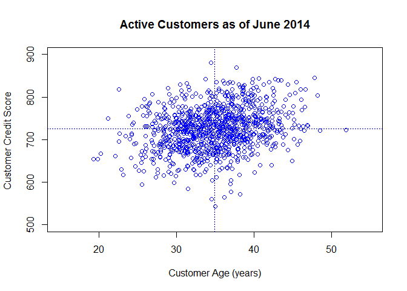 
  
  - 오프라인과 온라인 spend

```r
plot(cust.df$store.spend, cust.df$online.spend,
     main="Customers as of June 2014", 
     xlab="Prior 12 months in-store sales ($)",
     ylab="Prior 12 months online sales ($)",
     cex=0.7)
```

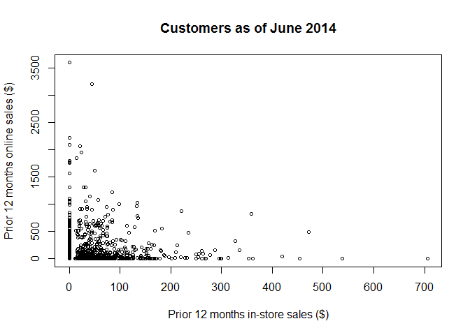 

  - 오프라인과 온라인 store.spend

```r
hist(cust.df$store.spend,
     breaks=(0:ceiling(max(cust.df$store.spend)/10))*10,
     main="Customers as of June 2014",
     xlab="Prior 12 months online sales ($)",
     ylab="Count of customers")
```

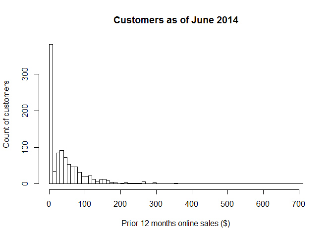 

  - Color-Coding Points on a Scatterplot

```r
my.col <- c("black", "green3")
my.pch <- c(1, 19)
```


```r
head(cust.df$email)
```

```
## [1] yes yes yes yes no  yes
## Levels: no yes
```

```r
as.numeric(head(cust.df$email))
```

```
## [1] 2 2 2 2 1 2
```

```r
my.col[as.numeric(head(cust.df$email))]
```

```
## [1] "green3" "green3" "green3" "green3" "black"  "green3"
```

```r
my.col[head(cust.df$email)]
```

```
## [1] "green3" "green3" "green3" "green3" "black"  "green3"
```


```r
plot(cust.df$store.spend, cust.df$online.spend,
     cex=0.7,
     col=my.col[cust.df$email], pch=my.pch[cust.df$email],
     main="Customers as of June 2014",
     xlab="Prior 12 months in-store sales ($)",
     ylab="Prior 12 months online sales ($)" )
```

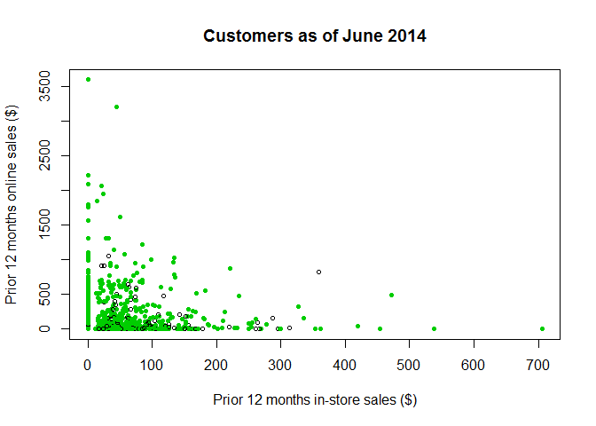 

   - 범례표시하기

```r
#legend(x="topright", legend=paste("email on file:", #levels(cust.df$email)),
#       col=my.col, pch=my.pch)
```

  - online and in-store sales are skewed, use a log scale for both axes

```r
plot(cust.df$store.spend + 1, cust.df$online.spend + 1,
     log="xy", 
     cex=0.7,
     col=my.col[cust.df$email], 
     pch=my.pch[cust.df$email],
     main="Customers as of June 2014",
     xlab="Prior 12 months in-store sales ($)",
     ylab="Prior 12 months online sales ($)" )

legend(x="topright", legend=paste("email on file:", levels(cust.df$email)),
       col=my.col, pch=my.pch)
```

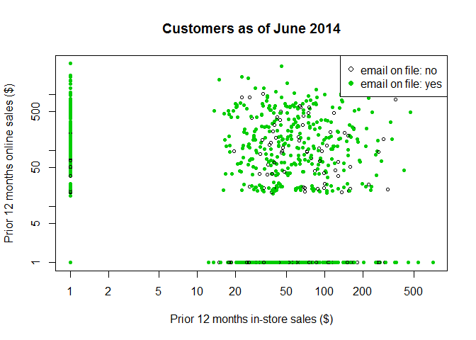 


### 4.3 Combining Plots in a Single Graphics Object

  -거리,오프라인지출 / 거리, 온라인지출 / 거리, 오프로그 / 거리, 온라인로그 

```r
par(mfrow=c(2, 2))
plot(cust.df$distance.to.store, cust.df$store.spend, main="store")
plot(cust.df$distance.to.store, cust.df$online.spend, main="online")
plot(cust.df$distance.to.store, cust.df$store.spend+1, log="xy", main="store, log")
plot(cust.df$distance.to.store, cust.df$online.spend+1, log="xy", main="online, log")
```

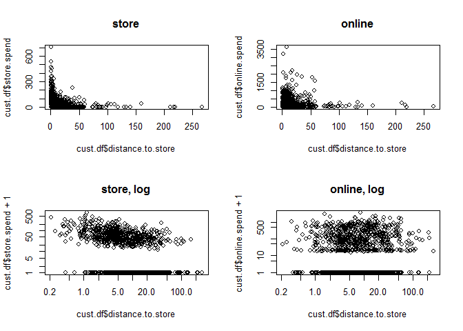 

  - pairs함수로 모든 변인 둘씩 짝지어서 분포 확인

```r
pairs(formula = ~ age + credit.score + email +
        distance.to.store + online.visits + online.trans +
        online.spend + store.trans + store.spend,
      data=cust.df)

pairs(cust.df[ , c(2:10)])
```

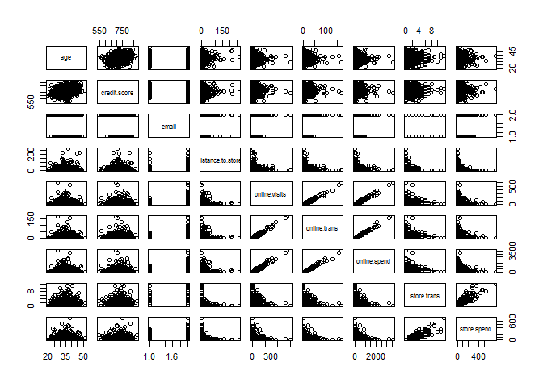 

  - scatterplotMatrix()

```r
library(car) # install if needed
scatterplotMatrix(formula = ~ age + credit.score + email +
                      distance.to.store + online.visits +
                      online.trans +
                      online.spend + store.trans + store.spend,
                    data=cust.df, diagonal="histogram")
```

```
## Warning in smoother(x, y, col = col[2], log.x = FALSE, log.y = FALSE,
## spread = spread, : could not fit smooth
```

```
## Warning in smoother(x, y, col = col[2], log.x = FALSE, log.y = FALSE,
## spread = spread, : could not fit smooth
```

```
## Warning in smoother(x, y, col = col[2], log.x = FALSE, log.y = FALSE,
## spread = spread, : could not fit smooth
```

```
## Warning in smoother(x, y, col = col[2], log.x = FALSE, log.y = FALSE,
## spread = spread, : could not fit smooth
```

```
## Warning in smoother(x, y, col = col[2], log.x = FALSE, log.y = FALSE,
## spread = spread, : could not fit smooth
```

```
## Warning in smoother(x, y, col = col[2], log.x = FALSE, log.y = FALSE,
## spread = spread, : could not fit smooth
```

```
## Warning in smoother(x, y, col = col[2], log.x = FALSE, log.y = FALSE,
## spread = spread, : could not fit smooth
```

```
## Warning in smoother(x, y, col = col[2], log.x = FALSE, log.y = FALSE,
## spread = spread, : could not fit smooth
```

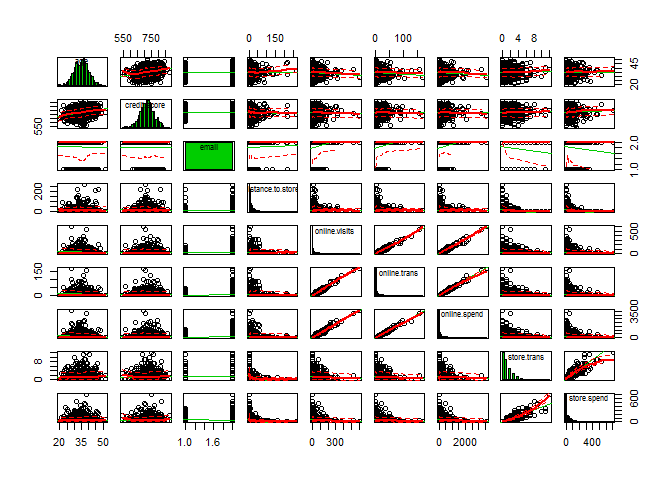 


```r
#install.packages("gpairs") # only run once
library(gpairs)
gpairs(cust.df[ , c(2:10)])
```

```
## Loading required package: grid
## Loading required package: lattice
```

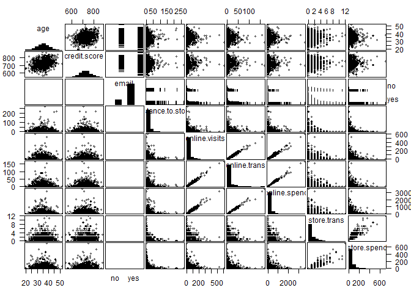 

###4.5 Correlation Coefficients

  -cov, cor
  -cov(x, y) is zero, then there is no (linear) association between xi and yi
  -Pearson’s r : range [−1, +1].
  -cor.test
  -correlation matrix

```r
cov(cust.df$age, cust.df$credit.score)
```

```
## [1] 63.23443
```

```r
cor(cust.df$age, cust.df$credit.score)
```

```
## [1] 0.2545045
```

```r
cov(cust.df$age, cust.df$credit.score) / (sd(cust.df$age)*sd(cust.df$credit.score))
```

```
## [1] 0.2545045
```

```r
cor.test(cust.df$age, cust.df$credit.score)
```

```
## 
## 	Pearson's product-moment correlation
## 
## data:  cust.df$age and cust.df$credit.score
## t = 8.3138, df = 998, p-value = 4.441e-16
## alternative hypothesis: true correlation is not equal to 0
## 95 percent confidence interval:
##  0.1955974 0.3115816
## sample estimates:
##       cor 
## 0.2545045
```

```r
cor(cust.df[, c(2, 3, 5:12)])
```

```
##                            age credit.score distance.to.store
## age                1.000000000  0.254504457        0.00198741
## credit.score       0.254504457  1.000000000       -0.02326418
## distance.to.store  0.001987410 -0.023264183        1.00000000
## online.visits     -0.061381070 -0.010818272       -0.01460036
## online.trans      -0.063019935 -0.005018400       -0.01955166
## online.spend      -0.060685729 -0.006079881       -0.02040533
## store.trans        0.024229708  0.040424158       -0.27673229
## store.spend        0.003841953  0.042298123       -0.24149487
## sat.service                 NA           NA                NA
## sat.selection               NA           NA                NA
##                   online.visits online.trans online.spend store.trans
## age                 -0.06138107  -0.06301994 -0.060685729  0.02422971
## credit.score        -0.01081827  -0.00501840 -0.006079881  0.04042416
## distance.to.store   -0.01460036  -0.01955166 -0.020405326 -0.27673229
## online.visits        1.00000000   0.98732805  0.982406842 -0.03666932
## online.trans         0.98732805   1.00000000  0.993346657 -0.04024588
## online.spend         0.98240684   0.99334666  1.000000000 -0.04089133
## store.trans         -0.03666932  -0.04024588 -0.040891332  1.00000000
## store.spend         -0.05068554  -0.05224465 -0.051690053  0.89275685
## sat.service                  NA           NA           NA          NA
## sat.selection                NA           NA           NA          NA
##                    store.spend sat.service sat.selection
## age                0.003841953          NA            NA
## credit.score       0.042298123          NA            NA
## distance.to.store -0.241494870          NA            NA
## online.visits     -0.050685537          NA            NA
## online.trans      -0.052244650          NA            NA
## online.spend      -0.051690053          NA            NA
## store.trans        0.892756851          NA            NA
## store.spend        1.000000000          NA            NA
## sat.service                 NA           1            NA
## sat.selection               NA          NA             1
```

  -corrplot 패키지활용한 correlation matrix

```r
#install.packages("gplots")
library(corrplot) # for correlation plot, install if needed
library(gplots)   # color interpolation, install if needed
```

```
## 
## Attaching package: 'gplots'
## 
## The following object is masked from 'package:stats':
## 
##     lowess
```

```r
par(mfrow=c(1,1))
corrplot.mixed(corr=cor(cust.df[ , c(2, 3, 5:12)], use="complete.obs"),
               upper="ellipse", tl.pos="lt",
               col = colorpanel(50, "red", "gray60", "blue4"))
```

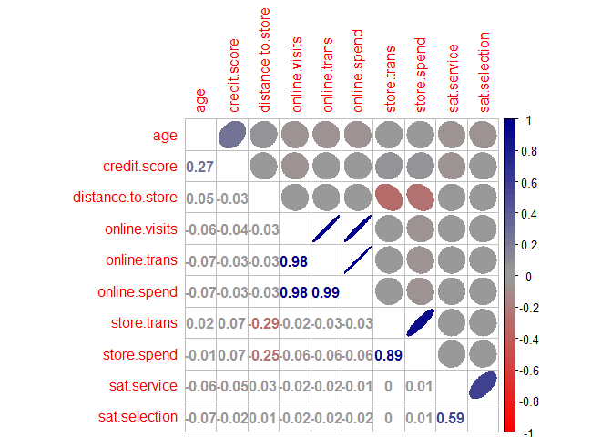 
  
  - Transforming Variables before Computing Correlations
  - Many relationships in marketing data are nonlinear. 
  - cust.df data, the number of trips a customer makes to a store may be inversely related to distance from the store. 
  - When we compute the correlation between the raw values of distance.to.store and store.spend, we get a modest negative

```r
set.seed(49931)
x <- runif(1000, min=-10, max=10)
cor(x, x^2)
```

```
## [1] -0.003674254
```

  -역수로 바꿔서 계산해야하는 항목이 있음(루트까지 씌우면 상관이 더크게나타남)

```r
cor(cust.df$distance.to.store, cust.df$store.spend)
```

```
## [1] -0.2414949
```

```r
cor(1/cust.df$distance.to.store, cust.df$store.spend)
```

```
## [1] 0.4329997
```

```r
cor(1/sqrt(cust.df$distance.to.store), cust.df$store.spend)
```

```
## [1] 0.4843334
```
  
  -루트씌우면..해석은 어떻게하지? 그림으로보자!

```r
plot(cust.df$distance.to.store, cust.df$store.trans)
```

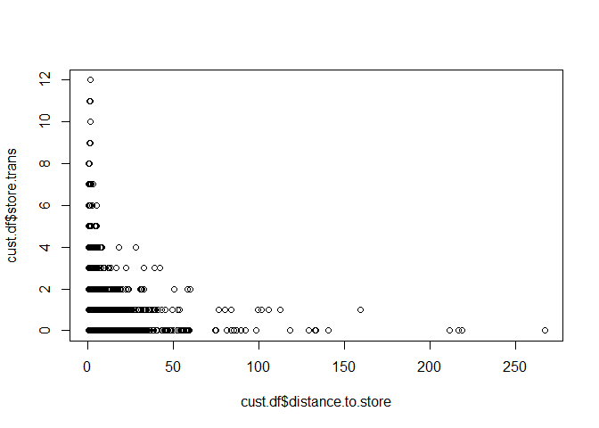 

```r
plot(1/sqrt(cust.df$distance.to.store), cust.df$store.trans)
```

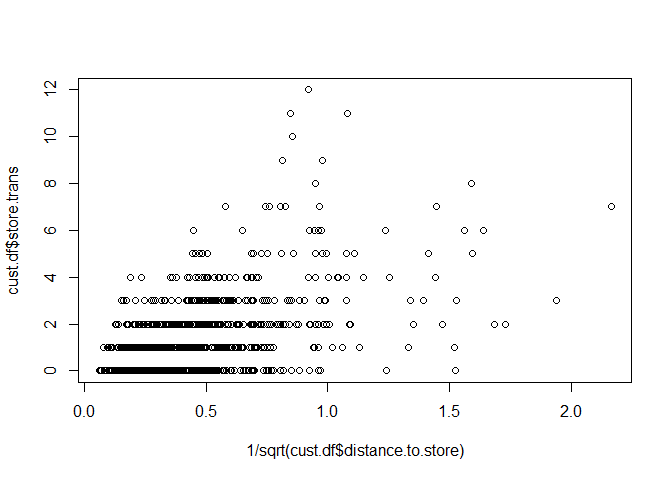 

### 교재 102 마케팅 데이터 트랜스포메이션 꼭 보기!! 
### 마케팅 데이터 트랜스포메이션 형식 표로 있음
### Box–Cox Transformations*
  - Many of the transformations involve taking a power of(x2, 1/x =x−1, x−0.5)      - The Box–Cox transformation generalizes this use of power functions

```r
library(car)
powerTransform(cust.df$distance.to.store)
```

```
## Estimated transformation parameters 
## cust.df$distance.to.store 
##              -0.003696395
```


```r
lambda <- coef(powerTransform(1/cust.df$distance.to.store))
bcPower(cust.df$distance.to.store, lambda)
```

```
##    [1]  0.950421270  3.902743543  0.251429693  1.664085284  3.239908993
##    [6]  2.931485684  2.243992143  1.940984081  2.565290889  1.896458754
##   [11]  1.898262423  0.411047042  4.101597125  1.359172873  3.897338322
##   [16]  2.593839288  3.071153848  0.916256737  0.319686032  4.530164904
##   [21]  0.557839249  3.160834493  3.125507166  3.122155783  1.478636046
##   [26]  1.500077591  2.118448825  1.707559150  1.297341047  1.013165556
##   [31]  0.671306062  1.816181940 -1.092448063  1.575277980  2.429053815
##   [36]  1.952798708  3.378217984  4.111249953  1.756269290  1.736456692
##   [41]  2.755796818  3.126626783  2.156646335  1.743374467  2.331754162
##   [46]  2.473876858  2.818135360  2.670383766  1.673001467  1.882553373
##   [51]  3.244994404  1.123209388  1.524507737  1.536941414  3.421898564
##   [56]  3.647341284  1.602658659  1.566765895  2.502170189  2.504574230
##   [61]  2.737412673  3.357817914  0.701630091  1.770714815  3.012618982
##   [66]  1.970962256  2.971897783  0.338605268  2.167231888  0.358969607
##   [71]  3.350316644  2.571735567  0.733448001  1.115383944  2.340491941
##   [76]  0.591775550  4.039256908 -0.845125124  2.476291446  3.119853245
##   [81]  1.617830621  1.628255232  2.312340046  1.838303317  1.683952493
##   [86]  0.612015475  2.496908465  2.705894850  3.108930315  2.036274484
##   [91]  0.854573622  2.595188766  2.478262922  0.743310906  3.996194768
##   [96]  2.519213681  5.442685650 -0.451534461  4.701867493  1.108745429
##  [101]  2.236950738  4.003140381  2.347768567  5.431947052  2.460932182
##  [106]  0.123230493  2.302183955  2.798571912  1.677425094  1.983388685
##  [111]  4.812542065  2.347260275  1.686355342  3.995118418  2.690505187
##  [116]  3.659578178  3.366002074  3.290176480  2.817171943  1.148319367
##  [121]  4.903632074  1.366210335  1.142199431  0.867207432  1.428600718
##  [126]  1.190309888  1.435500011  0.400682124  3.460976455  0.047863548
##  [131]  1.375765748  2.171641801  3.407331497  2.585643722  2.513187939
##  [136] -0.181276119  0.964765158  3.142830062  1.875460920  2.756468323
##  [141]  1.697694242  2.452110292  1.227525814  1.703061031  1.047881552
##  [146]  1.596601731  1.677290570  2.535027715  0.503488135  1.148986396
##  [151]  0.677619354  3.802125200  1.643291979  1.289068226  1.549553998
##  [156]  1.307534545  3.518662733  1.371853645  3.928273355  0.733446791
##  [161]  0.159869366  1.660230236  2.820665199  1.242537258  1.460466217
##  [166]  1.036325383  2.385795093  1.573952632 -0.693049862  2.656575344
##  [171]  1.879327513  3.352224517  1.545748349  3.269076112  0.905019038
##  [176]  0.115204046  3.233137745  3.784443746  1.399282149  2.546917436
##  [181]  2.469719509  2.523127776  0.324504777  3.374272718  1.917403365
##  [186]  2.053187280  2.147262477  3.505129942  3.442438619  2.080496200
##  [191]  1.630864520  1.496637664  0.099686582  4.502818626  0.545603112
##  [196]  0.797848740  4.659663823  3.991263487  1.565228230  0.638682604
##  [201]  1.474503392  2.355060380  1.078067981  2.763208965  3.682277517
##  [206]  3.529416520  0.634735758  1.457812198  1.720535471  3.458892012
##  [211]  0.876728612  1.814200614  1.259013627  1.078252999  2.261374913
##  [216]  2.739653971  1.782470447  2.301045756  2.220709947  4.052854963
##  [221]  1.416209266  3.197225815  2.810892464  2.355341627  0.728024125
##  [226]  2.191241340  1.196631280  2.217406013 -0.932254907  0.205531252
##  [231]  3.843211726  2.545845736  3.513922810  0.544562000  4.026985096
##  [236] -0.244156235  3.599265500  2.070206562  2.879912503  4.006215149
##  [241]  2.357939367  2.940133465  2.876673418  1.740587961  2.793074612
##  [246]  2.134111329  1.620535589 -0.771310490  2.193899837  4.373923645
##  [251]  1.590654352  0.631896662  1.889509185  1.500658448  0.299704222
##  [256]  2.571649741  3.237310115  1.595553423  1.421198991  1.937825739
##  [261]  2.726894793  1.932473177  1.445979943  3.324178157  2.253861058
##  [266]  3.615543310  3.762996855 -0.148640504 -0.839432344  2.753238842
##  [271]  1.386178290  1.180771181  3.427652386  2.299035176  1.581118411
##  [276]  3.228080893  0.075317604  3.392089390  3.448386095  1.704146831
##  [281]  2.704976545  2.801094157  0.642420446  3.250131989  1.376466248
##  [286]  2.564466261  2.882172361  1.529188437  1.848527815  1.295399951
##  [291]  1.428853217  3.556214032  1.772124853 -0.115756851  2.055549834
##  [296]  0.577918674  1.027751475  1.610501824  0.610175138  1.291038356
##  [301]  1.729348747  1.846079495  0.615058907  2.571838571  3.704721617
##  [306]  0.049815106  2.284910413  1.850033669  2.277058155  2.733476886
##  [311]  0.722202082  3.157510041  1.441861052  2.798497687  2.506263401
##  [316]  2.114169719  1.202065727  4.625879513  2.887507632  0.162255524
##  [321]  2.242747843  1.152026313  0.526116663  1.835742561  0.713316324
##  [326]  0.767564915  1.085079137  1.738170700  0.600219175  0.921827630
##  [331]  2.204563565  3.103050013  3.107763488  1.682814425  2.387439119
##  [336]  1.256074917  2.289244545  4.116760424  1.442349251  0.780988941
##  [341]  2.325997971 -0.273048294  3.610794972  2.203621379  3.529063293
##  [346]  3.611011942  4.465047438  2.182634781  2.468245365  0.008255597
##  [351]  1.427143470  2.486108110  4.639037719  2.003565728  3.296217682
##  [356]  2.784781682  2.483887968  2.345960209  2.737172337  1.443796942
##  [361] -0.146818431  2.959187631  1.979406479  1.904495267  1.331311317
##  [366]  3.053474205  2.806475211  1.187125674  1.736934732  1.815233242
##  [371]  1.522986606  4.563451045  3.115424069  3.322666479  1.245442823
##  [376]  1.985561962  1.672697578  1.222170283  1.512293356  1.050961712
##  [381]  1.099250226  1.362996180  0.627102369  2.456362377 -0.739354062
##  [386]  3.129761534  2.703639241  3.035142012  1.177588504  2.674631544
##  [391]  2.460143220  3.594612302  1.043085929  1.646261398  3.983913816
##  [396]  1.958095264  1.331801703  1.121504128  2.148527465  3.240631860
##  [401]  2.209376792  1.491619400  1.090062894  3.282251724  1.862262017
##  [406]  1.560074756  0.815692983  0.717256133  2.615582754  1.441903654
##  [411]  1.345708915  1.175689368  3.744319712  1.428042559  0.941527772
##  [416]  0.869716556  2.524423354  1.655564062  1.713969112  2.253162368
##  [421]  1.100938606  2.658786773  2.736003580  2.650569551  1.615027478
##  [426]  2.948542034  2.312125784  3.828504659  1.194085555  0.160005226
##  [431]  2.719275280  2.227897744  1.020371584  2.252840697  2.840752399
##  [436]  0.259996532  0.758062644  3.788514798  1.430294319  3.233182272
##  [441]  1.771353228  3.621622722  2.092946110  3.913559203  3.723291565
##  [446]  2.124527119  3.253278523  1.900814542  3.014028375 -0.659201029
##  [451]  3.525429578  3.146806816  1.971488911  3.545639505  3.861780431
##  [456]  1.159396044  3.511318453  3.645959360  1.259209659  3.948691105
##  [461]  1.187204524  3.110759118  1.798910266  1.372384141  2.873016864
##  [466]  5.645674022  0.110824859  2.799029902 -0.987369471  2.127274341
##  [471]  1.490051448  1.086965044  1.995749435  0.495090882  3.200853364
##  [476]  2.902969145  2.891571330  1.039540209  1.411957116  2.495670073
##  [481]  2.866473644  2.358266940  2.239172255  2.414606495  0.829342952
##  [486]  2.828240945  1.217706665  0.610389035 -0.733767751  4.529335079
##  [491]  0.695044977  1.131611622  2.342333101 -0.928107751  1.742411033
##  [496]  3.314791067  1.593485785  1.796484245  2.239127286  1.199816979
##  [501]  2.324878364  2.410742668  4.353764208  4.764427177  3.942471760
##  [506]  2.253440174  1.939036531  1.551771580  1.232239278  1.104442508
##  [511]  1.024429354  1.394120300  1.092883816  2.808347009  3.168777911
##  [516]  1.101207210  0.383521528  1.738635370  2.307156445  1.540562561
##  [521]  2.452121340  2.953805648  3.150218241  2.125259149  1.166565182
##  [526]  1.713216990  3.226518420  4.037531848  3.639497445  2.295808992
##  [531]  1.708459683  2.254510689  1.843754910  4.938227869  4.016216677
##  [536]  2.465273973  0.598903842  0.750790608  1.628469147  2.309874643
##  [541]  2.816014603  1.352917953  0.101487288  1.502278535  1.309445774
##  [546] -0.433476155  3.539875074  2.072338190  3.788961293  0.330422040
##  [551]  3.355080437  0.969084276  1.728719561  2.354125508  0.923328684
##  [556]  1.211263424  1.849003739  1.183337854  3.011334979  0.801330685
##  [561]  2.542593018  0.887664871  1.779236679  2.452483840  3.840566102
##  [566]  1.693012910  1.767634546  3.409736241 -0.074220936  1.193124873
##  [571]  2.509097527  2.599054928  0.533746688  2.827561216  3.671039549
##  [576]  4.991318325  2.097826317  0.978912592  3.902031817  1.566352880
##  [581]  0.503246209  0.144872069  4.932317750  0.719137939  1.980887294
##  [586]  1.130317280  2.675418866  1.599017533  2.591776171  2.300994227
##  [591]  2.902530273  3.089224878  4.047762236  3.398415328 -0.574230490
##  [596] -1.539247233  3.360655958  3.510816718  2.056202275  3.508369247
##  [601]  0.425649114  3.666501838  2.527100022  1.565678981  3.196511739
##  [606]  3.390042862  1.595339485  1.345887926  2.568233453  2.914961863
##  [611]  1.836945601 -0.010425847  0.831780385  0.725443010  2.154042961
##  [616] -0.153970312  1.240766777  2.209124813  0.100842219  2.239059851
##  [621]  2.576507201  0.913173288  2.182681619  2.787732937  1.204937968
##  [626]  0.451309552  3.050066335  2.704173043  1.716282009  1.491113214
##  [631]  1.562338355  0.030615275  3.663343297  1.438555538  2.807668646
##  [636] -0.167919832  0.525987298  1.523606902  1.538195479  1.324246551
##  [641]  4.463881210  0.035139772  1.566361603 -0.889902779  2.684103943
##  [646]  1.384305405  0.565609628  1.481047845  2.770120674  1.309707141
##  [651]  3.224780209  2.354788771  2.563788055  1.593211976  1.626661645
##  [656]  3.495212514  2.797428071  3.138498508  1.100724762  3.548100760
##  [661]  4.483704923  2.827784962  1.722135457  1.668196080  3.076832014
##  [666]  2.541222348  1.250938045  2.442710216  2.323518909  1.208168603
##  [671]  2.121722376  0.501701244  1.381365805  0.757898687  3.668862386
##  [676]  0.863787645  2.897227744  2.095920685  2.119991231  2.438863153
##  [681]  4.089598966  1.914221439  0.773877517  1.189701090  3.510235189
##  [686]  1.370392534  1.069314567  2.650052351  4.416501457 -0.837511692
##  [691]  2.997493819  2.925608354  2.227682214  2.921601274  2.053917957
##  [696]  5.119532385  1.957487805  0.012306936  2.045714740  1.258873709
##  [701]  0.072197476  3.372219363  3.185034404  3.436299561  1.375049570
##  [706]  4.098865430  2.617264864  2.217671888  0.062641675  0.153393814
##  [711]  0.316433549  0.065935083  1.941785833  0.958503877  2.358833710
##  [716]  2.401564908  2.099679688  4.340521275  2.346029385  1.287148877
##  [721]  1.902048082  1.777949925  3.840456462  1.500246049 -0.211365251
##  [726]  0.792133930  3.248083151  1.879542710  2.856462268  3.118943768
##  [731]  1.603637393  3.122825924  2.319296815  3.067034986  0.377174592
##  [736]  2.261795771  0.912214094  0.502682200  4.074693722  2.647889953
##  [741]  2.285385086  3.073342544  1.885424844  2.967931908  1.003716690
##  [746]  3.019573630  1.829110829 -0.586213252  0.805819312  1.505824517
##  [751] -0.005627459  1.015184652  1.606898064  1.118885509  3.557484201
##  [756]  3.341470591  1.485667295  3.670335155  2.360543175  2.852205650
##  [761]  2.492673630  2.305760907  2.438840586  3.191284924  2.862620077
##  [766]  1.169186164  0.671796791  2.650977461  0.724774793  1.271375105
##  [771]  1.009494957  2.410765852  1.868544492  2.000889467  0.478130186
##  [776]  1.593336328  2.301824564  1.939711088  2.111433626  2.442182541
##  [781]  1.885317766  1.755887694  2.168992878  1.077919397  1.203785877
##  [786]  1.315043637  4.092661524  1.014239111  2.546705769  1.204889358
##  [791]  3.613975810  3.479384675  2.508062387  2.865162927 -0.148478323
##  [796]  1.179540843  3.038040150  1.560737982  3.473417550  1.706244170
##  [801]  2.777691510  3.212420235  0.041092043  1.289895165  0.758709499
##  [806]  1.474621809  3.354744837  0.022775804  2.620472130  2.288942683
##  [811]  0.697109136  2.567271685  1.290745646  2.457190894  3.210189839
##  [816]  1.738758518  2.883171861  0.076268864  0.080232705  0.746330156
##  [821]  3.390617867  2.110129188  2.842352486  2.963783678  0.436911475
##  [826]  1.813908694  1.988538750  2.986623921  1.604197515 -0.036540798
##  [831]  1.598859627  2.983544081  1.510256007  1.409268298  2.118586845
##  [836]  2.079083343  3.238518304  2.503058211  3.226721128  1.651740020
##  [841]  1.776017903  2.058261982  2.495216060  0.756128132  1.891517394
##  [846]  3.395129847  1.963734416  1.794980198  2.651097548  1.898981022
##  [851]  2.326419704  1.964260915  3.169639581  3.461393336  0.539852425
##  [856]  1.353239264  1.944643843  2.751203626  2.210972223  1.418535099
##  [861]  1.654903948 -1.039306268  1.971912875  0.166838732  2.302560467
##  [866]  1.260127058  3.285727237  0.100588265  2.879094353  1.141231045
##  [871]  1.952214453  1.374848249 -0.423783740  2.838980744  1.287614057
##  [876]  2.767895201  3.713878261  2.739783512  2.745485350  1.705922726
##  [881]  3.199157038  1.888196966  0.570679978  0.406465902  0.758796677
##  [886]  2.280509806  1.124581047  0.435936202  1.105948889  1.523377396
##  [891]  3.062333242  1.880035674  1.454315352  1.249599046  2.029811986
##  [896]  2.752609984  1.208080777  2.907934880  1.024362602  2.055317544
##  [901]  1.566956806  0.251261154  0.937520954 -1.321476440  2.265611310
##  [906]  0.577620469  1.271812344  1.990100031  1.047056758  1.227889636
##  [911] -0.603548676  2.764475250  0.546977450  0.750428440  1.229359671
##  [916]  4.435496278  3.568366164  1.058159136  0.528831715  2.087777221
##  [921]  2.299593300  1.075787065  2.675217174  1.005964588 -0.086566350
##  [926]  2.328128618  1.938417076  3.147048108  3.686828768  1.121354393
##  [931]  0.338836040  2.593575521  3.597525176  2.596966737  0.456313195
##  [936]  1.647698927  1.002327060  3.621375533  1.581636121  2.566713788
##  [941]  2.223738854  2.025961025  0.738055628  3.843369713  2.867680752
##  [946]  1.747393373  2.710745064  2.112056271  1.652970615  1.459002511
##  [951]  2.103143560  0.081826677  2.464187307  1.695013742  0.854740625
##  [956]  2.920763315  0.912090573  3.853600278  2.231174779  4.123698650
##  [961]  1.423959045  2.108064182  0.564249448  5.406226906  1.808707209
##  [966]  3.546963242  3.790183603  1.487718596  3.568429038  2.854406930
##  [971]  3.459551214  2.479012328  2.005461769  0.277878362  3.361514964
##  [976]  2.052847102  3.841958988  0.572387187  1.788477719  0.821110343
##  [981]  1.614600787  1.599392732  2.476938130  1.412428571  0.435294724
##  [986]  0.737233080  3.506631506  1.266054214  2.857976780  2.769652439
##  [991]  2.489657596  1.553487630  0.736516315  2.755935167  3.381453225
##  [996]  0.852806029  2.979754002  2.459026195  1.688332413  3.396654548
```


```r
par(mfrow=c(1,2))

hist(cust.df$distance.to.store, 
     xlab="Distance to Nearest Store", 
     ylab="Count of Customers",
     main="Original Distribution")

hist(bcPower(cust.df$distance.to.store, lambda), 
     xlab="Box-Cox Transform of Distance", 
     ylab="Count of Customers",
     main="Transformed Distribution")
```

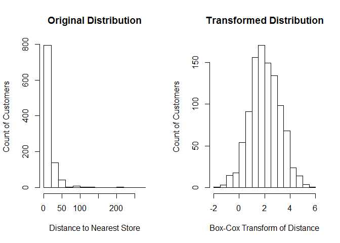 


```r
powerTransform(cust.df$age)
```

```
## Estimated transformation parameters 
## cust.df$age 
##    1.036142
```


```r
l.dist <- coef(powerTransform(cust.df$distance.to.store))
l.spend <- coef(powerTransform(cust.df$store.spend+1))

cor(bcPower(cust.df$distance.to.store, l.dist),
    bcPower(cust.df$store.spend+1, l.spend))
```

```
## [1] -0.4683126
```

### 4.6 Exploring Associations in Survey Responses*

  - Survey

```r
plot(cust.df$sat.service, cust.df$sat.selection,
     xlab="Customer Satisfaction with Service",
     ylab="Customer Satisfaction with Selection",
     main="Customers as of June 2014")
```

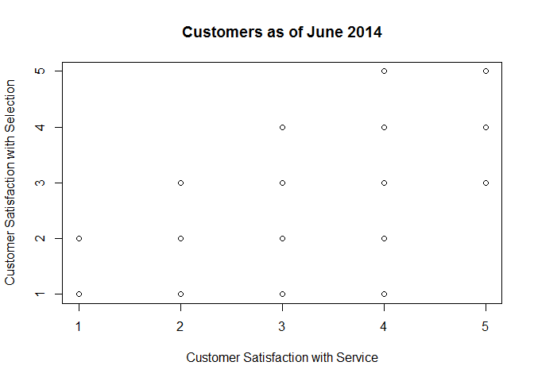 

  - jitter() : 안겹치게 조금씩 위치변경한것

```r
plot(jitter(cust.df$sat.service), jitter(cust.df$sat.selection),
     xlab="Customer Satisfaction with Service",
     ylab="Customer Satisfaction with Selection",
     main="Customers as of June 2014")
```

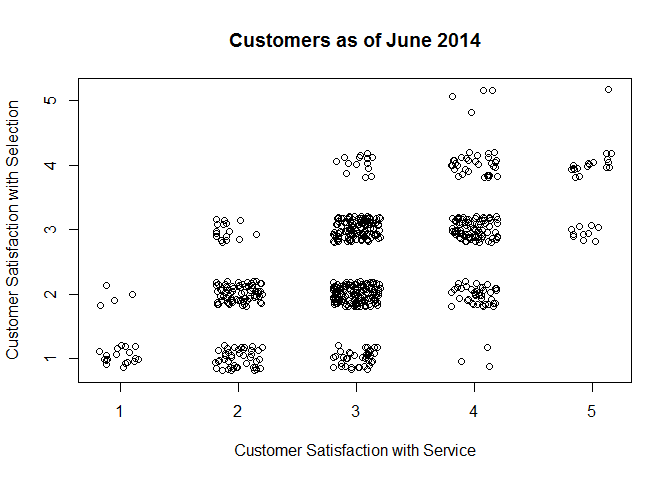 


```r
resp <- !is.na(cust.df$sat.service)
cor(cust.df$sat.service[resp], cust.df$sat.selection[resp])
```

```
## [1] 0.5878558
```


```r
library(psych)
```

```
## 
## Attaching package: 'psych'
## 
## The following object is masked from 'package:car':
## 
##     logit
```

```r
polychoric(cbind(cust.df$sat.service[resp], cust.df$sat.selection[resp]))
```

```
## Call: polychoric(x = cbind(cust.df$sat.service[resp], cust.df$sat.selection[resp]))
## Polychoric correlations 
##    C1   C2  
## R1 1.00     
## R2 0.67 1.00
## 
##  with tau of 
##          1     2    3   4
## [1,] -1.83 -0.72 0.54 1.7
## [2,] -0.99  0.12 1.26 2.4
```


###<시각화>
  -1. plot(x,y) 함수로 산점도 생성할수 있다
  -2. xlab, ylab, main 인수를 활용해 플랏추가정보 입력
  -3. col 인수로 색깔도 바꿀수 있다.
  -4. legend 인수로 범례로 넣을수 있다.
  -5. cex 인수는 점크기 바꿀수있다.
  -6. 산점도 행렬은 한번에 여러변수의 관계를 시각화한다 (pairs 함수도, gpairs는 cars패키지에 있음)
  -7. 플랏함수는 숫치형자료에서 작동하는 제너릭함수, 플랏안돼면 데이터유형 다시 파악해라
  -8. 변량이 편포하면...skewed하면 로그알고리즘 스케일을 적용해라 "log=xy"

###<통계>
  -1. cor(x, y) 함수는 피어슨 상관계수를 산출한다.
  -2. cor함수는 많은 변수를 넣으면 상관계수 행렬을 보여줌, corrplot패키지는 좋은 시각화방법
  -3. cor.test함수로 상관계수의 통계적 유의성과 신뢰구간을 알려수있다.
  -4. 마케팅 데이터는 Cohen’s rules of thumb따라 0.1약한/0.3은 보통/0.5강한 상관관계해석
  -5. 변인들의 관련성이 논리니어할때 변수를 트랜스폼해서 상관계수를 구해라
  -6. 일반적으로 마케팅데이터에서 판매량은 로그프라이스와 관련성이 있다. (히스토그램 그려보고 트렌스폼할지 결정)
  -7. Box–Cox transform 을 바탕으로 적절한 트랜스포메이션을 선택해라
  -8. psycy 패키지의 polychor() 함수는 설문지 응답에 상관을 구하는데 유용하다

