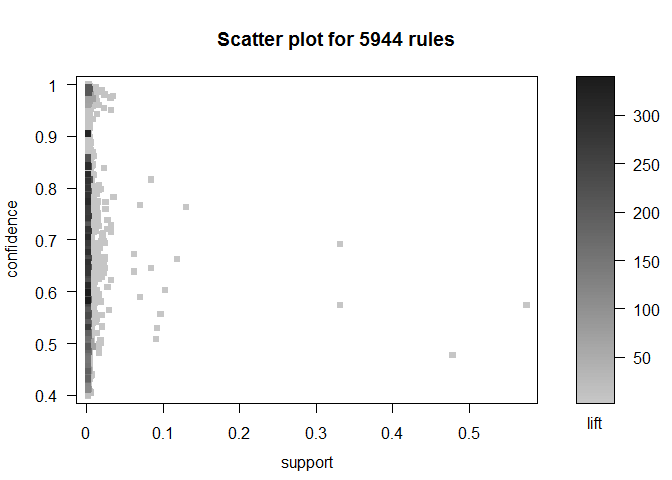
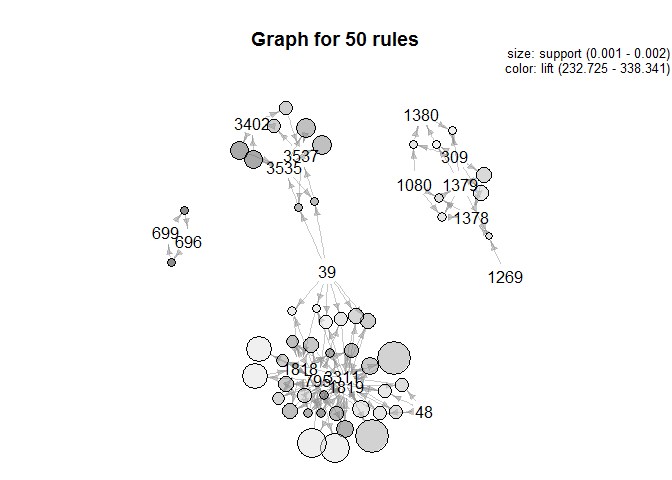
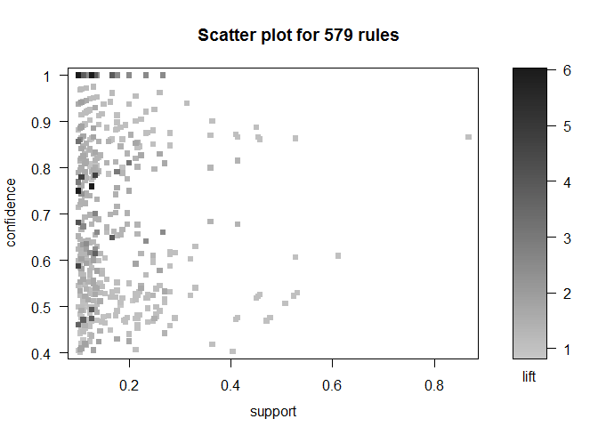
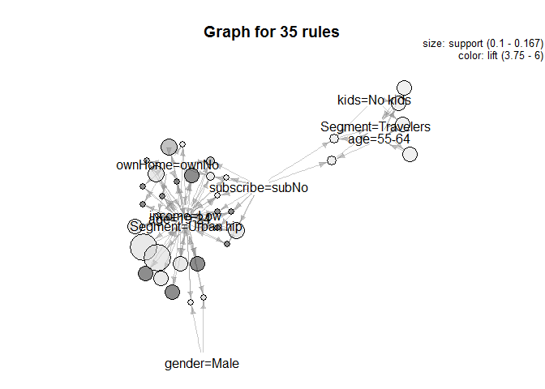
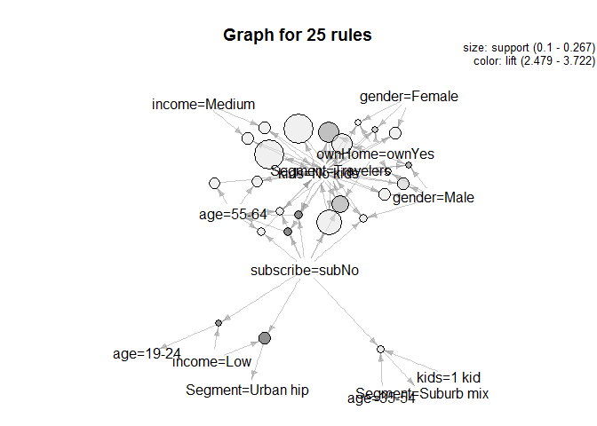

# 12.asso_rules
kimsungguen  
2015년 12월 4일  

# Association Rules for Market Basket Analysis

  - 구매와 동시발생 자료로 부터 인사이트를 얻는 전략에 대해 연구할것이다.
  - 연관규칙분석은 광범위한 데이터셋에서 정보가를 가진 패턴셋을 찾는 접근이다.
  - 연관규칙분석을 활용해 80,000개 장바구니의 16000개 아이템에 대한 분석을 실시하겠다.

## 1. The Basics of Association Rules
  - 연관규칙은 기대치 보다 더 많은 빈도로 특정 물건이 함께 구매된 패턴을 찾는것이다.
  - R package arules 사용할 것이다.
  - summary() 함수는 169물품들의 9835개 거래를 보여준다.
  - inspect(head(Groceries)) 장바구니의 물건들을 볼수 있다.

## 2. Retail Transaction Data: Market Baskets

```r
library(arules)
```

```
## Warning: package 'arules' was built under R version 3.2.2
```

```
## Loading required package: Matrix
## 
## Attaching package: 'arules'
## 
## The following objects are masked from 'package:base':
## 
##     %in%, abbreviate, write
```

```r
library(arulesViz)
```

```
## Warning: package 'arulesViz' was built under R version 3.2.2
```

```
## Loading required package: grid
## 
## Attaching package: 'arulesViz'
## 
## The following object is masked from 'package:arules':
## 
##     abbreviate
## 
## The following object is masked from 'package:base':
## 
##     abbreviate
```

```r
data("Groceries")
summary(Groceries)
```

```
## transactions as itemMatrix in sparse format with
##  9835 rows (elements/itemsets/transactions) and
##  169 columns (items) and a density of 0.02609146 
## 
## most frequent items:
##       whole milk other vegetables       rolls/buns             soda 
##             2513             1903             1809             1715 
##           yogurt          (Other) 
##             1372            34055 
## 
## element (itemset/transaction) length distribution:
## sizes
##    1    2    3    4    5    6    7    8    9   10   11   12   13   14   15 
## 2159 1643 1299 1005  855  645  545  438  350  246  182  117   78   77   55 
##   16   17   18   19   20   21   22   23   24   26   27   28   29   32 
##   46   29   14   14    9   11    4    6    1    1    1    1    3    1 
## 
##    Min. 1st Qu.  Median    Mean 3rd Qu.    Max. 
##   1.000   2.000   3.000   4.409   6.000  32.000 
## 
## includes extended item information - examples:
##        labels  level2           level1
## 1 frankfurter sausage meet and sausage
## 2     sausage sausage meet and sausage
## 3  liver loaf sausage meet and sausage
```

```r
inspect(head(Groceries, 10))
```

```
##    items                     
## 1  {citrus fruit,            
##     semi-finished bread,     
##     margarine,               
##     ready soups}             
## 2  {tropical fruit,          
##     yogurt,                  
##     coffee}                  
## 3  {whole milk}              
## 4  {pip fruit,               
##     yogurt,                  
##     cream cheese ,           
##     meat spreads}            
## 5  {other vegetables,        
##     whole milk,              
##     condensed milk,          
##     long life bakery product}
## 6  {whole milk,              
##     butter,                  
##     yogurt,                  
##     rice,                    
##     abrasive cleaner}        
## 7  {rolls/buns}              
## 8  {other vegetables,        
##     UHT-milk,                
##     rolls/buns,              
##     bottled beer,            
##     liquor (appetizer)}      
## 9  {pot plants}              
## 10 {whole milk,              
##     cereals}
```

  - apriori(data, parameters=...) 함수는 apriori알고리즘으로 연관규칙을 찾아준다.
  - apriori알고리즘은 transactions 리스트중에서 빈번하게 발생하는 아이템 셋을 찾는다.
  - parameter=list()사용하여 최소지지도와 최소 신뢰도 값을 조절할수 있다.
  - apriori() 결과해석시 2가지가 핵심이다.
  - 첫째는 sorting and recoding items 결과에서 보여지는 규칙안에 몇개의 아이템이 있는지 보는것이다.
  - 이 사례에서는 88개 아이템이 발견된다.
  - 아이템이 너무많거나 적으면 지지도와 신뢰도 수준을 조정해야한다.
  - 두번째는 writing 결과에서 보여지는 규칙의 수를 확인하는것이다. 이사례에서는 125개 룰이 발견된다.
  - 규칙의 수가 너무 적으면 지지도와 신뢰도수준을 낮춰야한다. 규칙의 수가너무 많으면 지지도와 신뢰도를 높여야한다. 


```r
groc.rules <- apriori(Groceries, parameter=list(supp=0.01, conf=0.3, target="rules"))
```

```
## 
## Parameter specification:
##  confidence minval smax arem  aval originalSupport support minlen maxlen
##         0.3    0.1    1 none FALSE            TRUE    0.01      1     10
##  target   ext
##   rules FALSE
## 
## Algorithmic control:
##  filter tree heap memopt load sort verbose
##     0.1 TRUE TRUE  FALSE TRUE    2    TRUE
## 
## apriori - find association rules with the apriori algorithm
## version 4.21 (2004.05.09)        (c) 1996-2004   Christian Borgelt
## set item appearances ...[0 item(s)] done [0.00s].
## set transactions ...[169 item(s), 9835 transaction(s)] done [0.01s].
## sorting and recoding items ... [88 item(s)] done [0.00s].
## creating transaction tree ... done [0.01s].
## checking subsets of size 1 2 3 4 done [0.01s].
## writing ... [125 rule(s)] done [0.00s].
## creating S4 object  ... done [0.00s].
```
 
 
  - 첫번째규칙에서 {beef}와 {root vegetables}규칙이 발견딘다. 1.7%지지도(장바구니의 1.7에서 해당 조합이 발생), 3.04리프트(단독으로 판매되는것보다 3배더 잘발생)함을 보여준다. 
  - 이는 가게에서 제품진열이나 쿠폰발행시 고려할수있음

```r
inspect(subset(groc.rules, lift > 3))
```

```
##   lhs                   rhs                   support confidence     lift
## 1 {beef}             => {root vegetables}  0.01738688  0.3313953 3.040367
## 2 {citrus fruit,                                                         
##    root vegetables}  => {other vegetables} 0.01037112  0.5862069 3.029608
## 3 {citrus fruit,                                                         
##    other vegetables} => {root vegetables}  0.01037112  0.3591549 3.295045
## 4 {tropical fruit,                                                       
##    root vegetables}  => {other vegetables} 0.01230300  0.5845411 3.020999
## 5 {tropical fruit,                                                       
##    other vegetables} => {root vegetables}  0.01230300  0.3427762 3.144780
```


## 2.2 Supermarket Data

  - 상품에 대한 설명없이 상품번호로 구성된 바스켓 데이터
  - 각 행은 1개의 바스켓에 담긴 물건, 88,162거래

```r
retail.raw <- readLines("http://goo.gl/FfjDAO")
head(retail.raw)
```

```
## [1] "0 1 2 3 4 5 6 7 8 9 10 11 12 13 14 15 16 17 18 19 20 21 22 23 24 25 26 27 28 29 "
## [2] "30 31 32 "                                                                       
## [3] "33 34 35 "                                                                       
## [4] "36 37 38 39 40 41 42 43 44 45 46 "                                               
## [5] "38 39 47 48 "                                                                    
## [6] "38 39 48 49 50 51 52 53 54 55 56 57 58 "
```

```r
tail(retail.raw)
```

```
## [1] "48 201 255 278 407 479 767 824 986 1395 1598 2022 2283 2375 6725 13334 14006 14099 "                          
## [2] "39 875 2665 2962 12959 14070 14406 15518 16379 "                                                              
## [3] "39 41 101 346 393 413 479 522 586 635 695 799 1466 1786 1994 2449 2830 3035 3591 3722 6217 11493 12129 13033 "
## [4] "2310 4267 "                                                                                                   
## [5] "39 48 2528 "                                                                                                  
## [6] "32 39 205 242 1393 "
```

```r
summary(retail.raw)
```

```
##    Length     Class      Mode 
##     88162 character character
```

  - 이런 텍스트형식의 데이터는 분석을 할수 없음
  - strsplit(lines," ")함수로 텍스트를 개별아이템으로 분리

```r
retail.list <- strsplit(retail.raw, " ")
names(retail.list) <- paste("Trans", 1:length(retail.list), sep="")
head(retail.list)
```

```
## $Trans1
##  [1] "0"  "1"  "2"  "3"  "4"  "5"  "6"  "7"  "8"  "9"  "10" "11" "12" "13"
## [15] "14" "15" "16" "17" "18" "19" "20" "21" "22" "23" "24" "25" "26" "27"
## [29] "28" "29"
## 
## $Trans2
## [1] "30" "31" "32"
## 
## $Trans3
## [1] "33" "34" "35"
## 
## $Trans4
##  [1] "36" "37" "38" "39" "40" "41" "42" "43" "44" "45" "46"
## 
## $Trans5
## [1] "38" "39" "47" "48"
## 
## $Trans6
##  [1] "38" "39" "48" "49" "50" "51" "52" "53" "54" "55" "56" "57" "58"
```

  - 데이터 확인 

```r
library(car)
```

```
## 
## Attaching package: 'car'
## 
## The following object is masked from 'package:arules':
## 
##     recode
```

```r
str(retail.list)
```

```
## List of 88162
##  $ Trans1    : chr [1:30] "0" "1" "2" "3" ...
##  $ Trans2    : chr [1:3] "30" "31" "32"
##  $ Trans3    : chr [1:3] "33" "34" "35"
##  $ Trans4    : chr [1:11] "36" "37" "38" "39" ...
##  $ Trans5    : chr [1:4] "38" "39" "47" "48"
##  $ Trans6    : chr [1:13] "38" "39" "48" "49" ...
##  $ Trans7    : chr [1:6] "32" "41" "59" "60" ...
##  $ Trans8    : chr [1:3] "3" "39" "48"
##  $ Trans9    : chr [1:6] "63" "64" "65" "66" ...
##  $ Trans10   : chr [1:2] "32" "69"
##  $ Trans11   : chr [1:4] "48" "70" "71" "72"
##  $ Trans12   : chr [1:8] "39" "73" "74" "75" ...
##  $ Trans13   : chr [1:8] "36" "38" "39" "41" ...
##  $ Trans14   : chr [1:3] "82" "83" "84"
##  $ Trans15   : chr [1:5] "41" "85" "86" "87" ...
##  $ Trans16   : chr [1:15] "39" "48" "89" "90" ...
##  $ Trans17   : chr [1:5] "36" "38" "39" "48" ...
##  $ Trans18   : chr [1:9] "39" "41" "102" "103" ...
##  $ Trans19   : chr [1:5] "38" "39" "41" "109" ...
##  $ Trans20   : chr [1:9] "39" "111" "112" "113" ...
##  $ Trans21   : chr [1:15] "119" "120" "121" "122" ...
##  $ Trans22   : chr [1:4] "48" "134" "135" "136"
##  $ Trans23   : chr [1:15] "39" "48" "137" "138" ...
##  $ Trans24   : chr [1:4] "39" "150" "151" "152"
##  $ Trans25   : chr [1:6] "38" "39" "56" "153" ...
##  $ Trans26   : chr [1:6] "48" "156" "157" "158" ...
##  $ Trans27   : chr [1:3] "39" "41" "48"
##  $ Trans28   : chr [1:7] "161" "162" "163" "164" ...
##  $ Trans29   : chr [1:9] "38" "39" "48" "168" ...
##  $ Trans30   : chr [1:9] "32" "39" "41" "48" ...
##  $ Trans31   : chr [1:10] "32" "38" "39" "47" ...
##  $ Trans32   : chr [1:4] "39" "184" "185" "186"
##  $ Trans33   : chr [1:7] "36" "38" "41" "48" ...
##  $ Trans34   : chr [1:15] "39" "48" "186" "189" ...
##  $ Trans35   : chr [1:10] "39" "201" "202" "203" ...
##  $ Trans36   : chr [1:9] "39" "65" "193" "210" ...
##  $ Trans37   : chr [1:10] "179" "216" "217" "218" ...
##  $ Trans38   : chr [1:3] "225" "226" "227"
##  $ Trans39   : chr [1:7] "39" "41" "48" "228" ...
##  $ Trans40   : chr [1:14] "36" "38" "39" "232" ...
##  $ Trans41   : chr [1:4] "39" "243" "244" "245"
##  $ Trans42   : chr [1:8] "39" "41" "48" "246" ...
##  $ Trans43   : chr [1:6] "39" "48" "65" "251" ...
##  $ Trans44   : chr [1:3] "48" "230" "254"
##  $ Trans45   : chr [1:12] "39" "48" "66" "78" ...
##  $ Trans46   : chr [1:3] "39" "48" "262"
##  $ Trans47   : chr [1:9] "36" "38" "39" "225" ...
##  $ Trans48   : chr [1:6] "39" "242" "268" "269" ...
##  $ Trans49   : chr [1:8] "39" "48" "79" "146" ...
##  $ Trans50   : chr "274"
##  $ Trans51   : chr [1:13] "32" "38" "39" "48" ...
##  $ Trans52   : chr [1:3] "39" "48" "68"
##  $ Trans53   : chr [1:10] "38" "39" "48" "95" ...
##  $ Trans54   : chr [1:16] "39" "41" "48" "212" ...
##  $ Trans55   : chr [1:3] "300" "301" "302"
##  $ Trans56   : chr [1:23] "36" "38" "39" "105" ...
##  $ Trans57   : chr [1:7] "10" "322" "323" "324" ...
##  $ Trans58   : chr [1:5] "39" "48" "152" "161" ...
##  $ Trans59   : chr [1:3] "39" "329" "330"
##  $ Trans60   : chr [1:10] "48" "331" "332" "333" ...
##  $ Trans61   : chr [1:14] "18" "37" "38" "41" ...
##  $ Trans62   : chr [1:7] "32" "39" "41" "48" ...
##  $ Trans63   : chr [1:15] "48" "351" "352" "353" ...
##  $ Trans64   : chr [1:2] "365" "366"
##  $ Trans65   : chr [1:14] "38" "39" "41" "48" ...
##  $ Trans66   : chr [1:17] "1" "11" "39" "41" ...
##  $ Trans67   : chr [1:4] "386" "387" "388" "389"
##  $ Trans68   : chr [1:3] "38" "41" "390"
##  $ Trans69   : chr [1:3] "38" "55" "391"
##  $ Trans70   : chr [1:15] "32" "43" "151" "152" ...
##  $ Trans71   : chr [1:6] "338" "400" "401" "402" ...
##  $ Trans72   : chr [1:4] "39" "405" "406" "407"
##  $ Trans73   : chr [1:22] "48" "89" "101" "179" ...
##  $ Trans74   : chr [1:8] "39" "45" "48" "248" ...
##  $ Trans75   : chr [1:7] "141" "344" "427" "428" ...
##  $ Trans76   : chr [1:4] "39" "432" "433" "434"
##  $ Trans77   : chr [1:7] "39" "48" "65" "435" ...
##  $ Trans78   : chr [1:23] "15" "23" "36" "38" ...
##  $ Trans79   : chr [1:11] "48" "451" "452" "453" ...
##  $ Trans80   : chr [1:16] "37" "38" "48" "147" ...
##  $ Trans81   : chr [1:6] "39" "48" "472" "473" ...
##  $ Trans82   : chr [1:3] "39" "41" "476"
##  $ Trans83   : chr [1:3] "477" "478" "479"
##  $ Trans84   : chr [1:9] "39" "161" "480" "481" ...
##  $ Trans85   : chr [1:7] "32" "39" "41" "48" ...
##  $ Trans86   : chr [1:6] "38" "39" "41" "105" ...
##  $ Trans87   : chr [1:2] "60" "381"
##  $ Trans88   : chr [1:17] "11" "39" "48" "255" ...
##  $ Trans89   : chr "39"
##  $ Trans90   : chr [1:3] "41" "110" "501"
##  $ Trans91   : chr [1:8] "32" "38" "39" "48" ...
##  $ Trans92   : chr [1:3] "38" "41" "504"
##  $ Trans93   : chr [1:14] "225" "232" "347" "505" ...
##  $ Trans94   : chr [1:9] "38" "39" "41" "48" ...
##  $ Trans95   : chr [1:2] "39" "48"
##  $ Trans96   : chr [1:4] "38" "39" "281" "517"
##  $ Trans97   : chr [1:4] "2" "518" "519" "520"
##  $ Trans98   : chr [1:3] "310" "521" "522"
##  $ Trans99   : chr [1:3] "41" "523" "524"
##   [list output truncated]
```

```r
some(retail.list)
```

```
## $Trans12435
## [1] "48"   "179"  "438"  "2942" "5829" "6068" "6698" "6794"
## 
## $Trans14761
##  [1] "39"   "48"   "155"  "515"  "577"  "589"  "789"  "987"  "1235" "1782"
## [11] "2315" "2389" "2408" "2449" "3316" "4349" "5116" "7869"
## 
## $Trans19349
## [1] "39"   "48"   "2469"
## 
## $Trans25154
## [1] "310"  "1262" "1498" "1517"
## 
## $Trans26013
## [1] "32"  "79"  "653"
## 
## $Trans44741
## [1] "48"    "225"   "1763"  "6515"  "7756"  "9235"  "10447"
## 
## $Trans61584
## [1] "39"   "1081" "2388" "4676"
## 
## $Trans61735
##  [1] "249"   "344"   "424"   "824"   "896"   "1277"  "1445"  "1973" 
##  [9] "2167"  "4267"  "4292"  "5342"  "5776"  "10184" "10443" "10862"
## [17] "15076"
## 
## $Trans78609
##  [1] "32"   "38"   "39"   "41"   "55"   "108"  "548"  "1180" "3015" "4841"
## 
## $Trans78742
## [1] "39"   "2689"
```

```r
rm(retail.raw)
```

  - 연관규칙분석을 위해 as(..., "transactions")함수로 리스트를 transactions으로 변환시켜야함

```r
retail.trans <- as(retail.list, "transactions") 
summary(retail.trans)
```

```
## transactions as itemMatrix in sparse format with
##  88162 rows (elements/itemsets/transactions) and
##  16470 columns (items) and a density of 0.0006257289 
## 
## most frequent items:
##      39      48      38      32      41 (Other) 
##   50675   42135   15596   15167   14945  770058 
## 
## element (itemset/transaction) length distribution:
## sizes
##    1    2    3    4    5    6    7    8    9   10   11   12   13   14   15 
## 3016 5516 6919 7210 6814 6163 5746 5143 4660 4086 3751 3285 2866 2620 2310 
##   16   17   18   19   20   21   22   23   24   25   26   27   28   29   30 
## 2115 1874 1645 1469 1290 1205  981  887  819  684  586  582  472  480  355 
##   31   32   33   34   35   36   37   38   39   40   41   42   43   44   45 
##  310  303  272  234  194  136  153  123  115  112   76   66   71   60   50 
##   46   47   48   49   50   51   52   53   54   55   56   57   58   59   60 
##   44   37   37   33   22   24   21   21   10   11   10    9   11    4    9 
##   61   62   63   64   65   66   67   68   71   73   74   76 
##    7    4    5    2    2    5    3    3    1    1    1    1 
## 
##    Min. 1st Qu.  Median    Mean 3rd Qu.    Max. 
##    1.00    4.00    8.00   10.31   14.00   76.00 
## 
## includes extended item information - examples:
##   labels
## 1      0
## 2      1
## 3     10
## 
## includes extended transaction information - examples:
##   transactionID
## 1        Trans1
## 2        Trans2
## 3        Trans3
```

```r
rm(retail.list)
```

## 2.3 Finding and Visualizing Association Rules

  - apriori(data, parameters=...) 함수로 연관규칙 탐색
  - minimum support = 0.001 and minimum confidence = 0.4
  - 해당 신뢰도 지지도에서 5,944 rules 찾음  

```r
retail.rules <- apriori(retail.trans, parameter=list(supp=0.001, conf=0.4))
```

```
## 
## Parameter specification:
##  confidence minval smax arem  aval originalSupport support minlen maxlen
##         0.4    0.1    1 none FALSE            TRUE   0.001      1     10
##  target   ext
##   rules FALSE
## 
## Algorithmic control:
##  filter tree heap memopt load sort verbose
##     0.1 TRUE TRUE  FALSE TRUE    2    TRUE
## 
## apriori - find association rules with the apriori algorithm
## version 4.21 (2004.05.09)        (c) 1996-2004   Christian Borgelt
## set item appearances ...[0 item(s)] done [0.00s].
## set transactions ...[16470 item(s), 88162 transaction(s)] done [0.49s].
## sorting and recoding items ... [2117 item(s)] done [0.05s].
## creating transaction tree ... done [0.16s].
## checking subsets of size 1 2 3 4 5 6 done [0.45s].
## writing ... [5944 rule(s)] done [0.03s].
## creating S4 object  ... done [0.04s].
```

  - 연관규칙 시각화
  - upper left with high lift인 몇개 규칙발견

```r
library(arulesViz)
plot(retail.rules)
```

 
  
  - interactive=TRUE 인수로 다시 시각화 
  - 인터랙티브 모드에서는 일부지역의 룰을 조사할수 있다.
  - 플랏 창에 관심있는 영역의 코너를 클릭하고 다시 반대편 코너를 클릭
  - 해당영역의 규칙 리스트를 볼수있다. 끝낼때는 end클릭

```r
#plot(retail.rules, interactive=TRUE)
```

## 3.1 Finding and Plotting Subsets of Rules

  - 일반적인 장바구니 분석의 목적은 높은 리프트의 규칙을 찾는것
  - lift값을 sorting해서 찾을수 있음 lift가 가장 높은 50개 규칙
  -  첫번째 두번째 룰은 같은 룰이다(696-699)/  지지도는 약간다름 

```r
retail.hi <- head(sort(retail.rules, by="lift"), 50)
inspect(retail.hi)
```

```
##      lhs                 rhs    support     confidence lift    
## 99   {696}            => {699}  0.001032191 0.5833333  338.3410
## 98   {699}            => {696}  0.001032191 0.5986842  338.3410
## 5097 {1818,3311,795}  => {1819} 0.001088905 0.9056604  318.1069
## 193  {3402}           => {3535} 0.001417844 0.7062147  305.2024
## 194  {3535}           => {3402} 0.001417844 0.6127451  305.2024
## 5099 {1818,1819,795}  => {3311} 0.001088905 0.8275862  302.7455
## 5100 {1819,3311,795}  => {1818} 0.001088905 0.7741935  302.0108
## 2856 {3311,795}       => {1819} 0.001406502 0.8435374  296.2866
## 5098 {1818,1819,3311} => {795}  0.001088905 0.8421053  295.7836
## 2481 {3537,39}        => {3535} 0.001043533 0.6764706  292.3480
## 2482 {3535,39}        => {3537} 0.001043533 0.6571429  288.2340
## 2833 {1818,1819}      => {3311} 0.001293074 0.7862069  287.6082
## 2832 {1818,3311}      => {1819} 0.001293074 0.8142857  286.0122
## 2831 {3311,795}       => {1818} 0.001202332 0.7210884  281.2947
## 2839 {1818,1819}      => {795}  0.001315760 0.8000000  280.9944
## 453  {3537}           => {3535} 0.001474558 0.6467662  279.5108
## 454  {3535}           => {3537} 0.001474558 0.6372549  279.5108
## 2838 {1818,795}       => {1819} 0.001315760 0.7733333  271.6279
## 2858 {1819,795}       => {3311} 0.001406502 0.7425150  271.6249
## 2840 {1819,795}       => {1818} 0.001315760 0.6946108  270.9658
## 2866 {3311,39}        => {1819} 0.001304417 0.7615894  267.5030
## 2829 {1818,3311}      => {795}  0.001202332 0.7571429  265.9411
## 191  {3402}           => {3537} 0.001213675 0.6045198  265.1526
## 192  {3537}           => {3402} 0.001213675 0.5323383  265.1526
## 1211 {1819}           => {3311} 0.002041696 0.7171315  262.3392
## 1210 {3311}           => {1819} 0.002041696 0.7468880  262.3392
## 2830 {1818,795}       => {3311} 0.001202332 0.7066667  258.5110
## 2867 {1819,39}        => {3311} 0.001304417 0.7055215  258.0920
## 3360 {1379,309}       => {1378} 0.001327102 0.7048193  254.6651
## 3356 {1080,1378}      => {1379} 0.001077562 0.8119658  252.9489
## 2863 {3311,48}        => {1819} 0.001213675 0.7181208  252.2349
## 3351 {1269,1379}      => {1378} 0.001009505 0.6953125  251.2301
## 2864 {1819,48}        => {3311} 0.001213675 0.6858974  250.9132
## 2834 {1819,3311}      => {1818} 0.001293074 0.6333333  247.0617
## 3047 {1080,309}       => {1380} 0.001043533 0.5786164  244.0764
## 3357 {1080,1379}      => {1378} 0.001077562 0.6737589  243.4423
## 2998 {1819,48}        => {795}  0.001225018 0.6923077  243.1683
## 3000 {39,795}         => {1819} 0.001225018 0.6923077  243.1683
## 2857 {1819,3311}      => {795}  0.001406502 0.6888889  241.9674
## 3359 {1378,309}       => {1379} 0.001327102 0.7748344  241.3815
## 2997 {48,795}         => {1819} 0.001225018 0.6835443  240.0902
## 2837 {3311,39}        => {1818} 0.001043533 0.6092715  237.6752
## 2846 {39,795}         => {1818} 0.001077562 0.6089744  237.5593
## 3042 {1379,1380}      => {309}  0.001043533 0.8214286  234.3650
## 3044 {1379,309}       => {1380} 0.001043533 0.5542169  233.7841
## 1354 {795}            => {1819} 0.001894240 0.6653386  233.6956
## 1355 {1819}           => {795}  0.001894240 0.6653386  233.6956
## 1199 {795}            => {1818} 0.001701413 0.5976096  233.1259
## 1198 {1818}           => {795}  0.001701413 0.6637168  233.1259
## 3001 {1819,39}        => {795}  0.001225018 0.6625767  232.7254
```

  - 그래프는 높은수준의 발생패턴을 파악하는데 유용함
  - 리프트 상위 50개 규칙에 대한 차트 트 plot(..., method="graph")
  - 원의 크기는 지지도에 비례한다.
  - 음영은 리프트값에 비례한다.(진할수록 높음)
  - 다음 아이템들의 군집을 확인하수 있다.
  - {3402, 3535, 3537}, 
  - {309, 1080, 1269, 1378, 1379, 1380} 
  - 39번 아이템은 두 군집과 연관된 아이템이다.
  - 화살표방향은 레프트핸드->라이트핸드

```r
plot(retail.hi, method="graph", control=list(type="items"))
```

 


## 3.2 Using Profit Margin Data with Transactions: An Initial Start

  - 분석가라면 제품의 마진이나 고개의 특성에 관심을 가질것
  - 현재 데이터에는 가격이나 마진에 대한 내용이 없음
  - 아이템별 가격을 넣어보자자
  - 현재 아이템명은 수치형 자료가 아닌 문자이다.

```r
retail.itemnames <- sort(unique(unlist(as(retail.trans, "list"))))
head(retail.itemnames); tail(retail.itemnames)
```

```
## [1] "0"     "1"     "10"    "100"   "1000"  "10000"
```

```
## [1] "9994" "9995" "9996" "9997" "9998" "9999"
```

  - 아이템별 가격과 마진에대한 데이터를 nrorm으로만들자 

```r
set.seed(03870)
retail.margin <- data.frame(margin=rnorm(length(retail.itemnames), 
                                         mean=0.30, 
                                         sd=0.30))
quantile(retail.margin$margin)
```

```
##         0%        25%        50%        75%       100% 
## -1.1090452  0.1045897  0.3026245  0.5050533  1.5542344
```

  - 아이템 이름에 마진을 매칭시켜서 넣자

```r
rownames(retail.margin) <- retail.itemnames
head(retail.margin); tail(retail.margin)
```

```
##            margin
## 0      0.88340359
## 1      0.52964087
## 10     0.22114807
## 100   -0.03793804
## 1000   0.35830549
## 10000  0.37334289
```

```
##          margin
## 9994  0.3931183
## 9995  0.1459387
## 9996  0.5623275
## 9997  0.7698083
## 9998 -0.4374318
## 9999  0.6850124
```

```r
library(car); some(retail.margin)
```

```
##            margin
## 12336  0.18504274
## 13678  0.47677608
## 14641  0.70268882
## 1506   0.68192909
## 15718  0.53122274
## 1683   0.35093588
## 7104  -0.09544371
## 7692   0.82340505
## 7700   0.11612354
## 8718   0.57274873
```


  - 재품명으로 마진값을 추출
  - 장바구니 상품들의 마진을 합할수 있음 {39, 48}
  - 39, 48 장바구니 의 마진 합은 -0.09
  

```r
retail.margin[c("39", "48"), ]
```

```
## [1]  0.1217833 -0.2125105
```

```r
sum(retail.margin[c("39", "48"), ])
```

```
## [1] -0.09072725
```

  - transaction을 다시 리스트로 변환 list함수

```r
(basket.items <- as(retail.trans[3], "list")[[1]])
```

```
## [1] "33" "34" "35"
```

```r
retail.margin[basket.items, ]
```

```
## [1] 0.3817115 0.6131403 0.1979879
```

```r
sum(retail.margin[basket.items, ])
```

```
## [1] 1.19284
```

## 3.3 Language Brief: A Function for Margin Using an Object’s class
  - 마진을 산출하는 함수 작성
  - 깊이있는 프로그래밍을 원치 않으면 스킵할것

## 4. Rules in Non-Transactional Data: Exploring

  - “transaction”은 데이터가 동시발한 지점을 말한다.
  - 이는 연관규칙이 다른 일반 데이터프레임에도 적용가능함을 의미한다.
  - 고객세그먼트 탐색에 연관규칙분석을 적용해보자 

```r
seg.df <- read.csv("http://goo.gl/qw303p")
summary(seg.df)
```

```
##       age           gender        income            kids        ownHome   
##  Min.   :19.26   Female:157   Min.   : -5183   Min.   :0.00   ownNo :159  
##  1st Qu.:33.01   Male  :143   1st Qu.: 39656   1st Qu.:0.00   ownYes:141  
##  Median :39.49                Median : 52014   Median :1.00               
##  Mean   :41.20                Mean   : 50937   Mean   :1.27               
##  3rd Qu.:47.90                3rd Qu.: 61403   3rd Qu.:2.00               
##  Max.   :80.49                Max.   :114278   Max.   :7.00               
##   subscribe         Segment   
##  subNo :260   Moving up : 70  
##  subYes: 40   Suburb mix:100  
##               Travelers : 80  
##               Urban hip : 50  
##                               
## 
```

## 4.1 Language Brief: Slicing Continuous Data with cut()
  - 명목형자료이어야 연관규칙을 적용할수 있음
  - 3개 연속형 자료(나이, 소득, 자녀수)를 명목형으로 변환

```r
seg.fac <- seg.df
seg.fac$age <- cut(seg.fac$age,
                   breaks=c(0,25,35,55,65,100),
                   labels=c("19-24", "25-34", "35-54", "55-64", "65+"),
                   right=FALSE, ordered_result=TRUE)
summary(seg.fac$age)
```

```
## 19-24 25-34 35-54 55-64   65+ 
##    38    58   152    38    14
```

```r
seg.fac$income <- cut(seg.fac$income,
                      breaks=c(-100000, 40000, 70000, 1000000),
                      labels=c("Low", "Medium", "High"),
                      right=FALSE, 
                      ordered_result=TRUE)


seg.fac$kids <- cut(seg.fac$kids,
                    breaks=c(0, 1, 2, 3, 100),
                    labels=c("No kids", "1 kid", "2 kids", "3+ kids"),
                    right=FALSE, 
                    ordered_result=TRUE)

summary(seg.fac)
```

```
##     age         gender       income         kids       ownHome   
##  19-24: 38   Female:157   Low   : 77   No kids:121   ownNo :159  
##  25-34: 58   Male  :143   Medium:183   1 kid  : 70   ownYes:141  
##  35-54:152                High  : 40   2 kids : 51               
##  55-64: 38                             3+ kids: 58               
##  65+  : 14                                                       
##   subscribe         Segment   
##  subNo :260   Moving up : 70  
##  subYes: 40   Suburb mix:100  
##               Travelers : 80  
##               Urban hip : 50  
## 
```

## 4.2 Exploring Segment Associations

  - 데이터 형식 변환 using as(..., "transactions")

```r
library(arules)
library(arulesViz)
seg.trans <- as(seg.fac, "transactions")
summary(seg.trans)
```

```
## transactions as itemMatrix in sparse format with
##  300 rows (elements/itemsets/transactions) and
##  22 columns (items) and a density of 0.3181818 
## 
## most frequent items:
## subscribe=subNo   income=Medium   ownHome=ownNo   gender=Female 
##             260             183             159             157 
##       age=35-54         (Other) 
##             152            1189 
## 
## element (itemset/transaction) length distribution:
## sizes
##   7 
## 300 
## 
##    Min. 1st Qu.  Median    Mean 3rd Qu.    Max. 
##       7       7       7       7       7       7 
## 
## includes extended item information - examples:
##      labels variables levels
## 1 age=19-24       age  19-24
## 2 age=25-34       age  25-34
## 3 age=35-54       age  35-54
## 
## includes extended transaction information - examples:
##   transactionID
## 1             1
## 2             2
## 3             3
```

  - 연관규칙분석

```r
seg.rules <- apriori(seg.trans, 
                     parameter=list(support=0.1, conf=0.4,target="rules"))
```

```
## 
## Parameter specification:
##  confidence minval smax arem  aval originalSupport support minlen maxlen
##         0.4    0.1    1 none FALSE            TRUE     0.1      1     10
##  target   ext
##   rules FALSE
## 
## Algorithmic control:
##  filter tree heap memopt load sort verbose
##     0.1 TRUE TRUE  FALSE TRUE    2    TRUE
## 
## apriori - find association rules with the apriori algorithm
## version 4.21 (2004.05.09)        (c) 1996-2004   Christian Borgelt
## set item appearances ...[0 item(s)] done [0.00s].
## set transactions ...[22 item(s), 300 transaction(s)] done [0.00s].
## sorting and recoding items ... [21 item(s)] done [0.00s].
## creating transaction tree ... done [0.00s].
## checking subsets of size 1 2 3 4 5 done [0.00s].
## writing ... [579 rule(s)] done [0.00s].
## creating S4 object  ... done [0.00s].
```

```r
summary(seg.rules)
```

```
## set of 579 rules
## 
## rule length distribution (lhs + rhs):sizes
##   1   2   3   4   5 
##   8 109 263 174  25 
## 
##    Min. 1st Qu.  Median    Mean 3rd Qu.    Max. 
##   1.000   3.000   3.000   3.171   4.000   5.000 
## 
## summary of quality measures:
##     support         confidence          lift       
##  Min.   :0.1000   Min.   :0.4026   Min.   :0.7941  
##  1st Qu.:0.1100   1st Qu.:0.5200   1st Qu.:1.0000  
##  Median :0.1300   Median :0.6522   Median :1.1002  
##  Mean   :0.1632   Mean   :0.6847   Mean   :1.4715  
##  3rd Qu.:0.1867   3rd Qu.:0.8421   3rd Qu.:1.4896  
##  Max.   :0.8667   Max.   :1.0000   Max.   :6.0000  
## 
## mining info:
##       data ntransactions support confidence
##  seg.trans           300     0.1        0.4
```

  - 결과시각화

```r
plot(seg.rules)
```

 

```r
#plot(seg.rules, interactive=T)
```

  - 상위 30개 규칙 확인

```r
seg.hi <- head(sort(seg.rules, by="lift"), 35)
inspect(seg.hi)
```

```
##    lhs                    rhs                   support confidence     lift
## 1  {age=19-24}         => {Segment=Urban hip} 0.1266667  1.0000000 6.000000
## 2  {Segment=Urban hip} => {age=19-24}         0.1266667  0.7600000 6.000000
## 3  {age=19-24,                                                             
##     income=Low}        => {Segment=Urban hip} 0.1266667  1.0000000 6.000000
## 4  {income=Low,                                                            
##     Segment=Urban hip} => {age=19-24}         0.1266667  0.7600000 6.000000
## 5  {age=19-24,                                                             
##     ownHome=ownNo}     => {Segment=Urban hip} 0.1000000  1.0000000 6.000000
## 6  {age=19-24,                                                             
##     subscribe=subNo}   => {Segment=Urban hip} 0.1000000  1.0000000 6.000000
## 7  {age=19-24,                                                             
##     income=Low,                                                            
##     ownHome=ownNo}     => {Segment=Urban hip} 0.1000000  1.0000000 6.000000
## 8  {age=19-24,                                                             
##     income=Low,                                                            
##     subscribe=subNo}   => {Segment=Urban hip} 0.1000000  1.0000000 6.000000
## 9  {ownHome=ownNo,                                                         
##     Segment=Urban hip} => {age=19-24}         0.1000000  0.7500000 5.921053
## 10 {subscribe=subNo,                                                       
##     Segment=Urban hip} => {age=19-24}         0.1000000  0.7500000 5.921053
## 11 {income=Low,                                                            
##     ownHome=ownNo,                                                         
##     Segment=Urban hip} => {age=19-24}         0.1000000  0.7500000 5.921053
## 12 {income=Low,                                                            
##     subscribe=subNo,                                                       
##     Segment=Urban hip} => {age=19-24}         0.1000000  0.7500000 5.921053
## 13 {income=Low,                                                            
##     ownHome=ownNo}     => {Segment=Urban hip} 0.1333333  0.7843137 4.705882
## 14 {income=Low,                                                            
##     ownHome=ownNo,                                                         
##     subscribe=subNo}   => {Segment=Urban hip} 0.1066667  0.7804878 4.682927
## 15 {income=Low,                                                            
##     ownHome=ownNo}     => {age=19-24}         0.1000000  0.5882353 4.643963
## 16 {gender=Male,                                                           
##     income=Low}        => {Segment=Urban hip} 0.1000000  0.6818182 4.090909
## 17 {income=Low}        => {Segment=Urban hip} 0.1666667  0.6493506 3.896104
## 18 {age=19-24}         => {income=Low}        0.1266667  1.0000000 3.896104
## 19 {income=Low}        => {age=19-24}         0.1266667  0.4935065 3.896104
## 20 {Segment=Urban hip} => {income=Low}        0.1666667  1.0000000 3.896104
## 21 {age=19-24,                                                             
##     Segment=Urban hip} => {income=Low}        0.1266667  1.0000000 3.896104
## 22 {age=19-24,                                                             
##     ownHome=ownNo}     => {income=Low}        0.1000000  1.0000000 3.896104
## 23 {age=19-24,                                                             
##     subscribe=subNo}   => {income=Low}        0.1000000  1.0000000 3.896104
## 24 {gender=Male,                                                           
##     Segment=Urban hip} => {income=Low}        0.1000000  1.0000000 3.896104
## 25 {ownHome=ownNo,                                                         
##     Segment=Urban hip} => {income=Low}        0.1333333  1.0000000 3.896104
## 26 {subscribe=subNo,                                                       
##     Segment=Urban hip} => {income=Low}        0.1333333  1.0000000 3.896104
## 27 {age=19-24,                                                             
##     ownHome=ownNo,                                                         
##     Segment=Urban hip} => {income=Low}        0.1000000  1.0000000 3.896104
## 28 {age=19-24,                                                             
##     subscribe=subNo,                                                       
##     Segment=Urban hip} => {income=Low}        0.1000000  1.0000000 3.896104
## 29 {ownHome=ownNo,                                                         
##     subscribe=subNo,                                                       
##     Segment=Urban hip} => {income=Low}        0.1066667  1.0000000 3.896104
## 30 {age=55-64}         => {Segment=Travelers} 0.1266667  1.0000000 3.750000
## 31 {Segment=Travelers} => {age=55-64}         0.1266667  0.4750000 3.750000
## 32 {age=55-64,                                                             
##     kids=No kids}      => {Segment=Travelers} 0.1266667  1.0000000 3.750000
## 33 {kids=No kids,                                                          
##     Segment=Travelers} => {age=55-64}         0.1266667  0.4750000 3.750000
## 34 {age=55-64,                                                             
##     subscribe=subNo}   => {Segment=Travelers} 0.1100000  1.0000000 3.750000
## 35 {age=55-64,                                                             
##     kids=No kids,                                                          
##     subscribe=subNo}   => {Segment=Travelers} 0.1100000  1.0000000 3.750000
```

  - 연관규칙 시각화

```r
plot(seg.hi, method="graph", control=list(type="items"))
```

 

  - 리프트 상위35개 이후의 연관규칙 시각화

```r
seg.next <- sort(seg.rules, by="lift")[36:60]
plot(seg.next, method="graph", control=list(type="items"))
```

 
