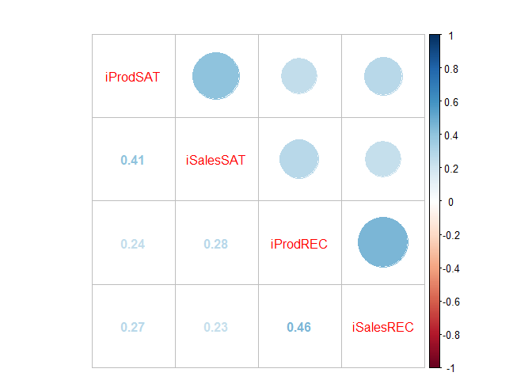
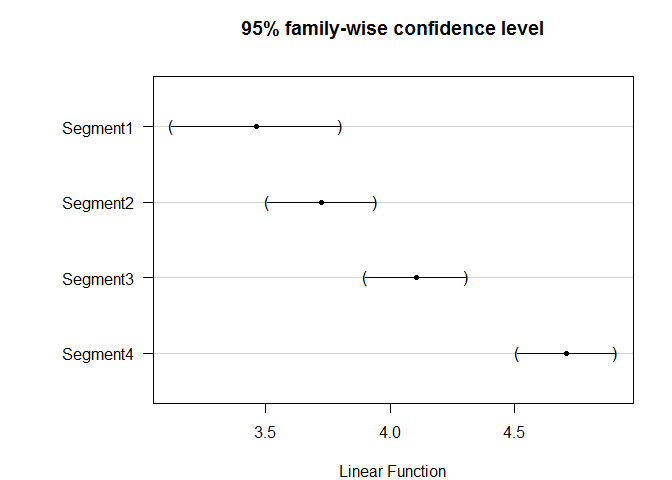

# R for maketing
ksg  
2015년 7월 14일  

#2. An Overview of the R Language
##2) A Quick Tour of R’s Capabilities
  - 데이터 불러오기, segment변수 명목형 변수로 변형, 
  - install.packages(c("lavaan", "semPlot", "corrplot", "multcomp", "scales"))

```r
satData <- read.csv("http://goo.gl/UDv12g")
head(satData)
```

```
##   iProdSAT iSalesSAT Segment iProdREC iSalesREC
## 1        6         2       1        4         3
## 2        4         5       3        4         4
## 3        5         3       4        5         4
## 4        3         3       2        4         4
## 5        3         3       3        2         2
## 6        4         4       4        5         4
```

```r
satData$Segment <- factor(satData$Segment)
summary(satData)
```

```
##     iProdSAT      iSalesSAT     Segment    iProdREC       iSalesREC    
##  Min.   :1.00   Min.   :1.000   1: 54   Min.   :1.000   Min.   :1.000  
##  1st Qu.:3.00   1st Qu.:3.000   2:131   1st Qu.:3.000   1st Qu.:3.000  
##  Median :4.00   Median :4.000   3:154   Median :4.000   Median :3.000  
##  Mean   :4.13   Mean   :3.802   4:161   Mean   :4.044   Mean   :3.444  
##  3rd Qu.:5.00   3rd Qu.:5.000           3rd Qu.:5.000   3rd Qu.:4.000  
##  Max.   :7.00   Max.   :7.000           Max.   :7.000   Max.   :7.000
```


  - 상관계수 행렬그림, 변량별 평균값, 변량분석

```r
library(corrplot)
corrplot.mixed(cor(satData[,-3]))
```

 

```r
aggregate(iProdSAT~Segment, satData, mean)
```

```
##   Segment iProdSAT
## 1       1 3.462963
## 2       2 3.725191
## 3       3 4.103896
## 4       4 4.708075
```

```r
sat.anova <- aov(iProdSAT~-1+Segment, satData)
summary(sat.anova)
```

```
##            Df Sum Sq Mean Sq F value Pr(>F)    
## Segment     4   8628    2157    2161 <2e-16 ***
## Residuals 496    495       1                   
## ---
## Signif. codes:  0 '***' 0.001 '**' 0.01 '*' 0.05 '.' 0.1 ' ' 1
```


  - segment별 평균값 및 신뢰구간 plot 생성

```r
library(multcomp)
```

```
## Warning: package 'multcomp' was built under R version 3.2.2
```

```
## Loading required package: mvtnorm
## Loading required package: survival
## Loading required package: TH.data
```

```
## Warning: package 'TH.data' was built under R version 3.2.2
```

```r
par(mar=c(4,8,4,2))
plot(glht(sat.anova))
```

 


  - fit a structural equation model
  - satisfaction (“SAT”)and likelihood-to-recommend(“REC”)-8장, 10장에서 다룰예정

```r
satModel <- "SAT =~ iProdSAT + iSalesSAT
             REC =~ iProdREC + iSalesREC
             REC ~ SAT "
```


  - fit that model to the data using the lavaan package

```r
library(lavaan)
```

```
## Warning: package 'lavaan' was built under R version 3.2.2
```

```
## This is lavaan 0.5-18
## lavaan is BETA software! Please report any bugs.
```

```r
sat.fit <- cfa(satModel, data=satData)
summary(sat.fit, fit.m=TRUE)
```

```
## lavaan (0.5-18) converged normally after  31 iterations
## 
##   Number of observations                           500
## 
##   Estimator                                         ML
##   Minimum Function Test Statistic                2.319
##   Degrees of freedom                                 1
##   P-value (Chi-square)                           0.128
## 
## Model test baseline model:
## 
##   Minimum Function Test Statistic              278.557
##   Degrees of freedom                                 6
##   P-value                                        0.000
## 
## User model versus baseline model:
## 
##   Comparative Fit Index (CFI)                    0.995
##   Tucker-Lewis Index (TLI)                       0.971
## 
## Loglikelihood and Information Criteria:
## 
##   Loglikelihood user model (H0)              -3040.385
##   Loglikelihood unrestricted model (H1)      -3039.225
## 
##   Number of free parameters                          9
##   Akaike (AIC)                                6098.769
##   Bayesian (BIC)                              6136.701
##   Sample-size adjusted Bayesian (BIC)         6108.134
## 
## Root Mean Square Error of Approximation:
## 
##   RMSEA                                          0.051
##   90 Percent Confidence Interval          0.000  0.142
##   P-value RMSEA <= 0.05                          0.347
## 
## Standardized Root Mean Square Residual:
## 
##   SRMR                                           0.012
## 
## Parameter estimates:
## 
##   Information                                 Expected
##   Standard Errors                             Standard
## 
##                    Estimate  Std.err  Z-value  P(>|z|)
## Latent variables:
##   SAT =~
##     iProdSAT          1.000
##     iSalesSAT         1.067    0.173    6.154    0.000
##   REC =~
##     iProdREC          1.000
##     iSalesREC         0.900    0.138    6.528    0.000
## 
## Regressions:
##   REC ~
##     SAT               0.758    0.131    5.804    0.000
## 
## Variances:
##     iProdSAT          0.706    0.088
##     iSalesSAT         0.793    0.100
##     iProdREC          0.892    0.129
##     iSalesREC         0.808    0.107
##     SAT               0.483    0.097
##     REC               0.516    0.115
```


  - visualize the structural model using the semPlot

```r
library(semPlot)
```

```
## Warning: package 'semPlot' was built under R version 3.2.2
```

```r
semPaths(sat.fit, what="est", residuals=FALSE, intercepts=FALSE, nCharNodes=9)
```

 


##3) Basics of Working with R Commands
  - 콘솔 및 스크립트파일
  - CTRL+R on Windows, CTRL+Enter on Windows, Command+Enter on a Mac.
  - 주석을 쓸때는 "#"을 붙여주세요

```r
x<-c(2,4,6,8)
```


##2.4 Basic Objects (vector, list)
  - three most important R data types: vectors, lists, and data frames.
  - introduce the process of writing functions.

```r
x <- c(2, 4, 6, 8)
xNum <- c(1, 3.14159, 5, 7)
xLog <- c(TRUE, FALSE, TRUE, TRUE)
xChar <- c("foo", "bar", "boo", "far")
xMix <- c(1, TRUE, 3, "Hello, world!")
xNum
```

```
## [1] 1.00000 3.14159 5.00000 7.00000
```

```r
x2 <- c(x, x)
x2
```

```
## [1] 2 4 6 8 2 4 6 8
```


  - vector
  - summary function
  - vectors of numerics :  range and central tendency statistics, 
  - vectors of characters : length of the vector and the type of the elements

```r
summary(xNum)
```

```
##    Min. 1st Qu.  Median    Mean 3rd Qu.    Max. 
##   1.000   2.606   4.071   4.035   5.500   7.000
```

```r
summary(xChar)
```

```
##    Length     Class      Mode 
##         4 character character
```


  - mathematical language that understands vectors, matrices, and other structures
  - recycles the elements to match a longer set (x+cos(0.5)) * x2

```r
xNum[2]  
```

```
## [1] 3.14159
```

```r
x2 + 1   
```

```
## [1] 3 5 7 9 3 5 7 9
```

```r
x2 * pi
```

```
## [1]  6.283185 12.566371 18.849556 25.132741  6.283185 12.566371 18.849556
## [8] 25.132741
```

```r
(x+cos(0.5)) * x2  #recycles the elements to match a longer set
```

```
## [1]  5.755165 19.510330 41.265495 71.020660  5.755165 19.510330 41.265495
## [8] 71.020660
```

```r
length(x)
```

```
## [1] 4
```

```r
length(x2)
```

```
## [1] 8
```


  - R automatically assigns a data type or class to all elements
  - logical (TRUE/FALSE), integer (0,1,2), character(“hello,world!”), double (3.14159)
  - str() function is a good way to see detailed information

```r
c(1, 2, 3.5)
```

```
## [1] 1.0 2.0 3.5
```

```r
xMix
```

```
## [1] "1"             "TRUE"          "3"             "Hello, world!"
```

```r
as.numeric(xMix[1])+1
```

```
## [1] 2
```

```r
str(xNum)
```

```
##  num [1:4] 1 3.14 5 7
```

```r
str(xChar)
```

```
##  chr [1:4] "foo" "bar" "boo" "far"
```

```r
str(xMix)
```

```
##  chr [1:4] "1" "TRUE" "3" "Hello, world!"
```


  - More on Vectors and Indexing

```r
xSeq <- 1:10
xSeq
```

```
##  [1]  1  2  3  4  5  6  7  8  9 10
```

```r
xNum
```

```
## [1] 1.00000 3.14159 5.00000 7.00000
```

```r
xNum[2:4]
```

```
## [1] 3.14159 5.00000 7.00000
```

```r
myStart <- 2
xNum[myStart:sqrt(myStart+7)]
```

```
## [1] 3.14159 5.00000
```


  - complex sequences, use seq() (“sequence”) and rep() (“replicate”)
  - Exclude items []

```r
seq(from=-5, to=28, by=4)
```

```
## [1] -5 -1  3  7 11 15 19 23 27
```

```r
rep(c(1,2,3), each=3)
```

```
## [1] 1 1 1 2 2 2 3 3 3
```

```r
rep(seq(from=-3, to=13, by=4), c(1, 2, 3, 2, 1))
```

```
## [1] -3  1  1  5  5  5  9  9 13
```

```r
xSeq
```

```
##  [1]  1  2  3  4  5  6  7  8  9 10
```

```r
xSeq[-5:-7]
```

```
## [1]  1  2  3  4  8  9 10
```

```r
xSub <- xNum[2:4]
xSub
```

```
## [1] 3.14159 5.00000 7.00000
```

```r
xNum
```

```
## [1] 1.00000 3.14159 5.00000 7.00000
```

```r
xNum[c(FALSE, TRUE, TRUE, TRUE)]
```

```
## [1] 3.14159 5.00000 7.00000
```

```r
xNum[xNum > 3]
```

```
## [1] 3.14159 5.00000 7.00000
```


  - Missing and Interesting Values
  - NA 존재시 계산결과가 안나옴 / #NA 삭제 또는 제외, 확인 /#-999, -99 주의

```r
my.test.scores <- c(91, NA, NA)
mean(my.test.scores)
```

```
## [1] NA
```

```r
max(my.test.scores)
```

```
## [1] NA
```

```r
mean(my.test.scores, na.rm=TRUE) 
```

```
## [1] 91
```

```r
max(my.test.scores, na.rm=TRUE)
```

```
## [1] 91
```

```r
mean(na.omit(my.test.scores)) 
```

```
## [1] 91
```

```r
na.omit(my.test.scores)
```

```
## [1] 91
## attr(,"na.action")
## [1] 2 3
## attr(,"class")
## [1] "omit"
```

```r
is.na(my.test.scores)
```

```
## [1] FALSE  TRUE  TRUE
```

```r
my.test.scores[!is.na(my.test.scores)]
```

```
## [1] 91
```

```r
my.test.scores <- c(91, -999, -999)
my.test.scores[my.test.scores < -900] <- NA
mean(my.test.scores)
```

```
## [1] NA
```

```r
log(c(-1,0,1))
```

```
## Warning in log(c(-1, 0, 1)): NaN이 생성되었습니다
```

```
## [1]  NaN -Inf    0
```


  - list
  - lists are indexed with double brackets

```r
str(xNum)
```

```
##  num [1:4] 1 3.14 5 7
```

```r
str(xChar)
```

```
##  chr [1:4] "foo" "bar" "boo" "far"
```

```r
xList <- list(xNum, xChar)
xList
```

```
## [[1]]
## [1] 1.00000 3.14159 5.00000 7.00000
## 
## [[2]]
## [1] "foo" "bar" "boo" "far"
```

```r
str(xList)
```

```
## List of 2
##  $ : num [1:4] 1 3.14 5 7
##  $ : chr [1:4] "foo" "bar" "boo" "far"
```

```r
summary(xList[[1]])
```

```
##    Min. 1st Qu.  Median    Mean 3rd Qu.    Max. 
##   1.000   2.606   4.071   4.035   5.500   7.000
```

```r
lapply(xList, summary)
```

```
## [[1]]
##    Min. 1st Qu.  Median    Mean 3rd Qu.    Max. 
##   1.000   2.606   4.071   4.035   5.500   7.000 
## 
## [[2]]
##    Length     Class      Mode 
##         4 character character
```


  - names() function : assigned a name

```r
xList <- list(xNum, xChar)
names(xList) <- c("itemnum", "itemchar")
xList <- list(itemnum=xNum, itemchar=xChar)
names(xList)
```

```
## [1] "itemnum"  "itemchar"
```


  - use $name or [["name"]]

```r
xList[[1]]
```

```
## [1] 1.00000 3.14159 5.00000 7.00000
```

```r
xList$itemnum
```

```
## [1] 1.00000 3.14159 5.00000 7.00000
```

```r
xList[["itemnum"]]
```

```
## [1] 1.00000 3.14159 5.00000 7.00000
```


##5) Data Frames
  - row = variables / column = observations

```r
x.df <- data.frame(xNum, xLog, xChar)
x.df
```

```
##      xNum  xLog xChar
## 1 1.00000  TRUE   foo
## 2 3.14159 FALSE   bar
## 3 5.00000  TRUE   boo
## 4 7.00000  TRUE   far
```

```r
x.df[2,1]
```

```
## [1] 3.14159
```

```r
x.df[1,3]
```

```
## [1] foo
## Levels: bar boo far foo
```

```r
x.df[2, ] # all of row 2
```

```
##      xNum  xLog xChar
## 2 3.14159 FALSE   bar
```

```r
x.df[ ,3] # all of column 3
```

```
## [1] foo bar boo far
## Levels: bar boo far foo
```

```r
x.df[2:3, ]
```

```
##      xNum  xLog xChar
## 2 3.14159 FALSE   bar
## 3 5.00000  TRUE   boo
```

```r
x.df[ ,1:2]
```

```
##      xNum  xLog
## 1 1.00000  TRUE
## 2 3.14159 FALSE
## 3 5.00000  TRUE
## 4 7.00000  TRUE
```

```r
x.df[-3, ]
```

```
##      xNum  xLog xChar
## 1 1.00000  TRUE   foo
## 2 3.14159 FALSE   bar
## 4 7.00000  TRUE   far
```

```r
x.df[, -2]
```

```
##      xNum xChar
## 1 1.00000   foo
## 2 3.14159   bar
## 3 5.00000   boo
## 4 7.00000   far
```


  - stringsAsFactors=FALSE (통계 분석시 원소를 명목형 자료로 변환하여 분석하는 경우가 많음)
  - '주소'등과 같은 단순텍스트는 팩터로로 변환하면 안됌 ##stringsAsFactors=FALSE 사용

```r
x.df <- data.frame(xNum, xLog, xChar,stringsAsFactors=FALSE)
x.df
```

```
##      xNum  xLog xChar
## 1 1.00000  TRUE   foo
## 2 3.14159 FALSE   bar
## 3 5.00000  TRUE   boo
## 4 7.00000  TRUE   far
```

```r
x.df[1,3]
```

```
## [1] "foo"
```


  - 행과 열 지정시 한개의 원소
  - 열만 지정시 벡터를 반환함
  - 행만 지정할시 새로운 dataframe을 반환

```r
str(x.df[2,1])
```

```
##  num 3.14
```

```r
str(x.df[, 2])
```

```
##  logi [1:4] TRUE FALSE TRUE TRUE
```

```r
str(x.df[c(1,3), ]) 
```

```
## 'data.frame':	2 obs. of  3 variables:
##  $ xNum : num  1 5
##  $ xLog : logi  TRUE TRUE
##  $ xChar: chr  "foo" "boo"
```


  - collummns을 변수로 활용

```r
x.df$xNum
```

```
## [1] 1.00000 3.14159 5.00000 7.00000
```


  - 데이터 프레임을 만들어보자!

```r
store.num <- factor(c(3, 14, 21, 32, 54))
store.rev <- c(543, 654, 345, 678, 234)
store.visits <- c(45, 78, 32, 56, 34)
store.manager <- c("Annie", "Bert", "Carla", "Dave", "Ella")
(store.df <- data.frame(store.num, store.rev, store.visits,
 store.manager, stringsAsFactors=F))
```

```
##   store.num store.rev store.visits store.manager
## 1         3       543           45         Annie
## 2        14       654           78          Bert
## 3        21       345           32         Carla
## 4        32       678           56          Dave
## 5        54       234           34          Ella
```


  - 데이터 프레임을 조작해보자!

```r
store.df$store.manager
```

```
## [1] "Annie" "Bert"  "Carla" "Dave"  "Ella"
```

```r
mean(store.df$store.rev)
```

```
## [1] 490.8
```

```r
cor(store.df$store.rev, store.df$store.visits)
```

```
## [1] 0.8291032
```

```r
summary(store.df)
```

```
##  store.num   store.rev      store.visits store.manager     
##  3 :1      Min.   :234.0   Min.   :32    Length:5          
##  14:1      1st Qu.:345.0   1st Qu.:34    Class :character  
##  21:1      Median :543.0   Median :45    Mode  :character  
##  32:1      Mean   :490.8   Mean   :49                      
##  54:1      3rd Qu.:654.0   3rd Qu.:56                      
##            Max.   :678.0   Max.   :78
```


##6) Loading and Saving Data
  - data 저장 및 로딩

```r
save(store.df, file="store-df-backup.RData")
rm(store.df) # caution, only if save() gave no error
load("store-df-backup.RData")
mean(store.df$store.rev)
```

```
## [1] 490.8
```


   - 복수의 data list로 묶어서 저장

```r
save(list=c("store.df","store.visits"), file="store-df-backup.RData")
```


  - 워킹디렉토리 확인 / 새로운 워킹디렉토리 설정 / 폴더내 파일확인 / 파일 삭제

```r
getwd()
```

```
## [1] "D:/study/Psygement/소비자ON/R_marketing/ch2"
```

```r
#setwd("G:/R_study")
list.files()
```

```
## [1] "R-marketing_ch2.html"  "R-marketing_ch2.Rmd"   "R-marketing_ch2_files"
## [4] "store-df-backup.RData"
```

```r
file.remove("store-df-backup.RData")
```

```
## [1] TRUE
```


  - csv 파일 저장 및 로딩
  - 파일명 지정없을시 output이 저장되고, 파일명 지정시 해당 data가 저장됨

```r
write.csv(store.df, row.names=FALSE)
```

```
## "store.num","store.rev","store.visits","store.manager"
## "3",543,45,"Annie"
## "14",654,78,"Bert"
## "21",345,32,"Carla"
## "32",678,56,"Dave"
## "54",234,34,"Ella"
```

```r
write.csv(store.df, file="store-df.csv", row.names=FALSE)
read.csv("store-df.csv")
```

```
##   store.num store.rev store.visits store.manager
## 1         3       543           45         Annie
## 2        14       654           78          Bert
## 3        21       345           32         Carla
## 4        32       678           56          Dave
## 5        54       234           34          Ella
```


  - csv 파일은 자동으로 dataframe으로 불러짐
  - dataframe은 문자를 모두 명목형자료(팩터)로 불러오기때문에 stringsAsFactors=FALSE 사용
  - csv를 불러왔을때, 팩터로 지정되지 않은 변수들이 존재할수 있음, 팩터처리해 줌(csv파일특성)

```r
store.df2 <- read.csv("store-df.csv", stringsAsFactors=FALSE)
all.equal(store.df, store.df2)
```

```
## [1] "Component \"store.num\": 'current' is not a factor"
```

```r
store.df2$store.num <- factor(store.df2$store.num)
all.equal(store.df, store.df2)
```

```
## [1] TRUE
```


##7.1) Writing Your Own Functions
  - 특정 목정에 맞게 생성된 연산과정의 집합
  - 이름 / function / 인수(argument) / 몸체(body) 4부분으로 구성
  - 형태 : name<-function(argument_1...argument_k) {body}

```r
se <- function(x) { sd(x) / sqrt(length(x)) }
se(store.df$store.visits)
```

```
## [1] 8.42615
```

```r
mean(store.df$store.visits) + 1.96 * se(store.df$store.visits)
```

```
## [1] 65.51525
```

```r
se(store.df$store.manager)
```

```
## Warning in var(if (is.vector(x)) x else as.double(x), na.rm = na.rm): 강제
## 형변환에 의해 생성된 NA 입니다
```

```
## [1] NA
```

 
  - 함수작성 시 조언
  - Put braces around the body using { and }, even if it’s just a one line function
  - Create temporary values to hold results along the way inside the function
  - Comment the function profusely
  - Use the keyword return() to show the explicit value returned by the function.

```r
se <- function(x) {
# computes standard error of the mean
tmp.sd <- sd(x) # standard deviation
tmp.N <- length(x) # sample size
tmp.se <- tmp.sd / sqrt(tmp.N) # std error of the mean
return(tmp.se)
}
se
```

```
## function(x) {
## # computes standard error of the mean
## tmp.sd <- sd(x) # standard deviation
## tmp.N <- length(x) # sample size
## tmp.se <- tmp.sd / sqrt(tmp.N) # std error of the mean
## return(tmp.se)
## }
```


##7.2) Language Structures*

  - if 명령문
  - if(condition) {state_1......state_k}

```r
x<-3
y<-c(-1,0,1)
if(x>2) x+2
```

```
## [1] 5
```

```r
if(x==3&&y==-1) {
  x<-x^3
  y<-y*y
  cat("you are hero")
}
```

```
## you are hero
```

```r
x;y
```

```
## [1] 27
```

```
## [1] 1 0 1
```


  - if...else명령문
  - if(condition) {state_1......state_k} else {state_1......state_k}
  - elseif 명령문 #각자 찾아 봅시다.

```r
x<--15
y<-50
if(x>y) cat("almost finished") else cat("about 10minute left")
```

```
## about 10minute left
```

```r
if(x>y) {
  cat("almost finished") 
    if(x%%2==0) 
      cat("AA") else 
      cat("BB")
} else {
  cat("about 10minute left") 
    if(y%%2==0) 
      cat("you are champion") else 
      cat("cc")
}
```

```
## about 10minute leftyou are champion
```
  
  
  - ifelse() 함수
  - ifelse(contion, yes, no)

```r
ifelse(x>0, yes="loser", no="champion")
```

```
## [1] "champion"
```

```r
ifelse(y>0, y, -y)
```

```
## [1] 50
```


  - switch() 함수
  - switch(조건, statement_1, ......, statement_k)
  - 여러개의 대안중 하나를 선택하여 실행 하는 기능

```r
x<-1:10
switch(2, mean(x), sum(x), sd(x), var(x))
```

```
## [1] 55
```


  - repeat 명령문
  - 단순한 형태의 반복문으로 break명령문과 함께 사용해야함
  - repeat{statement_1, ... , statement_k}

```r
start<-1 ; x<-1
repeat{
  start<-start+x
  if(x>=10) break
  x<-x+1
}
start
```

```
## [1] 56
```


  - for 명령문
  - 일반적으로 루핑을 수행하기 위해 가장 많이 사용하는 명령문
  - for(name in vector) {state_1, ... , state_k}

```r
for(i in 1:3) {x=i*3 ; print(x)}
```

```
## [1] 3
## [1] 6
## [1] 9
```

```r
P<-c(150,100,80,90,120)
Q<-c(3,4,5,7,2)
value<-0
for(i in 1:5) {
  value<-value+P[i]*Q[i]
  cat(value,"\n")
  }
```

```
## 450 
## 850 
## 1250 
## 1880 
## 2120
```


  - while 명령문
  - 조건하에 판별결과가 참인 경우에만 반복실행하는 명령문
  - while(조건) {state_1, ...state_k}

```r
x<-1
while(x<=5){
  cat("almost finishied")
  x<-x+1
  }
```

```
## almost finishiedalmost finishiedalmost finishiedalmost finishiedalmost finishied
```


##7.2) Anonymous Functions


```r
my.data <- matrix(runif(100), ncol=5) # 100 random numbers in 5 columns
apply(my.data, 2, median) / 2
```

```
## [1] 0.3373758 0.2149183 0.2693862 0.3080907 0.2950589
```


```r
halfmedian <- function (x) { median(x) / 2 }
apply(my.data, 2, halfmedian)
```

```
## [1] 0.3373758 0.2149183 0.2693862 0.3080907 0.2950589
```

```r
apply(my.data, 2, function(x) { median(x) / 2 } )
```

```
## [1] 0.3373758 0.2149183 0.2693862 0.3080907 0.2950589
```


##8) Clean Up!

```r
ls()
```

```
##  [1] "halfmedian"     "i"              "my.data"        "my.test.scores"
##  [5] "myStart"        "P"              "Q"              "sat.anova"     
##  [9] "sat.fit"        "satData"        "satModel"       "se"            
## [13] "start"          "store.df"       "store.df2"      "store.manager" 
## [17] "store.num"      "store.rev"      "store.visits"   "value"         
## [21] "x"              "x.df"           "x2"             "xChar"         
## [25] "xList"          "xLog"           "xMix"           "xNum"          
## [29] "xSeq"           "xSub"           "y"
```

```r
rm(store.num)
rm(list=c("store.rev", "store.visits"))
rm(list=ls(pattern="store"))
rm(list=ls())
```
