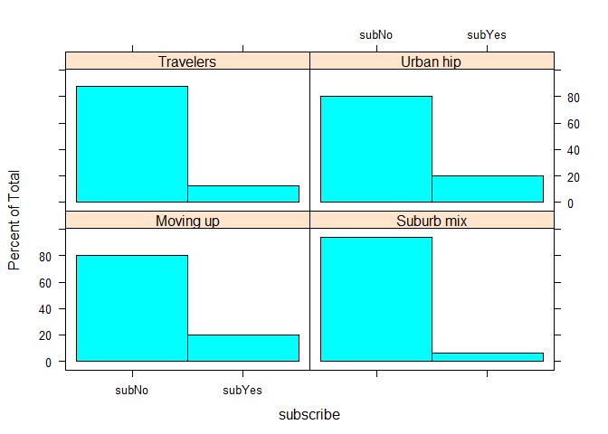
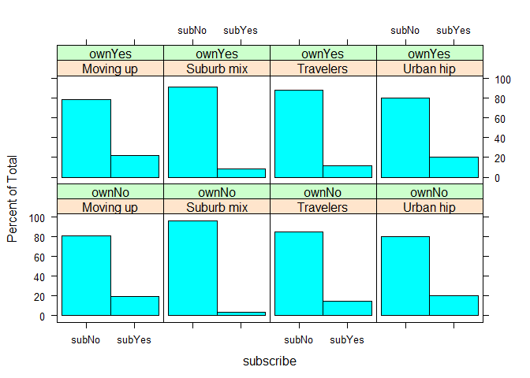
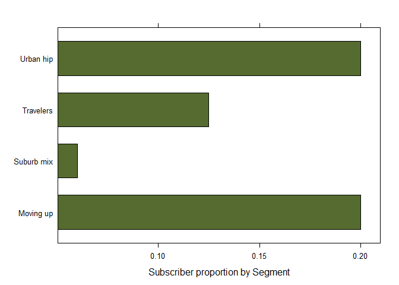
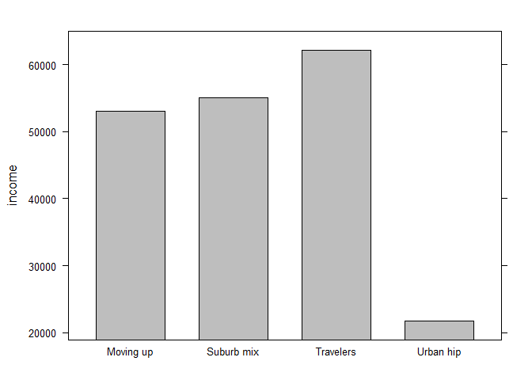
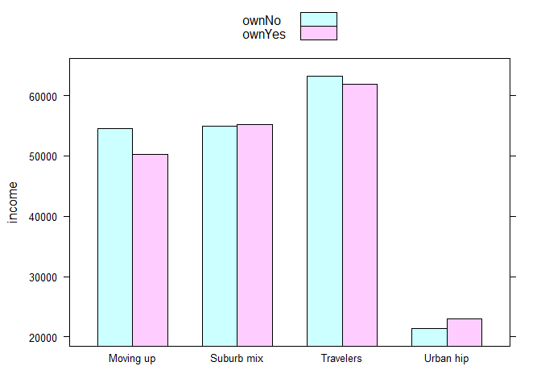
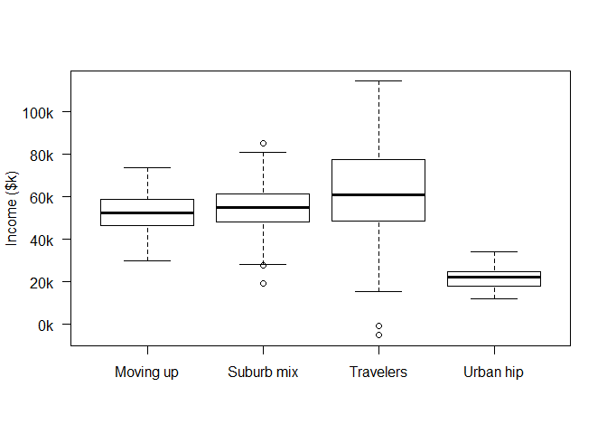
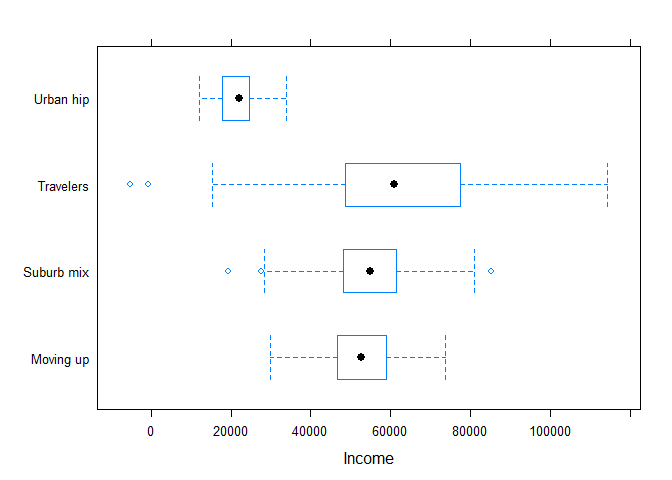
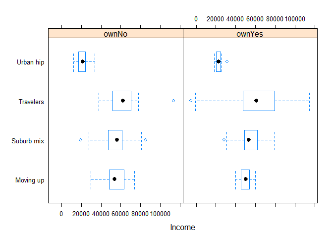

# ch5
kimsungguen  
2015년 12월 5일  

## 5. Comparing Groups: Tables and Visualizations
### 5.1 Simulating Consumer Segment Data
  - 마케팅 분석은 종종 그룹간의 차이점을 분석함
  - 소비자의 세그먼트 데이터로 비교를해볼것이다.
  - 생성할 데이터 원본(케이블 방송 가입자 데이터와 유사)


```r
seg.df <- read.csv("http://goo.gl/qw303p")
```


```r
summary(seg.df)
```

```
##       age           gender        income            kids        ownHome   
##  Min.   :19.26   Female:157   Min.   : -5183   Min.   :0.00   ownNo :159  
##  1st Qu.:33.01   Male  :143   1st Qu.: 39656   1st Qu.:0.00   ownYes:141  
##  Median :39.49                Median : 52014   Median :1.00               
##  Mean   :41.20                Mean   : 50937   Mean   :1.27               
##  3rd Qu.:47.90                3rd Qu.: 61403   3rd Qu.:2.00               
##  Max.   :80.49                Max.   :114278   Max.   :7.00               
##   subscribe         Segment   
##  subNo :260   Moving up : 70  
##  subYes: 40   Suburb mix:100  
##               Travelers : 80  
##               Urban hip : 50  
##                               
## 
```


```r
head(seg.df)
```

```
##        age gender   income kids ownHome subscribe    Segment
## 1 47.31613   Male 49482.81    2   ownNo     subNo Suburb mix
## 2 31.38684   Male 35546.29    1  ownYes     subNo Suburb mix
## 3 43.20034   Male 44169.19    0  ownYes     subNo Suburb mix
## 4 37.31700 Female 81041.99    1   ownNo     subNo Suburb mix
## 5 40.95439 Female 79353.01    3  ownYes     subNo Suburb mix
## 6 43.03387   Male 58143.36    4  ownYes     subNo Suburb mix
```


```r
str(seg.df)
```

```
## 'data.frame':	300 obs. of  7 variables:
##  $ age      : num  47.3 31.4 43.2 37.3 41 ...
##  $ gender   : Factor w/ 2 levels "Female","Male": 2 2 2 1 1 2 2 2 1 1 ...
##  $ income   : num  49483 35546 44169 81042 79353 ...
##  $ kids     : int  2 1 0 1 3 4 3 0 1 0 ...
##  $ ownHome  : Factor w/ 2 levels "ownNo","ownYes": 1 2 2 1 2 2 1 1 1 2 ...
##  $ subscribe: Factor w/ 2 levels "subNo","subYes": 1 1 1 1 1 1 1 1 1 1 ...
##  $ Segment  : Factor w/ 4 levels "Moving up","Suburb mix",..: 2 2 2 2 2 2 2 2 2 2 ...
```


  - 데이터 구조 정의(변수, 데이터 타입 등)
  - 변수의 분포를 결정하는 모수 설정 (평균, 편차 등)
  - 전체 데이터를 랜덤하게 채워넣는 반복코드 사용(for 문)


```r
segVars <- c("age","gender","income","kids","ownHome","subscribe") #데이터 변수
segVarType <- c("norm","binom","norm","pois","binom","binom") #변수생성 확률분포
segNames <- c("Suburb mix","Urban hip","Travelers","Moving up") #세그먼트
segSize <- c(100,50,80,70)   #세그먼트별 data 크기

#세그먼트별 각 변인의 평균(나이,성별,수익) , 이산확률(성별,자가,회원), 포아송람다(자녀)
segMeans <- matrix( c(    
  40, 0.5, 55000, 2, 0.5, 0.1,
  24, 0.7, 21000, 1, 0.2, 0.2,
  58, 0.5, 64000, 0, 0.7, 0.05,
  36, 0.3, 52000, 2, 0.3, 0.2   ), ncol=length(segVars), byrow=TRUE)

segMeans
```

```
##      [,1] [,2]  [,3] [,4] [,5] [,6]
## [1,]   40  0.5 55000    2  0.5 0.10
## [2,]   24  0.7 21000    1  0.2 0.20
## [3,]   58  0.5 64000    0  0.7 0.05
## [4,]   36  0.3 52000    2  0.3 0.20
```


```r
#세그먼트별 각 변인의 표준편차(나이, 수입)
segSDs <- matrix ( c(
  5, NA, 12000, NA, NA, NA,
  2, NA, 5000, NA, NA, NA,
  8, NA, 21000, NA, NA, NA,
  4, NA, 10000, NA, NA, NA ), ncol=length(segVars), byrow=TRUE)

segSDs
```

```
##      [,1] [,2]  [,3] [,4] [,5] [,6]
## [1,]    5   NA 12000   NA   NA   NA
## [2,]    2   NA  5000   NA   NA   NA
## [3,]    8   NA 21000   NA   NA   NA
## [4,]    4   NA 10000   NA   NA   NA
```

  - for문, if~else문 활용하여 데이터 생성

```r
seg.df <- NULL
set.seed(02554)
for (i in seq_along(segNames)) { 
 cat(i, segNames[i], "\n")

 this.seg <- data.frame(matrix(NA, nrow = segSize[i], ncol=length(segVars)))
 for (j in seq_along(segVars)) {
  if (segVarType[j] == "norm") {
    this.seg[,j] <- rnorm(segSize[i], mean=segMeans[i,j], sd=segSDs[i,j])
  } else if (segVarType[j] == "pois") {
    this.seg[,j] <- rpois(segSize[i], lambda=segMeans[i,j])
  } else if (segVarType[j] == "binom") {
    this.seg[,j] <- rbinom(segSize[i], size=1, prob=segMeans[i,j])
  } else {
    stop("Bad segment data type: ", segVarType[i])
  }
 }
 seg.df <- rbind(seg.df, this.seg)
}
```

```
## 1 Suburb mix 
## 2 Urban hip 
## 3 Travelers 
## 4 Moving up
```

  - 변인 이름 추가

```r
head(seg.df)
```

```
##         X1 X2       X3 X4 X5 X6
## 1 47.31613  1 49482.81  2  0  0
## 2 31.38684  1 35546.29  1  1  0
## 3 43.20034  1 44169.19  0  1  0
## 4 37.31700  0 81041.99  1  0  0
## 5 40.95439  0 79353.01  3  1  0
## 6 43.03387  1 58143.36  4  1  0
```


```r
names(seg.df) <- segVars
head(seg.df)
```

```
##        age gender   income kids ownHome subscribe
## 1 47.31613      1 49482.81    2       0         0
## 2 31.38684      1 35546.29    1       1         0
## 3 43.20034      1 44169.19    0       1         0
## 4 37.31700      0 81041.99    1       0         0
## 5 40.95439      0 79353.01    3       1         0
## 6 43.03387      1 58143.36    4       1         0
```


  - 세그먼트 변수 추가하고, 명목형 변수 처리


```r
seg.df$Segment <- factor(rep(segNames, times=segSize))
head(seg.df)
```

```
##        age gender   income kids ownHome subscribe    Segment
## 1 47.31613      1 49482.81    2       0         0 Suburb mix
## 2 31.38684      1 35546.29    1       1         0 Suburb mix
## 3 43.20034      1 44169.19    0       1         0 Suburb mix
## 4 37.31700      0 81041.99    1       0         0 Suburb mix
## 5 40.95439      0 79353.01    3       1         0 Suburb mix
## 6 43.03387      1 58143.36    4       1         0 Suburb mix
```
  
  - 이산형 데이터 라벨부여(자가, 성별, 구독여부)

```r
seg.df$ownHome <- factor(seg.df$ownHome, labels=c("ownNo","ownYes"))
seg.df$gender  <- factor(seg.df$gender, labels=c("Female", "Male"))
seg.df$subscribe <- factor(seg.df$subscribe, labels=c("subNo", "subYes"))
```

  - 최종데이터

```r
head(seg.df)
```

```
##        age gender   income kids ownHome subscribe    Segment
## 1 47.31613   Male 49482.81    2   ownNo     subNo Suburb mix
## 2 31.38684   Male 35546.29    1  ownYes     subNo Suburb mix
## 3 43.20034   Male 44169.19    0  ownYes     subNo Suburb mix
## 4 37.31700 Female 81041.99    1   ownNo     subNo Suburb mix
## 5 40.95439 Female 79353.01    3  ownYes     subNo Suburb mix
## 6 43.03387   Male 58143.36    4  ownYes     subNo Suburb mix
```


### 5.2 Finding Descriptives by Group
  - 특정 세그먼트 데이터 및 통계량 확인


```r
head(seg.df$incom[seg.df$Segment == "Moving up"])
```

```
## [1] 50595.78 50980.48 40590.08 52298.07 57663.86 56977.09
```

```r
seg.df$incom[seg.df$Segment == "Moving up"]
```

```
##  [1] 50595.78 50980.48 40590.08 52298.07 57663.86 56977.09 36411.98
##  [8] 46974.99 65233.26 58739.31 49509.43 57037.86 53792.40 69947.60
## [15] 57265.30 49895.18 52953.41 70541.50 66923.62 39678.95 54864.78
## [22] 60045.47 68037.81 73797.50 53604.17 52110.46 69549.93 50473.36
## [29] 61154.54 65688.53 49267.09 29771.91 51829.62 45637.09 53668.86
## [36] 43413.72 62087.12 49235.02 39779.99 41097.10 52776.42 58756.32
## [43] 44811.78 44125.40 36257.93 45347.01 50720.22 46540.88 50560.17
## [50] 59663.28 55940.78 66007.99 39366.95 54509.25 49308.97 54740.28
## [57] 49775.29 41766.29 73240.62 53520.36 66423.74 41192.28 58933.34
## [64] 52352.69 40522.39 43882.43 64197.09 47580.93 60747.34 53674.93
```

```r
mean(seg.df$income[seg.df$Segment == "Moving up"])
```

```
## [1] 53090.97
```

```r
mean(seg.df$income[seg.df$Segment == "Moving up" & seg.df$subscribe == "subNo"])
```

```
## [1] 53633.73
```
  - by 함수 사용하여 특정 변수기준으로 통계량 확인


```r
by(seg.df$income, seg.df$Segment, mean)
```

```
## seg.df$Segment: Moving up
## [1] 53090.97
## -------------------------------------------------------- 
## seg.df$Segment: Suburb mix
## [1] 55033.82
## -------------------------------------------------------- 
## seg.df$Segment: Travelers
## [1] 62213.94
## -------------------------------------------------------- 
## seg.df$Segment: Urban hip
## [1] 21681.93
```

```r
by(seg.df$income, list(seg.df$Segment, seg.df$subscribe), mean)
```

```
## : Moving up
## : subNo
## [1] 53633.73
## -------------------------------------------------------- 
## : Suburb mix
## : subNo
## [1] 54942.69
## -------------------------------------------------------- 
## : Travelers
## : subNo
## [1] 62746.11
## -------------------------------------------------------- 
## : Urban hip
## : subNo
## [1] 22082.11
## -------------------------------------------------------- 
## : Moving up
## : subYes
## [1] 50919.89
## -------------------------------------------------------- 
## : Suburb mix
## : subYes
## [1] 56461.41
## -------------------------------------------------------- 
## : Travelers
## : subYes
## [1] 58488.77
## -------------------------------------------------------- 
## : Urban hip
## : subYes
## [1] 20081.19
```


  - aggregate 함수 사용하여 특정 변수기준으로 통계량 확인

```r
aggregate(seg.df$income, list(seg.df$Segment), mean)
```

```
##      Group.1        x
## 1  Moving up 53090.97
## 2 Suburb mix 55033.82
## 3  Travelers 62213.94
## 4  Urban hip 21681.93
```


```r
seg.income.mean <- aggregate(seg.df$income, list(seg.df$Segment), mean)
seg.income.mean
```

```
##      Group.1        x
## 1  Moving up 53090.97
## 2 Suburb mix 55033.82
## 3  Travelers 62213.94
## 4  Urban hip 21681.93
```

  - car 패키지 some 함수로 데이터 확인

```r
library(car)
some(seg.df)
```

```
##          age gender   income kids ownHome subscribe    Segment
## 80  39.58306   Male 49815.67    1  ownYes     subNo Suburb mix
## 124 22.30333 Female 24541.24    1   ownNo     subNo  Urban hip
## 136 23.08861   Male 33909.50    3   ownNo     subNo  Urban hip
## 159 75.91358 Female 23968.11    0  ownYes     subNo  Travelers
## 187 58.60794 Female 60168.28    0  ownYes     subNo  Travelers
## 196 46.14294   Male 77294.76    0  ownYes     subNo  Travelers
## 233 46.48570 Female 40590.08    3   ownNo     subNo  Moving up
## 243 36.97339 Female 53792.40    0   ownNo     subNo  Moving up
## 258 30.88631 Female 50473.36    3  ownYes    subYes  Moving up
## 289 26.40436 Female 73240.62    2   ownNo     subNo  Moving up
```

### 5.2.1 Language Brief: Basic Formula Syntax
  - 포뮬러 사용, Multiple variable formula


```r
#aggregate(seg.df$income, list(seg.df$Segment), mean) 같은 
aggregate(income ~ Segment, data=seg.df, mean)
```

```
##      Segment   income
## 1  Moving up 53090.97
## 2 Suburb mix 55033.82
## 3  Travelers 62213.94
## 4  Urban hip 21681.93
```


```r
aggregate(income ~ Segment + ownHome, data = seg.df, mean)
```

```
##      Segment ownHome   income
## 1  Moving up   ownNo 54497.68
## 2 Suburb mix   ownNo 54932.83
## 3  Travelers   ownNo 63188.42
## 4  Urban hip   ownNo 21337.59
## 5  Moving up  ownYes 50216.37
## 6 Suburb mix  ownYes 55143.21
## 7  Travelers  ownYes 61889.12
## 8  Urban hip  ownYes 23059.27
```


```r
aggregate(income ~ Segment + ownHome + subscribe, data = seg.df, mean)
```

```
##       Segment ownHome subscribe   income
## 1   Moving up   ownNo     subNo 55402.89
## 2  Suburb mix   ownNo     subNo 54579.99
## 3   Travelers   ownNo     subNo 65852.54
## 4   Urban hip   ownNo     subNo 21604.16
## 5   Moving up  ownYes     subNo 49898.85
## 6  Suburb mix  ownYes     subNo 55354.86
## 7   Travelers  ownYes     subNo 61749.71
## 8   Urban hip  ownYes     subNo 23993.93
## 9   Moving up   ownNo    subYes 50675.70
## 10 Suburb mix   ownNo    subYes 63753.97
## 11  Travelers   ownNo    subYes 48091.75
## 12  Urban hip   ownNo    subYes 20271.33
## 13  Moving up  ownYes    subYes 51359.44
## 14 Suburb mix  ownYes    subYes 52815.13
## 15  Travelers  ownYes    subYes 62944.64
## 16  Urban hip  ownYes    subYes 19320.64
```


```r
agg.data <- aggregate(income ~ Segment + ownHome, data = seg.df, mean)
agg.data
```

```
##      Segment ownHome   income
## 1  Moving up   ownNo 54497.68
## 2 Suburb mix   ownNo 54932.83
## 3  Travelers   ownNo 63188.42
## 4  Urban hip   ownNo 21337.59
## 5  Moving up  ownYes 50216.37
## 6 Suburb mix  ownYes 55143.21
## 7  Travelers  ownYes 61889.12
## 8  Urban hip  ownYes 23059.27
```


```r
agg.data[2,]
```

```
##      Segment ownHome   income
## 2 Suburb mix   ownNo 54932.83
```

```r
agg.data[2,3]
```

```
## [1] 54932.83
```

  - compute frequencies using table(factor1, factor2, …)

```r
with(seg.df, table(Segment, ownHome))
```

```
##             ownHome
## Segment      ownNo ownYes
##   Moving up     47     23
##   Suburb mix    52     48
##   Travelers     20     60
##   Urban hip     40     10
```

```r
with(seg.df, table(kids, Segment))
```

```
##     Segment
## kids Moving up Suburb mix Travelers Urban hip
##    0        13         11        80        17
##    1        17         36         0        17
##    2        18         22         0        11
##    3        13         19         0         4
##    4         5          7         0         1
##    5         3          3         0         0
##    6         0          2         0         0
##    7         1          0         0         0
```

  - xtabs(formula, data) works with counts to find their total

```r
xtabs(kids ~ Segment, data = seg.df)
```

```
## Segment
##  Moving up Suburb mix  Travelers  Urban hip 
##        134        192          0         55
```

```r
aggregate(kids ~ Segment, data=seg.df, sum)
```

```
##      Segment kids
## 1  Moving up  134
## 2 Suburb mix  192
## 3  Travelers    0
## 4  Urban hip   55
```


```r
seg.tab <- with(seg.df, table(kids, Segment))
apply(seg.tab*0:7, 2, sum)
```

```
##  Moving up Suburb mix  Travelers  Urban hip 
##        134        192          0         55
```

```r
seg.tab <- with(seg.df, table(kids, Segment))
colSums(seg.tab*0:7)
```

```
##  Moving up Suburb mix  Travelers  Urban hip 
##        134        192          0         55
```

###5.2.3 Visualization by Group: Frequencies and Proportions


```r
require(lattice)
```

```
## Loading required package: lattice
```


```r
histogram(~subscribe | Segment, data = seg.df)
```

 


```r
colSums(seg.tab*0:7)
```

```
##  Moving up Suburb mix  Travelers  Urban hip 
##        134        192          0         55
```


```r
histogram(~subscribe | Segment, data = seg.df, type="count", 
          layout=c(4,1), col=c("burlywood", "darkolivegreen"))
```

 


```r
histogram(~subscribe | Segment + ownHome, data=seg.df)
```

 

```r
prop.table(table(seg.df$subscribe, seg.df$Segment), margin=2)          
```

```
##         
##          Moving up Suburb mix Travelers Urban hip
##   subNo      0.800      0.940     0.875     0.800
##   subYes     0.200      0.060     0.125     0.200
```


```r
barchart(prop.table(table(seg.df$subscribe, seg.df$Segment), margin=2)[2,],
         xlab="Subscriber proportion by Segment", col = "darkolivegreen")
```

 
### 5.2.4 Visualization by Group: Continuous Data


```r
seg.mean <- aggregate(income ~ Segment, data=seg.df, mean)
library(lattice)
barchart(income~Segment, data = seg.mean, col="grey")
```

 


```r
seg.income.agg <- aggregate(income ~ Segment + ownHome, data = seg.df, mean)
barchart(income ~ Segment, data=seg.income.agg,
         groups=ownHome, auto.key=TRUE,
         par.setting = simpleTheme(col=terrain.colors(2)))
```

 


```r
boxplot(income ~ Segment, data=seg.df, yaxt="n", ylab="Income ($k)")
ax.seq <- seq(from = 0, to = 120000, by=20000)
axis(side=2, at=ax.seq, labels=paste(ax.seq/1000, "k", sep=""), las=1)
```

 


```r
bwplot(Segment ~ income, data=seg.df, horizontal=TRUE, xlab="Income")
```

 


```r
bwplot(Segment ~ income | ownHome, data=seg.df, horizontal=TRUE, xlab="Income")
```

 

### Key point
  - writing for() loops, use seq along() instead of 1:length()
  - if() and for() blocks, always use brackets (“{” and “}”)
  - When creating a data object, pre-populate it with missing data (NA) and then fill it in
  - by() command can split up data and automatically apply functions such as mean() and summary()
  - aggregate() is even more powerful: it understands formula models and produces
  - Frequency of occurrence can be found with table()/ xtabs() is useful
  - Plots for continuous data by factor may use barchart(), or even better, boxand-whiskers plots with boxplot().
  - bwplot() command a reusable, indexable object with its results
