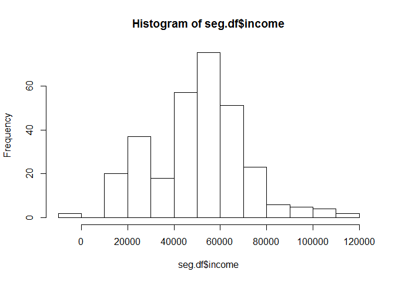
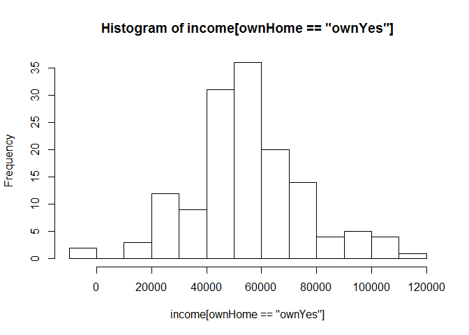
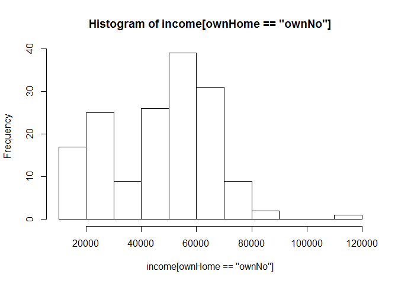
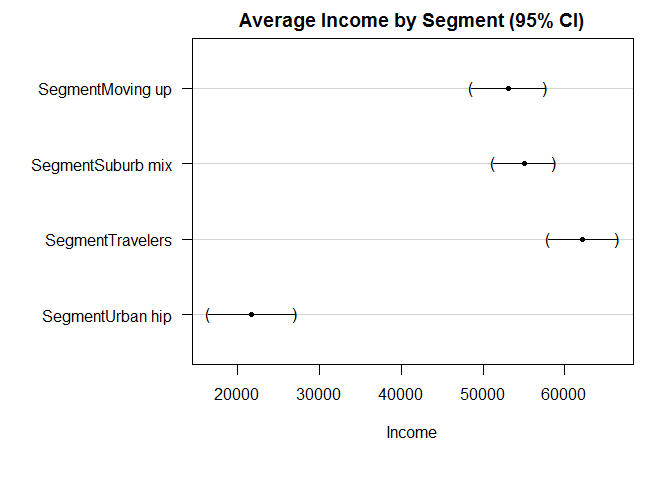
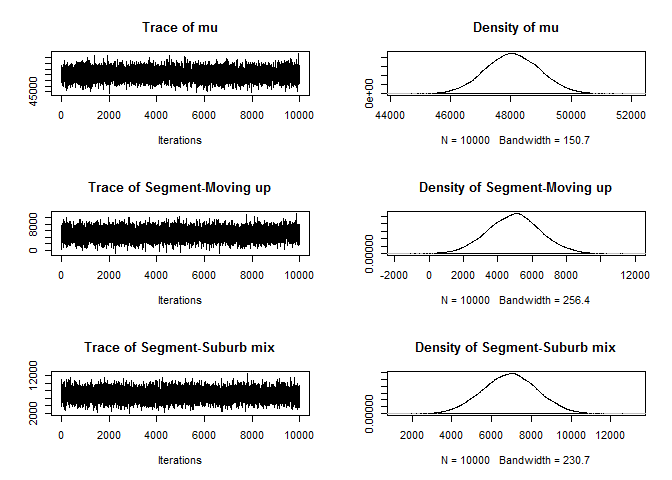
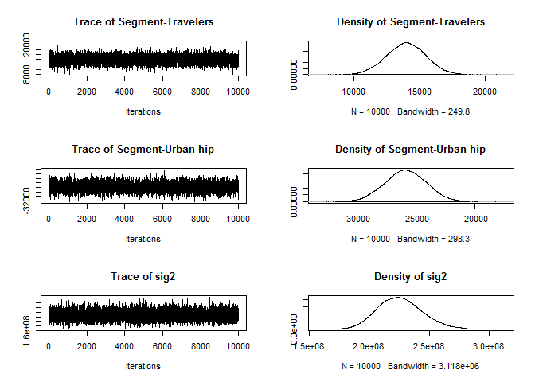

# 6.Comparing Groups: Statistical Tests
ksg  

###6.1 Data for Comparing Groups

```r
seg.df <- read.csv("http://goo.gl/qw303p")
summary(seg.df)
```

```
##       age           gender        income            kids        ownHome   
##  Min.   :19.26   Female:157   Min.   : -5183   Min.   :0.00   ownNo :159  
##  1st Qu.:33.01   Male  :143   1st Qu.: 39656   1st Qu.:0.00   ownYes:141  
##  Median :39.49                Median : 52014   Median :1.00               
##  Mean   :41.20                Mean   : 50937   Mean   :1.27               
##  3rd Qu.:47.90                3rd Qu.: 61403   3rd Qu.:2.00               
##  Max.   :80.49                Max.   :114278   Max.   :7.00               
##   subscribe         Segment   
##  subNo :260   Moving up : 70  
##  subYes: 40   Suburb mix:100  
##               Travelers : 80  
##               Urban hip : 50  
##                               
## 
```


###6.2 Testing Group Frequencies: chisq.test()

  - 영가설 : 그룹간의 차이가 없다
  - 검증 : p값이 0.1~0.05보다 작으면 영가설기가각
  - 결과 : p값이 0.85로 영가설이 지지됨

```r
tmp.tab <- table(rep(c(1:4), times=c(25,25,25,20)))
tmp.tab
```

```
## 
##  1  2  3  4 
## 25 25 25 20
```

```r
chisq.test(tmp.tab)
```

```
## 
## 	Chi-squared test for given probabilities
## 
## data:  tmp.tab
## X-squared = 0.78947, df = 3, p-value = 0.852
```


  - 결과 : p값이 0.05이라 이므로 영가설기각 대립가설지지
  - 그룹간에 유의미한 차이가 있음

```r
tmp.tab <- table(rep(c(1:4), times=c(25,25,25,10)))
tmp.tab
```

```
## 
##  1  2  3  4 
## 25 25 25 10
```

```r
chisq.test(tmp.tab)
```

```
## 
## 	Chi-squared test for given probabilities
## 
## data:  tmp.tab
## X-squared = 7.9412, df = 3, p-value = 0.04724
```

  - 그룹별 N수를 5로 나누
  - 결과 : p값이 0.66이라 이므로 영가설 지지

```r
tmp.tab <- tmp.tab/5
tmp.tab
```

```
## 
## 1 2 3 4 
## 5 5 5 2
```

```r
chisq.test(tmp.tab)
```

```
## Warning in chisq.test(tmp.tab): Chi-squared approximation may be incorrect
```

```
## 
## 	Chi-squared test for given probabilities
## 
## data:  tmp.tab
## X-squared = 1.5882, df = 3, p-value = 0.6621
```


 - Yates’ correction : 비연속적인 데이터를 연속성을 가지도록 교정하는 방법
 - correct=TRUE, FALSE 인수활용

```r
chisq.test(table(seg.df$Segment))
```

```
## 
## 	Chi-squared test for given probabilities
## 
## data:  table(seg.df$Segment)
## X-squared = 17.333, df = 3, p-value = 0.0006035
```

```r
table(seg.df$subscribe, seg.df$ownHome)
```

```
##         
##          ownNo ownYes
##   subNo    137    123
##   subYes    22     18
```

```r
chisq.test(table(seg.df$subscribe, seg.df$ownHome))
```

```
## 
## 	Pearson's Chi-squared test with Yates' continuity correction
## 
## data:  table(seg.df$subscribe, seg.df$ownHome)
## X-squared = 0.010422, df = 1, p-value = 0.9187
```

```r
chisq.test(table(seg.df$subscribe, seg.df$ownHome), correct=FALSE)
```

```
## 
## 	Pearson's Chi-squared test
## 
## data:  table(seg.df$subscribe, seg.df$ownHome)
## X-squared = 0.074113, df = 1, p-value = 0.7854
```


 - 신뢰구간계산시 시뮬레이션 메소드활용
 - sim=TRUE, B=10000 인수사용 
 - p-value indicates the proportion of those simulations with differences between the cell counts and marginal proportions at least as large as the ones in the observed table.

```r
chisq.test(table(seg.df$subscribe, seg.df$ownHome), sim=TRUE, B=10000)
```

```
## 
## 	Pearson's Chi-squared test with simulated p-value (based on 10000
## 	replicates)
## 
## data:  table(seg.df$subscribe, seg.df$ownHome)
## X-squared = 0.074113, df = NA, p-value = 0.8601
```


###6.3 Testing Observed Proportions: binom.test()

  - 12 groups of Seattle fans and 8 groups of Denver fans

```r
binom.test(12, 20, p=0.5)
```

```
## 
## 	Exact binomial test
## 
## data:  12 and 20
## number of successes = 12, number of trials = 20, p-value = 0.5034
## alternative hypothesis: true probability of success is not equal to 0.5
## 95 percent confidence interval:
##  0.3605426 0.8088099
## sample estimates:
## probability of success 
##                    0.6
```


###6.3.1 About Confidence Intervals
  - 95% 신뢰구간: 임의 추출한 값이 해당 구간에 포함될 확률이 95%임을 의미

###6.3.2 More About binom.test() and Binomial Distributions

  - 200명중 120명의 시애틀팬을 관찰했다. 
  - p값이 0.05보다 작으면 통계적으로 유의미한 차이가 있음을 의미한다.
  - 확률밀도, 누적확률밀도  

```r
binom.test(120, 200, p=0.5)
```

```
## 
## 	Exact binomial test
## 
## data:  120 and 200
## number of successes = 120, number of trials = 200, p-value =
## 0.005685
## alternative hypothesis: true probability of success is not equal to 0.5
## 95 percent confidence interval:
##  0.5285357 0.6684537
## sample estimates:
## probability of success 
##                    0.6
```

```r
dbinom(8:12, 20, 0.5)
```

```
## [1] 0.1201344 0.1601791 0.1761971 0.1601791 0.1201344
```

```r
sum(dbinom(8:12, 20, 0.5))
```

```
## [1] 0.736824
```

  - 이항분포검사는 실제값보다 신뢰구간을 적게 잡는다.
  - 이에 대한 대안으로 Agresti–Coull method를 사용한다.
  - binom 패키지의 binom.confint함수를 쓴다.
  - binom 패키지는 베이지안 버전의 이항분포 검사를 포함하고있다.

```r
#install.packages("binom")
library(binom)
```

```
## Warning: package 'binom' was built under R version 3.2.2
```

```r
binom.confint(12, 20, method="ac")
```

```
##          method  x  n mean     lower     upper
## 1 agresti-coull 12 20  0.6 0.3860304 0.7817446
```

```r
binom.confint(12, 20, method="bayes")
```

```
##   method  x  n      mean     lower     upper
## 1  bayes 12 20 0.5952381 0.3904659 0.7951753
```


  - 하한값?은 인위적인것으로 무시해도된다. 
  - 그룹중 0명을 관찰했다고 가정했을경우 그룹내  팬들이 석여 발생할 확률은 0~19%이다.

```r
binom.confint(0, 20, method="ac")
```

```
##          method x  n mean      lower     upper
## 1 agresti-coull 0 20    0 -0.0286844 0.1898096
```

###6.4 Testing Group Means: t.test()

  - p-value of 0.0012
  - 95% 신뢰구간의 차이는 −3,007 에서 −12,080
  - 자택여부에 따른 소득의 차이가 없다는 영가설은 기각된다.

```r
hist(seg.df$income) 
```

 

```r
with(seg.df, hist(income[ownHome=="ownYes"]))
```

 

```r
with(seg.df, hist(income[ownHome=="ownNo"])) 
```

 

```r
t.test(income~ownHome, data=seg.df)
```

```
## 
## 	Welch Two Sample t-test
## 
## data:  income by ownHome
## t = -3.2731, df = 285.25, p-value = 0.001195
## alternative hypothesis: true difference in means is not equal to 0
## 95 percent confidence interval:
##  -12080.155  -3007.193
## sample estimates:
##  mean in group ownNo mean in group ownYes 
##             47391.01             54934.68
```


 - data=subset(data, condition) 을 활용해 두그룹간의 비교를 반복할수 있음
 - t검정은 오직 두그룹을 비교할때만 사용가능
 - income을 각 세크먼트별로 검사해볼수 있지만 좋은방법이 아님
 - 다중 검정은 비논리적인 차이점을 발견하게될 가능성이 높아짐

```r
t.test(income~ownHome, data=subset(seg.df, Segment=="Travelers"))
```

```
## 
## 	Welch Two Sample t-test
## 
## data:  income by ownHome
## t = 0.26561, df = 53.833, p-value = 0.7916
## alternative hypothesis: true difference in means is not equal to 0
## 95 percent confidence interval:
##  -8508.993 11107.604
## sample estimates:
##  mean in group ownNo mean in group ownYes 
##             63188.42             61889.12
```

###6.5 Testing Multiple Group Means: ANOVA

  - ANOVA는 한개이상의 다중 변인들을 다룬다
  - 변인들간의 상호작용까지 측정한다.
  - aov(formula, data) : 모델 설정 
  - anova(model) : 변량분석 값을 요야해줌
  - segment is a significant predictor

```r
seg.aov.own <- aov(income ~ ownHome, data=seg.df) 
anova(seg.aov.own)
```

```
## Analysis of Variance Table
## 
## Response: income
##            Df     Sum Sq    Mean Sq F value   Pr(>F)   
## ownHome     1 4.2527e+09 4252661211  10.832 0.001118 **
## Residuals 298 1.1700e+11  392611030                    
## ---
## Signif. codes:  0 '***' 0.001 '**' 0.01 '*' 0.05 '.' 0.1 ' ' 1
```

  - segment 유의미한  predictor이다.
  - ownership 유의미하지 않은 predictor이다.

```r
anova(aov(income ~ Segment + ownHome, data=seg.df)) 
```

```
## Analysis of Variance Table
## 
## Response: income
##            Df     Sum Sq    Mean Sq F value Pr(>F)    
## Segment     3 5.4970e+10 1.8323e+10 81.6381 <2e-16 ***
## ownHome     1 6.9918e+07 6.9918e+07  0.3115 0.5772    
## Residuals 295 6.6211e+10 2.2444e+08                   
## ---
## Signif. codes:  0 '***' 0.001 '**' 0.01 '*' 0.05 '.' 0.1 ' ' 1
```

  - ownership과 segment 상호작용은 유의하지 않다.

```r
anova(aov(income~Segment * ownHome, data=seg.df))
```

```
## Analysis of Variance Table
## 
## Response: income
##                  Df     Sum Sq    Mean Sq F value Pr(>F)    
## Segment           3 5.4970e+10 1.8323e+10 81.1305 <2e-16 ***
## ownHome           1 6.9918e+07 6.9918e+07  0.3096 0.5784    
## Segment:ownHome   3 2.6329e+08 8.7762e+07  0.3886 0.7613    
## Residuals       292 6.5948e+10 2.2585e+08                   
## ---
## Signif. codes:  0 '***' 0.001 '**' 0.01 '*' 0.05 '.' 0.1 ' ' 1
```


###6.5.1 Model Comparison in ANOVA

  - 아래 사례에 첫번째 모델은 두번째모델에 포함되어있음

```r
anova(aov(income ~ Segment, data=seg.df),
      aov(income ~ Segment + ownHome, data=seg.df))
```

```
## Analysis of Variance Table
## 
## Model 1: income ~ Segment
## Model 2: income ~ Segment + ownHome
##   Res.Df        RSS Df Sum of Sq      F Pr(>F)
## 1    296 6.6281e+10                           
## 2    295 6.6211e+10  1  69918004 0.3115 0.5772
```


###6.5.2 Visualizing Group Confidence Intervals

  - 변량분석을 시각화하는 방법은 그룹별 평균값의 신뢰구간을 그리는것
  - multcomp패키지 glht(model) 함수(general linear hypothesis)
  - aov() model has an intercept term remove the intercept by adding “-1” 

```r
#install.packages("multcomp")
library(multcomp)
```

```
## Warning: package 'multcomp' was built under R version 3.2.2
```

```
## Loading required package: mvtnorm
## Loading required package: survival
## Loading required package: TH.data
```

```
## Warning: package 'TH.data' was built under R version 3.2.2
```

```r
seg.aov <- aov(income ~ Segment, data=seg.df)
glht(seg.aov)
```

```
## 
## 	 General Linear Hypotheses
## 
## Linear Hypotheses:
##                        Estimate
## (Intercept) == 0          53091
## SegmentSuburb mix == 0     1943
## SegmentTravelers == 0      9123
## SegmentUrban hip == 0    -31409
```

```r
seg.aov <- aov(income ~ -1 + Segment, data=seg.df)
glht(seg.aov)
```

```
## 
## 	 General Linear Hypotheses
## 
## Linear Hypotheses:
##                        Estimate
## SegmentMoving up == 0     53091
## SegmentSuburb mix == 0    55034
## SegmentTravelers == 0     62214
## SegmentUrban hip == 0     21682
```

```r
par(mar=c(6,10,2,2)) # adjusts margins to preserve axis labels
plot(glht(seg.aov), xlab="Income", main="Average Income by Segment (95% CI)")
```

 

###6.5.3 Variable Selection in ANOVA: Stepwise Modeling*

  - step(model) 함수는 자동으로 변수를 더하거나 제거해줌
  - optionsbackward () 큰셋에서 작은 셋으로 변수를 제거
  - forward () 작은셋에서 큰셋으로 변수를 추가
  - 상호작용효과 : such as “.ˆ2” fortwo-way interactions
  - “best” model as income ∼ Segment.

```r
seg.aov.step <- step(aov(income ~ ., data=seg.df))
```

```
## Start:  AIC=5779.17
## income ~ age + gender + kids + ownHome + subscribe + Segment
## 
##             Df  Sum of Sq        RSS    AIC
## - age        1 4.7669e+06 6.5661e+10 5777.2
## - ownHome    1 1.0337e+08 6.5759e+10 5777.6
## - kids       1 1.3408e+08 6.5790e+10 5777.8
## - subscribe  1 1.5970e+08 6.5816e+10 5777.9
## - gender     1 2.6894e+08 6.5925e+10 5778.4
## <none>                    6.5656e+10 5779.2
## - Segment    3 1.9303e+10 8.4959e+10 5850.5
## 
## Step:  AIC=5777.19
## income ~ gender + kids + ownHome + subscribe + Segment
## 
##             Df  Sum of Sq        RSS    AIC
## - ownHome    1 1.0159e+08 6.5762e+10 5775.7
## - kids       1 1.3205e+08 6.5793e+10 5775.8
## - subscribe  1 1.5794e+08 6.5819e+10 5775.9
## - gender     1 2.7009e+08 6.5931e+10 5776.4
## <none>                    6.5661e+10 5777.2
## - Segment    3 4.9044e+10 1.1470e+11 5938.6
## 
## Step:  AIC=5775.66
## income ~ gender + kids + subscribe + Segment
## 
##             Df  Sum of Sq        RSS    AIC
## - kids       1 1.0707e+08 6.5869e+10 5774.1
## - subscribe  1 1.6370e+08 6.5926e+10 5774.4
## - gender     1 2.5520e+08 6.6017e+10 5774.8
## <none>                    6.5762e+10 5775.7
## - Segment    3 5.2897e+10 1.1866e+11 5946.7
## 
## Step:  AIC=5774.15
## income ~ gender + subscribe + Segment
## 
##             Df  Sum of Sq        RSS    AIC
## - subscribe  1 1.6226e+08 6.6032e+10 5772.9
## - gender     1 2.4390e+08 6.6113e+10 5773.3
## <none>                    6.5869e+10 5774.1
## - Segment    3 5.3005e+10 1.1887e+11 5945.3
## 
## Step:  AIC=5772.88
## income ~ gender + Segment
## 
##           Df  Sum of Sq        RSS    AIC
## - gender   1 2.4949e+08 6.6281e+10 5772.0
## <none>                  6.6032e+10 5772.9
## - Segment  3 5.4001e+10 1.2003e+11 5946.2
## 
## Step:  AIC=5772.02
## income ~ Segment
## 
##           Df Sum of Sq        RSS    AIC
## <none>                 6.6281e+10 5772.0
## - Segment  3 5.497e+10 1.2125e+11 5947.2
```

```r
anova(seg.aov.step)
```

```
## Analysis of Variance Table
## 
## Response: income
##            Df     Sum Sq    Mean Sq F value    Pr(>F)    
## Segment     3 5.4970e+10 1.8323e+10  81.828 < 2.2e-16 ***
## Residuals 296 6.6281e+10 2.2392e+08                      
## ---
## Signif. codes:  0 '***' 0.001 '**' 0.01 '*' 0.05 '.' 0.1 ' ' 1
```


###6.6 Bayesian ANOVA: Getting Started
  - 베이지안 설명 : 역사, 중요

###6.6.2 Basics of Bayesian ANOVA
  - MCMCpack 패키지는 빠르고 강력한 베이지안 툴이다.
  - 지금은 단순한 BayesFactor 패키지로 해본다

```r
#install.packages("MCMCpack")
#install.packages("BayesFactor")
library(BayesFactor)
```

```
## Warning: package 'BayesFactor' was built under R version 3.2.2
```

```
## Loading required package: coda
## Loading required package: Matrix
## ************
## Welcome to BayesFactor 0.9.11-1. If you have questions, please contact Richard Morey (richarddmorey@gmail.com).
## 
## Type BFManual() to open the manual.
## ************
```


  - MCMCpack 패키지는 빠르고 강력한 베이지안 툴이다.
  - lmBF(formula, data) 함수사요
  - segment로 income을 모델링하는 선형모델로 변량분석을 함
  - 난수시드 활용 : this function will take draws from the posterior distribution.


```r
set.seed(96761)
library(BayesFactor)
seg.bf1 <- lmBF(income ~ Segment, data=seg.df)
```


  - Model comparison in BayesFactor is performed by using the “/” operator to find the ratio of the models’ Bayes Factors

```r
seg.bf2 <- lmBF(income ~ Segment + ownHome, data=seg.df)
seg.bf1 / seg.bf2
```

```
## Bayes factor analysis
## --------------
## [1] Segment : 6.579729 ±1.62%
## 
## Against denominator:
##   income ~ Segment + ownHome 
## ---
## Bayes factor type: BFlinearModel, JZS
```

  - To find the model parameters and their credible ranges, we use the posterior (model, index, draws) command to draw 10,000 samples of the possible parameters from model 1

```r
seg.bf.chain <- posterior(seg.bf1, 1, iterations = 10000)
plot(seg.bf.chain[, 1:6])
```

  


###6.6.3 Inspecting the Posterior Draws*
  
  - examine the parameters as expressed in our posterior draw chain.
  - A simple summary() of the chain shows us the estimates:  

```r
summary(seg.bf.chain)
```

```
## 
## Iterations = 1:10000
## Thinning interval = 1 
## Number of chains = 1 
## Sample size per chain = 10000 
## 
## 1. Empirical mean and standard deviation for each variable,
##    plus standard error of the mean:
## 
##                          Mean        SD  Naive SE Time-series SE
## mu                  4.806e+04 8.969e+02 8.969e+00      8.804e+00
## Segment-Moving up   4.951e+03 1.548e+03 1.548e+01      1.548e+01
## Segment-Suburb mix  6.927e+03 1.373e+03 1.373e+01      1.373e+01
## Segment-Travelers   1.398e+04 1.487e+03 1.487e+01      1.518e+01
## Segment-Urban hip  -2.586e+04 1.777e+03 1.777e+01      1.956e+01
## sig2                2.259e+08 1.856e+07 1.856e+05      1.856e+05
## g_Segment           2.138e+00 3.359e+00 3.359e-02      3.359e-02
## 
## 2. Quantiles for each variable:
## 
##                          2.5%        25%        50%        75%      97.5%
## mu                  4.631e+04  4.745e+04  4.805e+04  4.868e+04  4.982e+04
## Segment-Moving up   1.925e+03  3.916e+03  4.968e+03  5.961e+03  8.054e+03
## Segment-Suburb mix  4.243e+03  5.996e+03  6.934e+03  7.857e+03  9.608e+03
## Segment-Travelers   1.104e+04  1.297e+04  1.399e+04  1.499e+04  1.690e+04
## Segment-Urban hip  -2.934e+04 -2.703e+04 -2.586e+04 -2.466e+04 -2.239e+04
## sig2                1.923e+08  2.128e+08  2.249e+08  2.378e+08  2.647e+08
## g_Segment           3.765e-01  7.949e-01  1.298e+00  2.284e+00  8.738e+00
```

```r
head(seg.bf.chain)
```

```
## Markov Chain Monte Carlo (MCMC) output:
## Start = 1 
## End = 7 
## Thinning interval = 1 
##            mu Segment-Moving up Segment-Suburb mix Segment-Travelers
## [1,] 48055.75         4964.3105           6909.032          13983.21
## [2,] 47706.52         6478.1497           7816.873          12160.32
## [3,] 48362.90         5228.0718           6654.030          12565.87
## [4,] 49417.43         5300.9543           7249.228          12218.89
## [5,] 48177.21         6150.6339           6025.763          15589.03
## [6,] 49440.51          186.6233           6259.676          14172.76
## [7,] 46650.93         3530.4188           6921.267          14348.78
##      Segment-Urban hip      sig2 g_Segment
## [1,]         -25856.55 223195155 0.7316422
## [2,]         -26455.34 242898723 1.0773890
## [3,]         -24447.97 212407122 0.4827941
## [4,]         -24769.08 210490536 5.9279560
## [5,]         -27765.43 249129453 1.8348678
## [6,]         -20619.06 249498924 2.8711583
## [7,]         -24800.47 220446304 2.5618715
```

```r
seg.bf.chain[1:4, 1:5]
```

```
##            mu Segment-Moving up Segment-Suburb mix Segment-Travelers
## [1,] 48055.75          4964.310           6909.032          13983.21
## [2,] 47706.52          6478.150           7816.873          12160.32
## [3,] 48362.90          5228.072           6654.030          12565.87
## [4,] 49417.43          5300.954           7249.228          12218.89
##      Segment-Urban hip
## [1,]         -25856.55
## [2,]         -26455.34
## [3,]         -24447.97
## [4,]         -24769.08
```
