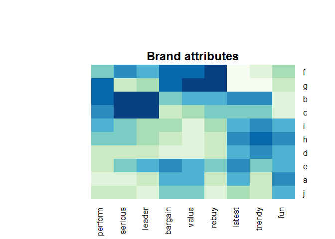
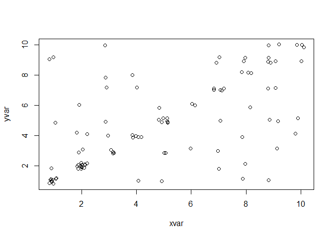
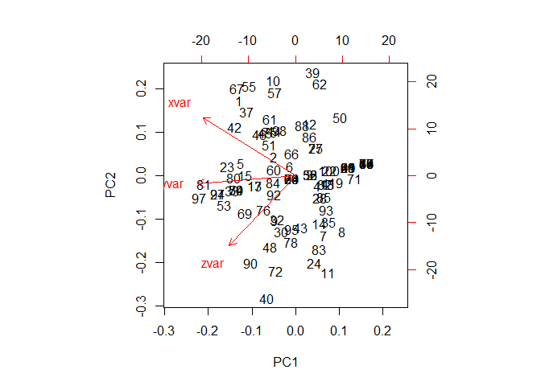
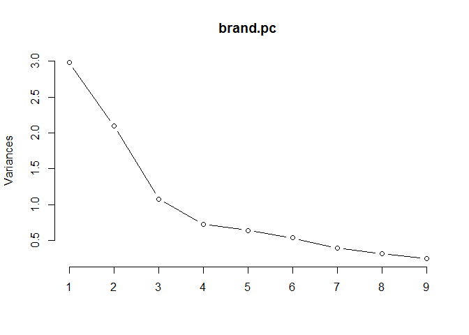
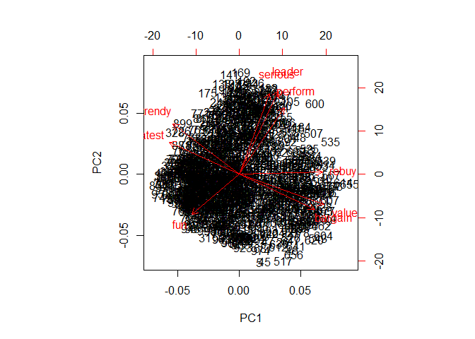
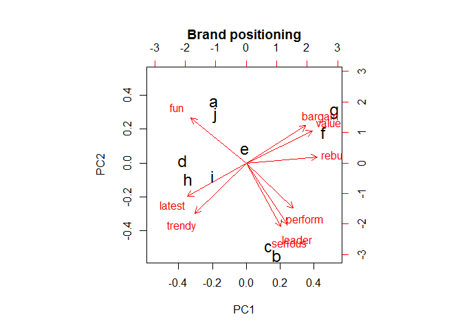
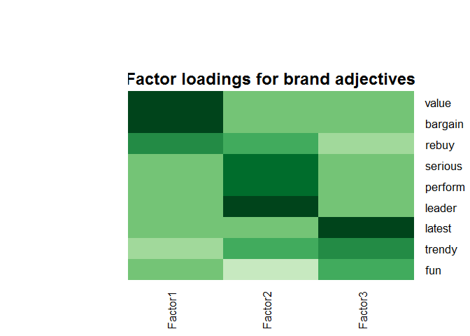
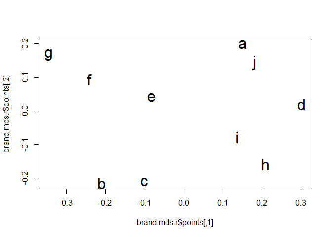

# Reducing Data Complexity
ksg  
2015년 9월 2일  

##데이터의 차원을 줄이는 3가지 방법

###1) Principal component analysis (PCA) - 주성분분석
  - 상관되어있지않은 선형차원을 찾는것 : 데이터에서maximal variance를 포착하여

###2) Exploratory factor analysis (EFA) 
  - 상관이 높은 변수들끼리 묶어 보다 적은 수의 요인으로 축소하는것

###3) Multidimensional scaling (MDS) 
  - 개체들 사이의 유사성 비유사성을 측정한 후에 개체들을 낮은차원의 공간에 점으로 표현하는 방법
  - non-metric data도 가능(범주형, 순서형 데이터에서도 적용할수 있음)
  - 브랜드에 대한 인지적지도를 보여주는데 PCA를 사용한다

###추가설명 
  - Brands perception surveys(10점 척도)
  - 설문문항의 인지적 형용사들을 통해 브랜드에대한 평정을 하도록한 데이터
  - how [ADJECTIVE] is [BRAND A]?
  - ex) How trendy is Intelligentsia Coffee?
  - ex) How much of a category leader is Blue Bottle Coffee?
  - 10개 브랜드에 대한 9가지 문항으로 구성됨(100개씩 * 10개브랜드 = 1000개)
  - factor analysis and MDS를통해 유사한 인지적 추론을 하게 만드는 요인들을 찾을수 있다.
  - <설문항목 및 변수명> 
  - Perceptual adjective (column name) Example survey text
  - perform  : Brand has strong performance
  - leader : Brand is a leader in the field
  - latest : Brand has the latest products
  - fun : Brand is fun
  - serious : Brand is serious
  - bargain : Brand products are a bargain
  - value : Brand products are a good value
  - trendy : Brand is trendy
  - rebuy : I would buy from Brand again

###데이터 학인 
  - 데이터 불러오기 

```r
brand.ratings <- read.csv("http://goo.gl/IQl8nc")
head(brand.ratings)
```

```
##   perform leader latest fun serious bargain value trendy rebuy brand
## 1       2      4      8   8       2       9     7      4     6     a
## 2       1      1      4   7       1       1     1      2     2     a
## 3       2      3      5   9       2       9     5      1     6     a
## 4       1      6     10   8       3       4     5      2     1     a
## 5       1      1      5   8       1       9     9      1     1     a
## 6       2      8      9   5       3       8     7      1     2     a
```

```r
tail(brand.ratings)
```

```
##      perform leader latest fun serious bargain value trendy rebuy brand
## 995        4      2      8   7       1       3     3      5     2     j
## 996        2      2      3   6       4       8     5      1     2     j
## 997        3      2      6   7       1       3     3      2     1     j
## 998        1      1     10  10       1       6     5      5     2     j
## 999        1      1      7   5       1       1     2      5     1     j
## 1000       7      4      7   8       4       1     2      5     1     j
```

  - 데이터 탐색 
  - 전처리가 완료된 데이터

```r
summary(brand.ratings)
```

```
##     perform           leader           latest            fun        
##  Min.   : 1.000   Min.   : 1.000   Min.   : 1.000   Min.   : 1.000  
##  1st Qu.: 1.000   1st Qu.: 2.000   1st Qu.: 4.000   1st Qu.: 4.000  
##  Median : 4.000   Median : 4.000   Median : 7.000   Median : 6.000  
##  Mean   : 4.488   Mean   : 4.417   Mean   : 6.195   Mean   : 6.068  
##  3rd Qu.: 7.000   3rd Qu.: 6.000   3rd Qu.: 9.000   3rd Qu.: 8.000  
##  Max.   :10.000   Max.   :10.000   Max.   :10.000   Max.   :10.000  
##                                                                     
##     serious          bargain           value            trendy     
##  Min.   : 1.000   Min.   : 1.000   Min.   : 1.000   Min.   : 1.00  
##  1st Qu.: 2.000   1st Qu.: 2.000   1st Qu.: 2.000   1st Qu.: 3.00  
##  Median : 4.000   Median : 4.000   Median : 4.000   Median : 5.00  
##  Mean   : 4.323   Mean   : 4.259   Mean   : 4.337   Mean   : 5.22  
##  3rd Qu.: 6.000   3rd Qu.: 6.000   3rd Qu.: 6.000   3rd Qu.: 7.00  
##  Max.   :10.000   Max.   :10.000   Max.   :10.000   Max.   :10.00  
##                                                                    
##      rebuy            brand    
##  Min.   : 1.000   a      :100  
##  1st Qu.: 1.000   b      :100  
##  Median : 3.000   c      :100  
##  Mean   : 3.727   d      :100  
##  3rd Qu.: 5.000   e      :100  
##  Max.   :10.000   f      :100  
##                   (Other):400
```

```r
str(brand.ratings)
```

```
## 'data.frame':	1000 obs. of  10 variables:
##  $ perform: int  2 1 2 1 1 2 1 2 2 3 ...
##  $ leader : int  4 1 3 6 1 8 1 1 1 1 ...
##  $ latest : int  8 4 5 10 5 9 5 7 8 9 ...
##  $ fun    : int  8 7 9 8 8 5 7 5 10 8 ...
##  $ serious: int  2 1 2 3 1 3 1 2 1 1 ...
##  $ bargain: int  9 1 9 4 9 8 5 8 7 3 ...
##  $ value  : int  7 1 5 5 9 7 1 7 7 3 ...
##  $ trendy : int  4 2 1 2 1 1 1 7 5 4 ...
##  $ rebuy  : int  6 2 6 1 1 2 1 1 1 1 ...
##  $ brand  : Factor w/ 10 levels "a","b","c","d",..: 1 1 1 1 1 1 1 1 1 1 ...
```


8.1.1 Rescaling the Data

  - 데이터의 Rescaling은 데이터의 비교를 용이하게한다.
  - 이는 표준화, 정규화, Z스코어링이라고 한다.
  - Z = (관측치-평균)/표준편차

```r
x <- 1:1000
x.sc <- (x - mean(x)) / sd(x)
summary(x.sc)
```

```
##    Min. 1st Qu.  Median    Mean 3rd Qu.    Max. 
## -1.7290 -0.8647  0.0000  0.0000  0.8647  1.7290
```

  - scale()함수는 변수들을 표준화해준다.
  - 10번째 변수 빼고 1~9번째 변수 표준화 (10번째는 브랜드명 명목형변수)

```r
brand.sc <- brand.ratings
brand.sc[, 1:9] <- scale(brand.ratings[, 1:9])
summary(brand.sc)
```

```
##     perform            leader            latest             fun          
##  Min.   :-1.0888   Min.   :-1.3100   Min.   :-1.6878   Min.   :-1.84677  
##  1st Qu.:-1.0888   1st Qu.:-0.9266   1st Qu.:-0.7131   1st Qu.:-0.75358  
##  Median :-0.1523   Median :-0.1599   Median : 0.2615   Median :-0.02478  
##  Mean   : 0.0000   Mean   : 0.0000   Mean   : 0.0000   Mean   : 0.00000  
##  3rd Qu.: 0.7842   3rd Qu.: 0.6069   3rd Qu.: 0.9113   3rd Qu.: 0.70402  
##  Max.   : 1.7206   Max.   : 2.1404   Max.   : 1.2362   Max.   : 1.43281  
##                                                                          
##     serious           bargain             value             trendy        
##  Min.   :-1.1961   Min.   :-1.22196   Min.   :-1.3912   Min.   :-1.53897  
##  1st Qu.:-0.8362   1st Qu.:-0.84701   1st Qu.:-0.9743   1st Qu.:-0.80960  
##  Median :-0.1163   Median :-0.09711   Median :-0.1405   Median :-0.08023  
##  Mean   : 0.0000   Mean   : 0.00000   Mean   : 0.0000   Mean   : 0.00000  
##  3rd Qu.: 0.6036   3rd Qu.: 0.65279   3rd Qu.: 0.6933   3rd Qu.: 0.64914  
##  Max.   : 2.0434   Max.   : 2.15258   Max.   : 2.3610   Max.   : 1.74319  
##                                                                           
##      rebuy             brand    
##  Min.   :-1.0717   a      :100  
##  1st Qu.:-1.0717   b      :100  
##  Median :-0.2857   c      :100  
##  Mean   : 0.0000   d      :100  
##  3rd Qu.: 0.5003   e      :100  
##  Max.   : 2.4652   f      :100  
##                    (Other):400
```

  - 최대, 최소값을 봤을때 각변수들을 크게 3가지 분산으로 나뉘는듯함
  - comprise fun/latest/trendy, rebuy/bargain/value,  perform/leader/serious
  - 분포가 정규분포보다 첨도가 낮음 (platykurtic)

```r
library(corrplot)
corrplot(cor(brand.sc[, 1:9]), order="hclust")
```

 


8.1.2 Aggregate Mean Ratings by Brand

  - aggregate() 함수로 브랜드별 평균값 산출

```r
brand.mean <- aggregate(. ~ brand, data=brand.sc, mean)
brand.mean
```

```
##    brand     perform     leader     latest        fun     serious
## 1      a -0.88591874 -0.5279035  0.4109732  0.6566458 -0.91894067
## 2      b  0.93087022  1.0707584  0.7261069 -0.9722147  1.18314061
## 3      c  0.64992347  1.1627677 -0.1023372 -0.8446753  1.22273461
## 4      d -0.67989112 -0.5930767  0.3524948  0.1865719 -0.69217505
## 5      e -0.56439079  0.1928362  0.4564564  0.2958914  0.04211361
## 6      f -0.05868665  0.2695106 -1.2621589 -0.2179102  0.58923066
## 7      g  0.91838369 -0.1675336 -1.2849005 -0.5167168 -0.53379906
## 8      h -0.01498383 -0.2978802  0.5019396  0.7149495 -0.14145855
## 9      i  0.33463879 -0.3208825  0.3557436  0.4124989 -0.14865746
## 10     j -0.62994504 -0.7885965 -0.1543180  0.2849595 -0.60218870
##        bargain       value      trendy       rebuy
## 1   0.21409609  0.18469264 -0.52514473 -0.59616642
## 2   0.04161938  0.15133957  0.74030819  0.23697320
## 3  -0.60704302 -0.44067747  0.02552787 -0.13243776
## 4  -0.88075605 -0.93263529  0.73666135 -0.49398892
## 5   0.55155051  0.41816415  0.13857986  0.03654811
## 6   0.87400696  1.02268859 -0.81324496  1.35699580
## 7   0.89650392  1.25616009 -1.27639344  1.36092571
## 8  -0.73827529 -0.78254646  0.86430070 -0.60402622
## 9  -0.25459062 -0.80339213  0.59078782 -0.20317603
## 10 -0.09711188 -0.07379367 -0.48138267 -0.96164748
```

  - ROW ID를 브랜드로 바꾸

```r
rownames(brand.mean) <- brand.mean[, 1] # use brand for the row names
brand.mean <- brand.mean[, -1]
brand.mean
```

```
##       perform     leader     latest        fun     serious     bargain
## a -0.88591874 -0.5279035  0.4109732  0.6566458 -0.91894067  0.21409609
## b  0.93087022  1.0707584  0.7261069 -0.9722147  1.18314061  0.04161938
## c  0.64992347  1.1627677 -0.1023372 -0.8446753  1.22273461 -0.60704302
## d -0.67989112 -0.5930767  0.3524948  0.1865719 -0.69217505 -0.88075605
## e -0.56439079  0.1928362  0.4564564  0.2958914  0.04211361  0.55155051
## f -0.05868665  0.2695106 -1.2621589 -0.2179102  0.58923066  0.87400696
## g  0.91838369 -0.1675336 -1.2849005 -0.5167168 -0.53379906  0.89650392
## h -0.01498383 -0.2978802  0.5019396  0.7149495 -0.14145855 -0.73827529
## i  0.33463879 -0.3208825  0.3557436  0.4124989 -0.14865746 -0.25459062
## j -0.62994504 -0.7885965 -0.1543180  0.2849595 -0.60218870 -0.09711188
##         value      trendy       rebuy
## a  0.18469264 -0.52514473 -0.59616642
## b  0.15133957  0.74030819  0.23697320
## c -0.44067747  0.02552787 -0.13243776
## d -0.93263529  0.73666135 -0.49398892
## e  0.41816415  0.13857986  0.03654811
## f  1.02268859 -0.81324496  1.35699580
## g  1.25616009 -1.27639344  1.36092571
## h -0.78254646  0.86430070 -0.60402622
## i -0.80339213  0.59078782 -0.20317603
## j -0.07379367 -0.48138267 -0.96164748
```

  - 히트맵 그림
  - 생각이 진할수록 높은 평점을 받은것임 
  - bargain/value/rebuy 비슷한 색상 패턴 보임
  - high on performance and leadership (brands b and c)
  - high for value and intention to rebuy (brands f and g)

```r
library(gplots)
```

```
## Warning: package 'gplots' was built under R version 3.2.2
```

```
## 
## Attaching package: 'gplots'
## 
## The following object is masked from 'package:stats':
## 
##     lowess
```

```r
library(RColorBrewer)
```

```
## Warning: package 'RColorBrewer' was built under R version 3.2.2
```

```r
heatmap.2(as.matrix(brand.mean),
          col=brewer.pal(9, "GnBu"), 
          trace="none", key=FALSE, 
          dend="none",
          main="\n\n\n\n\nBrand attributes")
```

 


##8.2 Principal Component Analysis and Perceptual Maps

## http://blog.naver.com/leerider/100190679279
## http://blog.naver.com/coolstu/130176439747
### 주성분 분석

###목적 : 차원축소
  - 일반적으로 변수가 2-3개인 경우 변수를 모두 활용하여 변수를 설명할수있다
  - 변수가 많을때 다양한 변수를 설명하는 주된 변수를 찾는것이 용이하다.
  - 주성분 분석은 변수들을 설명하는 새로운 축을 찾는것인데 서로 직교하도록 찾는다.
  - 즉, 각각의 축은 서로 독립이 된다. 
  - 일반적으로 첫번째 주성분이 가장 큰설명력을 가진다.

###방법
  - 변수들로부터 상관계수 행렬을 구한다.
  - 상관계수 행렬의 eigen vector를 구합니다. eigen vector끼리는 서로 직교 하게된다.
  - 관찰된 변수를 Z점수로 표준화한다.
  - Z점수를 eigen vector와 곱하면 주성분이 되는데 
  - 관찰변수가 3개이고 sample size가 100개이면 변수행렬은 (100*3)행렬이 된다.
  - 차원축소가 목적이므로 관찰변수들의 분포의 약 70% ~ 80%정도를 설명할 수 있는 주성분을 찾음.

###해석
  - 설명력은 eigen value로 파악하는데 상관계수 행렬로 부터 eigen value를 구함
  - eigen value를 합계하면 변수의 개수만큼의 크기가 됨(n개의 변수, eigen value를 모두 합계하면 n)
  - 각각의 eigen value를 n으로 나누면 주성분이 관찰변수들에  갖는 설명력의 비율(proportion)이 됨
  - 주성분끼리는 서로 직교하므로 설명력을 합계한 것이 약 70% ~ 80%가 되도록 하는 주성분을 채택

###주의
  - 데이터를 분포에 대한 설명하기 위한 목적으로 실시함
  - 찾아진 주성분들에 대한 의미를 파악하는 것이 목적이 아님
  - 일반적으로 주성분에 대해 어떤 의미를 부여하지는 않는다


###8.2.1 PCA Example
  
  - 상관이 높은 데이터 생성
  - 100개중 50개는 같고 50개만 새로 샘플링하는 방식
  - X에서 샘플링한것을  Y에다가, Y에서 샘플링한것을 Z에 할당 

```r
set.seed(98286)
xvar <- sample(1:10, 100, replace=TRUE)
yvar <- xvar
yvar[sample(1:length(yvar), 50)] <- sample(1:10, 50, replace=TRUE)
zvar <- yvar
zvar[sample(1:length(zvar), 50)] <- sample(1:10, 50, replace=TRUE)
my.vars <- cbind(xvar, yvar, zvar)
```

  - 플랏 및 변수들의 상관행렬 확인 
  - 세변수는 모두 정적 상관을 가질것이다.
  - X와 Z는 서로 다를것이다(Y와의 관계보다)
  - Y는 다른변수와 높은 상관을 지니는 특수성을 가지며 uniqueness한 콤포넌트임

```r
plot(yvar ~ xvar, data=jitter(my.vars))
```

 

```r
cor(my.vars)
```

```
##           xvar      yvar      zvar
## xvar 1.0000000 0.5969717 0.2496469
## yvar 0.5969717 1.0000000 0.5231468
## zvar 0.2496469 0.5231468 1.0000000
```

  
  - rcomp() 함수로 EigenValue, EigenVector 값을 구한다
  - 첫번째 성분은 65 % 기여도 / 반면 두번째 세번째는 24, 11%

```r
my.pca <- prcomp(my.vars)
summary(my.pca)
```

```
## Importance of components:
##                           PC1    PC2    PC3
## Standard deviation     3.9992 2.4381 1.6269
## Proportion of Variance 0.6505 0.2418 0.1077
## Cumulative Proportion  0.6505 0.8923 1.0000
```

  - We check the rotation matrix
  - 'my.pca'실행하면 분포가 전체적으로 어떻게 공유되고있는지 볼수있음(공분산?)
  - 성분1은 3대 변수보두 분산이 전체적으로 공유되고있음을 보여줌(모두 음의값)
  - 성분2는 X,Z가 서로 다른 것을 볼수있음(X양, Y음, Z음)
  - 성분3은 Y가 X,Z와 다른 분산을 갖고있음을 알수 있다(X양, Y음, Z양)

```r
my.pca
```

```
## Standard deviations:
## [1] 3.999154 2.438079 1.626894
## 
## Rotation:
##             PC1         PC2        PC3
## xvar -0.6156755  0.63704774  0.4638037
## yvar -0.6532994 -0.08354009 -0.7524766
## zvar -0.4406173 -0.76628404  0.4676165
```


Those are present in the PCA object as the $x matrix, where the columns
([ , 1],[ , 2], and so forth) may be used to obtain the values of the components
for each observation. We can use a small number of those columns in place of
the original data to obtain a set of observations that captures much of the variation
in the data.

A less obvious feature of PCA, but implicit in the definition, is that extracted PCA
components are uncorrelated with one another, because otherwise there would be
more linear variance that could have been captured. We see this in the scores
returned for observations in a PCA model, where the off-diagonal correlations are
effectively zero (approximately 10−15 as shown in R’s scientific notation):

```r
cor(my.pca$x)
```

```
##              PC1           PC2           PC3
## PC1 1.000000e+00  4.808932e-16  1.768720e-15
## PC2 4.808932e-16  1.000000e+00 -1.174441e-15
## PC3 1.768720e-15 -1.174441e-15  1.000000e+00
```

###8.2.2 Visualizing PCA

  - use biplot() to generate this
  - 앞의 2개 주성분값에 따라 점들이 찍힘
  - 점이 적을때 또는 분류할때 유용함

```r
biplot(my.pca)
```

 


8.2.3 PCA for Brand Ratings

```r
brand.pc <- prcomp(brand.sc[, 1:9])
summary(brand.pc)
```

```
## Importance of components:
##                          PC1    PC2    PC3    PC4     PC5     PC6     PC7
## Standard deviation     1.726 1.4479 1.0389 0.8528 0.79846 0.73133 0.62458
## Proportion of Variance 0.331 0.2329 0.1199 0.0808 0.07084 0.05943 0.04334
## Cumulative Proportion  0.331 0.5640 0.6839 0.7647 0.83554 0.89497 0.93831
##                            PC8     PC9
## Standard deviation     0.55861 0.49310
## Proportion of Variance 0.03467 0.02702
## Cumulative Proportion  0.97298 1.00000
```

  - 선이 꺽이는 부분이 추가적인 복잡한 성분은 의미가 없음을 의미함
  - 꺽이는 부분이 3,4지점이라면 초기 2-3개의 주성분이 많은 양의 분양을 설명해주는것임
  - A biplot() of the first two principal components—which biplot() selects by
    default for a PCA object—reveals how the rating adjectives are associated


```r
plot(brand.pc, type="l")
```

 


  - 형용사맵으로 4개 카테고리 구역을 볼수 있음
  - 우측상단-리더(“serious,” “leader,” “perform”)
  - 우측하단-가치(“rebuy,” “value,”  “bargain”)
  - 좌측상단-트렌디(“trendy”, “latest”)
  - 좌측하단-("fun")

```r
biplot(brand.pc)
```

 

  - 개개인의 응답은 너무 광범위하여 브랜드포지션을 알려줄수 없음
  - 브랜드별 평균값으로 PCA를 다시적용시켜봄
  - scale=TRUE in order to rescale the data; even though the raw data was already rescaled, 
    the aggregated means have a somewhat different scale than the standardized data itself.

```r
brand.mean
```

```
##       perform     leader     latest        fun     serious     bargain
## a -0.88591874 -0.5279035  0.4109732  0.6566458 -0.91894067  0.21409609
## b  0.93087022  1.0707584  0.7261069 -0.9722147  1.18314061  0.04161938
## c  0.64992347  1.1627677 -0.1023372 -0.8446753  1.22273461 -0.60704302
## d -0.67989112 -0.5930767  0.3524948  0.1865719 -0.69217505 -0.88075605
## e -0.56439079  0.1928362  0.4564564  0.2958914  0.04211361  0.55155051
## f -0.05868665  0.2695106 -1.2621589 -0.2179102  0.58923066  0.87400696
## g  0.91838369 -0.1675336 -1.2849005 -0.5167168 -0.53379906  0.89650392
## h -0.01498383 -0.2978802  0.5019396  0.7149495 -0.14145855 -0.73827529
## i  0.33463879 -0.3208825  0.3557436  0.4124989 -0.14865746 -0.25459062
## j -0.62994504 -0.7885965 -0.1543180  0.2849595 -0.60218870 -0.09711188
##         value      trendy       rebuy
## a  0.18469264 -0.52514473 -0.59616642
## b  0.15133957  0.74030819  0.23697320
## c -0.44067747  0.02552787 -0.13243776
## d -0.93263529  0.73666135 -0.49398892
## e  0.41816415  0.13857986  0.03654811
## f  1.02268859 -0.81324496  1.35699580
## g  1.25616009 -1.27639344  1.36092571
## h -0.78254646  0.86430070 -0.60402622
## i -0.80339213  0.59078782 -0.20317603
## j -0.07379367 -0.48138267 -0.96164748
```

```r
brand.mu.pc <- prcomp(brand.mean, scale=TRUE)
summary(brand.mu.pc)
```

```
## Importance of components:
##                           PC1    PC2    PC3     PC4     PC5     PC6
## Standard deviation     2.1345 1.7349 0.7690 0.61498 0.50983 0.36662
## Proportion of Variance 0.5062 0.3345 0.0657 0.04202 0.02888 0.01493
## Cumulative Proportion  0.5062 0.8407 0.9064 0.94842 0.97730 0.99223
##                            PC7     PC8     PC9
## Standard deviation     0.21506 0.14588 0.04867
## Proportion of Variance 0.00514 0.00236 0.00026
## Cumulative Proportion  0.99737 0.99974 1.00000
```

  - 초기2개 성분이 84%의 설명력을 가짐
  - 따라서 해석을하는데 2개 변인에 집중하도록함
  
###8.2.4 Perceptual Map of the Brands

  - PCA의 평균의 biplot은 인지적지도를 해석할수 있게 해줌
  - 최초2개 주성분으로 위치한 브랜드들의 위치들을 활용 인지적 지도 해석

```r
biplot(brand.mu.pc, main="Brand positioning", cex=c(1.5, 1))
```

 


###<브랜드포지셔닝의 관점>

  - 브랜드 f와 g는 “value”에서 높은 반면, 
  - j는 "leader” 과 “serious"반대방향인 “fun”에서 상대적으로 높다
  - e브랜드의 매니저에게 어떤정보를 주는가?
  - e브랜드는 중앙에 있지만 차별화된 차원이 없다. 
  - 이것이 좋고 나쁨은 당신의 전략적 목표에 달려있다.
  - 당신의 목표가 안전한것을 목표로 소비자에게 어필한다면 차별화하지 않은 포지션은 좋지만
  - 소비자가 차별화된 인식을 하길 바란다면 이런 결과는 원치않은 결과이다.
  - 당신이 C브랜드의 방향으로 포지셔닝을 하고싶다
  - C브랜드와의 차이를 볼 필요가 있다.

```r
brand.mean["c", ] - brand.mean["e", ]
```

```
##    perform    leader     latest       fun  serious   bargain      value
## c 1.214314 0.9699315 -0.5587936 -1.140567 1.180621 -1.158594 -0.8588416
##      trendy      rebuy
## c -0.113052 -0.1689859
```

  - e브랜드는 c브랜드보다 “value”와 “fun”이 상대적으로 높다.
  - c브랜드는 “perform”과  “serious,”가 높다.
  - 또다른 방법은 다른브랜드들이 자리잡지 않은 위치의 포지션을 향하는것이다.
  - b,c(가성비)와 f,g(성능,리더)사이에는 큰갭(공간)이 있다. 이 공간은 “value leader"포지션일 것이다.


```r
colMeans(brand.mean[c("b", "c", "f", "g"), ]) - brand.mean["e", ]
```

```
##    perform    leader     latest        fun   serious    bargain      value
## e 1.174513 0.3910396 -0.9372789 -0.9337707 0.5732131 -0.2502787 0.07921355
##       trendy     rebuy
## e -0.4695304 0.6690661
```
  - 이는 "performance"를 증가시키고 “latest” and “fun.”를 줄여야함을 제안한다.
  

###8.2.5 Cautions with Perceptual Maps

### 3가지주의점

###1) aggregation의 수준과 유형을 주의깊게 선택해야한다.
  - 우리는 브랜드 평점을 썼지만 범주형, 순서형에서는 중앙값이 적합할수있다.
  - interpreting aggregate maps 해석전에 차원의 유사한지 확인해라.
  
###2) 제품카테고리와 브랜드에서 관련성을 확인해봐야한다.
  - 제품카테고리와 브랜드에서 “fun” and “leader”같은 형용사도 다른관계를가질수있다.
  - 때때로 새로운 브랜드가 진입하게 되면 포지션은 상대적이기 때문에 결과map도 바뀐다
  - 다시말해 신규브랜드 진입은 다른 포지션을 바꾼다.
  - pca의 민감성이나 안정성을 확인하려면 일부관측치를 누락시키고(20%) 실시해봐라
  
###3) 모든 차원을 혼합한 주성분분석의 개념으로 상대적인 포지셔닝을 잘못이해하곤한다.
  - 차트로부터 바로 한가지 속성이 강한 브랜드는 찾아낼수 없다는 말이다.
  - 예를들어 B브랜드와 C브랜드는 DHI보다 LASTEST가 약하지만 서로는 비슷하다.
  - 실재 B는 LATEST가 단일로 강한 브랜드인 반면 c는 그속성이 약하다.


###주성분분석 : 상관되어있지않은 선형차원을 찾는것 
###요인분석 : 상관이 높은 변수들끼리 묶어 보다 적은 수의 요인으로 축소하는것
  
##8.3 Exploratory Factor Analysis
  - 요인분석은 심리검사 및 설문에서 개념의 구조관계를 측정하는데 사용하는 테크닉
  - Factor는 직접 관찰할수 없는 잠재도 변수로 간주(수리력,불안)
  - 마케팅에서 서로관련이 있는 작은셋트의 구조로 생각되는 많은 변인들을 관찰함(소비자만족도,소비자경험,가격민감도,구매관심도)

###8.3.1 Basic EFA Concepts
  - 효과적으로 해석될 수 있는 분명한 개념을 찾는 방법을 찾는데 사용한다.
  - 일반적으로 각 요인을 매우 높게 적재하고, 반대로 다른문항들은 매우 낮게 적재하는 작은 문항셋을 찾는다
  - 요인분석을 통해 적은변인의 개념으로 요인을 해석할 수 있다.
  - <EFA을 통해 얻을 수 있는것>
  - 1. 차원축소를 통해 많은 문항들 대신 요인점수를 활용할 수 있음
  - 2. 불확실성을 감소시킬수 있음(각각의 문항을 분석하는 것보다 노이즈가 적다)
  - 3. 요인에 높은 기여를 하는 아이템 중심으로 데이터를 수집하므로 데이터가 줄어듬


###8.3.2 Finding an EFA Solution
  - 탐색적 요인분석의 첫번째는 요인의 개수를 정하는것이다.
  - nFactors package formalizes this analysis with nScree()
  - 아이겐값이 1보다 큰경우 요인으로 채택할수 있다.
  - 데이터생성(지난주 9개문항으로 구성된 데이터)
  - nScree() 함수는 몇가지 방법으로 scree테스트를 통해 요인수를 제안해줌(현재 3개요인이 가장 많이제시됨)

```r
#nstall.packages("nFactors")
library(nFactors)
```

```
## Warning: package 'nFactors' was built under R version 3.2.2
```

```
## Loading required package: MASS
## Loading required package: psych
```

```
## Warning: package 'psych' was built under R version 3.2.2
```

```
## Loading required package: boot
## 
## Attaching package: 'boot'
## 
## The following object is masked from 'package:psych':
## 
##     logit
## 
## Loading required package: lattice
## 
## Attaching package: 'lattice'
## 
## The following object is masked from 'package:boot':
## 
##     melanoma
## 
## 
## Attaching package: 'nFactors'
## 
## The following object is masked from 'package:lattice':
## 
##     parallel
```

```r
nScree(brand.sc[, 1:9])
```

```
##   noc naf nparallel nkaiser
## 1   3   2         3       3
```

  - eigen() 함수로 상관행렬의 아이겐값을 측정할 수 있음
  - 3번째 아이겐값까지 1이넘는다, 이는 2~3개의 팩터를 제안한다.

```r
eigen(cor(brand.sc[, 1:9]))
```

```
## $values
## [1] 2.9792956 2.0965517 1.0792549 0.7272110 0.6375459 0.5348432 0.3901044
## [8] 0.3120464 0.2431469
## 
## $vectors
##             [,1]        [,2]        [,3]        [,4]        [,5]
##  [1,] -0.2374679 -0.41991179  0.03854006  0.52630873  0.46793435
##  [2,] -0.2058257 -0.52381901 -0.09512739  0.08923461 -0.29452974
##  [3,]  0.3703806 -0.20145317 -0.53273054 -0.21410754  0.10586676
##  [4,]  0.2510601  0.25037973 -0.41781346  0.75063952 -0.33149429
##  [5,] -0.1597402 -0.51047254 -0.04067075 -0.09893394 -0.55515540
##  [6,] -0.3991731  0.21849698 -0.48989756 -0.16734345 -0.01257429
##  [7,] -0.4474562  0.18980822 -0.36924507 -0.15118500 -0.06327757
##  [8,]  0.3510292 -0.31849032 -0.37090530 -0.16764432  0.36649697
##  [9,] -0.4390184 -0.01509832 -0.12461593  0.13031231  0.35568769
##             [,6]         [,7]        [,8]        [,9]
##  [1,]  0.3370676  0.364179109 -0.14444718 -0.05223384
##  [2,]  0.2968860 -0.613674301  0.28766118  0.17889453
##  [3,]  0.1742059 -0.185480310 -0.64290436 -0.05750244
##  [4,] -0.1405367 -0.007114761  0.07461259 -0.03153306
##  [5,] -0.3924874  0.445302862 -0.18354764 -0.09072231
##  [6,]  0.1393966  0.288264900  0.05789194  0.64720849
##  [7,]  0.2195327  0.017163011  0.14829295 -0.72806108
##  [8,] -0.2658186  0.153572108  0.61450289 -0.05907022
##  [9,] -0.6751400 -0.388656160 -0.20210688  0.01720236
```

  - 2개요인과 3개요인중 어떤것이 더유용한지 테스트해보자
  - factanal(x, factors=K) K는 요인수이다.
  - factor 1 loads strongly on “bargain” and “value,” and therefore might be interpreted as a “value” factor 
  - factor 2 loads on “leader” and “serious” and thus might be regarded as a category “leader” factor.

```r
factanal(brand.sc[, 1:9], factors=2)
```

```
## 
## Call:
## factanal(x = brand.sc[, 1:9], factors = 2)
## 
## Uniquenesses:
## perform  leader  latest     fun serious bargain   value  trendy   rebuy 
##   0.635   0.332   0.796   0.835   0.527   0.354   0.225   0.708   0.585 
## 
## Loadings:
##         Factor1 Factor2
## perform          0.600 
## leader           0.818 
## latest  -0.451         
## fun     -0.137  -0.382 
## serious          0.686 
## bargain  0.803         
## value    0.873   0.117 
## trendy  -0.534         
## rebuy    0.569   0.303 
## 
##                Factor1 Factor2
## SS loadings      2.245   1.759
## Proportion Var   0.249   0.195
## Cumulative Var   0.249   0.445
## 
## Test of the hypothesis that 2 factors are sufficient.
## The chi square statistic is 556.19 on 19 degrees of freedom.
## The p-value is 8.66e-106
```

  - 3개요인 팩터로 테스트해 비교해보자
  - “value” and “leader” factors and adds a clear 
  - “latest” factor that loads strongly on “latest” and “trendy.” 
  - This adds a clearly interpretable concept to our understanding of the data

```r
factanal(brand.sc[, 1:9], factors=3)
```

```
## 
## Call:
## factanal(x = brand.sc[, 1:9], factors = 3)
## 
## Uniquenesses:
## perform  leader  latest     fun serious bargain   value  trendy   rebuy 
##   0.624   0.327   0.005   0.794   0.530   0.302   0.202   0.524   0.575 
## 
## Loadings:
##         Factor1 Factor2 Factor3
## perform          0.607         
## leader           0.810   0.106 
## latest  -0.163           0.981 
## fun             -0.398   0.205 
## serious          0.682         
## bargain  0.826          -0.122 
## value    0.867          -0.198 
## trendy  -0.356           0.586 
## rebuy    0.499   0.296  -0.298 
## 
##                Factor1 Factor2 Factor3
## SS loadings      1.853   1.752   1.510
## Proportion Var   0.206   0.195   0.168
## Cumulative Var   0.206   0.401   0.568
## 
## Test of the hypothesis that 3 factors are sufficient.
## The chi square statistic is 64.57 on 12 degrees of freedom.
## The p-value is 3.28e-09
```

###8.3.3 EFA Rotations


  - factor analysis solution can be rotated to have new loadings that account for the same proportion of variance. 
  - there is one issue worth considering in any EFA: do you wish to allow the factors to be correlated with one another or not?
  - You might think that one should let the data decide. However, the question of whether to allow correlated factors is less a question about the data than it is about your concept of the underlying latent factors. 
  - Do you think the factors should be conceptually independent, or does it make more sense to consider them to be related?
  - factanal() is to find factors that have zero correlation (using avarimax rotation). 
  - 요인분석에서는 오차(error)를 고려하고 설명의 대상이 되는 변수가 관찰변수임 
  - 요인분석:관찰변수 = factor loading * 공통요인 + 오차(error)
  - 주성분분석 ː 주성분 = principal loading * 관찰변수
  - 주성분분석은 데이터의 분포를 잘 설명하기 위한 차원축소가 목적이기때문 
  - 요인이 관찰변수들과 명확히 할당되도록 회전(rotation)을 하는데 회전하는 방법에는 직교회전과 oblique회전이 있다
  - factanal()함수는 요인의 의미가 서로독립인것을 찾는 방법(using avarimax rotation)
  - oblique회전은 요인끼리 상관을 허용하는 회전으로 일반적으로 GPArotation 패키지의 rotation="oblimin" 인수를 사용한다.
  - 데이터를 바탕으로 밸류와 리더는 상관이 있을것임을 예상할수 있다
  - 리더요인은 높은가격과 연관이 있기에 다른 변수와 역상관이 있을 수있다 
  - 이는 요인간의 상관을 허용하는 것으로 oblique rotation회전방식이라 한다. 
  - rotation="oblimin" 으로 3요인 모델을 돌려보자

```r
#install.packages("GPArotation")
library(GPArotation)
```

```
## Warning: package 'GPArotation' was built under R version 3.2.2
```

```r
(brand.fa.ob <- factanal(brand.sc[, 1:9], factors=3, rotation="oblimin"))
```

```
## 
## Call:
## factanal(x = brand.sc[, 1:9], factors = 3, rotation = "oblimin")
## 
## Uniquenesses:
## perform  leader  latest     fun serious bargain   value  trendy   rebuy 
##   0.624   0.327   0.005   0.794   0.530   0.302   0.202   0.524   0.575 
## 
## Loadings:
##         Factor1 Factor2 Factor3
## perform          0.601         
## leader           0.816         
## latest                   1.009 
## fun             -0.381   0.229 
## serious          0.689         
## bargain  0.859                 
## value    0.880                 
## trendy  -0.267   0.128   0.538 
## rebuy    0.448   0.255  -0.226 
## 
##                Factor1 Factor2 Factor3
## SS loadings      1.789   1.733   1.430
## Proportion Var   0.199   0.193   0.159
## Cumulative Var   0.199   0.391   0.550
## 
## Factor Correlations:
##         Factor1 Factor2 Factor3
## Factor1  1.0000  -0.388  0.0368
## Factor2 -0.3884   1.000 -0.1091
## Factor3  0.0368  -0.109  1.0000
## 
## Test of the hypothesis that 3 factors are sufficient.
## The chi square statistic is 64.57 on 12 degrees of freedom.
## The p-value is 3.28e-09
```

  - 요인들간의 관계에 대한 적재량이 약간 차이는 있지만 요인을 해석하는데 중대한 변화는 없다.
  - 여전히 3개요인이다 “value,” “leader,” and “latest.”
  - Factor 1 (value) 은 Factor 2 (leader)와 음의상관이다 r = −0.39
  - 그리고 3 (latest) 과는 무관하다 r = 0.037.
  - Factor 2 (leader) 브랜드는 Factor 1 (value)를 갖기가 쉽지않다는 우리의 가정은 맞다 
  - 그러나 직교회전이 더 좋을수도 있다 : 도메인지식과 해석적 기능이 통계보다 결정하는데 낮다면
  
---------------------------------------------------------------------------------------

  - item-to-factor loadings are displayed.
  - We can the visualize itemfactor relationships with a heatmap of $loadings:

```r
library(gplots)
library(RColorBrewer)
heatmap.2(brand.fa.ob$loadings,
          col=brewer.pal(9, "Greens"), trace="none", key=FALSE, dend="none",
          Colv=FALSE, cexCol = 1.2,
          main="\n\n\n\n\nFactor loadings for brand adjectives")
```

 

  - The semPlot package (install if needed) will draw a factor analysis model. 
  - We use the procedure semPaths() to draw the paths. It is
  - To draw the loading estimates, we requested what="est". 
  - We omit the residual estimates for manifest variables using residuals=FALSE. 
  - cut loadings with absolute magnitude < 0.3 by adding cut=0.3 
  - options posCol=c("white","darkgreen") and negCol=c("white", "red"). 
  - text size with edge.label.cex, and create room to spell out full variable names with nCharNodes.

```r
#install.packages("semPlot")
library(semPlot)
```

```
## Warning: package 'semPlot' was built under R version 3.2.2
```

```r
semPaths(brand.fa.ob, what="est", residuals=FALSE,
         cut=0.3, posCol=c("white", "darkgreen"), negCol=c("white", "red"),
         edge.label.cex=0.75, nCharNodes=7)
```

 

###8.3.4 Using Factor Scores for Brands

  - factor scores를 사용해 브랜드 포지션을 밝히수 있다.
  - Factor scores are requested from factanal() by adding the scores=... argument.
  - We request Bartlett scores (see ?factanal), and extract them from the factanal() object using $scores, storing them as a separate data frame
  - 9개요인 대신 3개요인을 사용하면 회기, 세그맨테이션에 효과적으로 활용가능함
  - 모델의 복잡성을 줄이고 더 믿을수 있는 결과를 산출할수있ㅇ

```r
brand.fa.ob <- factanal(brand.sc[, 1:9], factors=3, rotation="oblimin",
                        scores="Bartlett")
brand.scores <- data.frame(brand.fa.ob$scores) # get the factor scores
brand.scores$brand <- brand.sc$brand # get the matching brands
head(brand.scores)
```

```
##      Factor1    Factor2    Factor3 brand
## 1  1.6521364 -0.6886749  0.5256104     a
## 2 -1.4005333 -1.6681901 -0.6764121     a
## 3  1.1457311 -1.0618008 -0.4285853     a
## 4  0.2009725 -0.3245462  1.2113424     a
## 5  2.0002009 -1.9071519 -0.4559905     a
## 6  1.4175063  0.3339462  0.8555525     a
```

  - 전체적인 브랜드 포지션을 알기위해 각점수를 합산 

```r
(brand.fa.mean <- aggregate(. ~ brand, data=brand.scores, mean))
```

```
##    brand     Factor1     Factor2     Factor3
## 1      a  0.23158792 -1.06993703  0.39326652
## 2      b  0.09686823  1.51913070  0.72391174
## 3      c -0.58937138  1.45069457 -0.07690784
## 4      d -1.04380419 -0.78186861  0.37914638
## 5      e  0.52169760 -0.05373430  0.43709349
## 6      f  1.15218492  0.45442899 -1.28395765
## 7      g  1.36873947  0.04408369 -1.31900029
## 8      h -0.91592078 -0.31418560  0.52676516
## 9      i -0.66918513 -0.20741901  0.37331202
## 10     j -0.15279666 -1.04119340 -0.15362952
```

  - 보기편하게 브랜드명을 row명으로 할당 

```r
rownames(brand.fa.mean) <- brand.fa.mean[, 1] # brand names
brand.fa.mean <- brand.fa.mean[, -1]
names(brand.fa.mean) <- c("Leader", "Value", "Latest") # factor names
brand.fa.mean
```

```
##        Leader       Value      Latest
## a  0.23158792 -1.06993703  0.39326652
## b  0.09686823  1.51913070  0.72391174
## c -0.58937138  1.45069457 -0.07690784
## d -1.04380419 -0.78186861  0.37914638
## e  0.52169760 -0.05373430  0.43709349
## f  1.15218492  0.45442899 -1.28395765
## g  1.36873947  0.04408369 -1.31900029
## h -0.91592078 -0.31418560  0.52676516
## i -0.66918513 -0.20741901  0.37331202
## j -0.15279666 -1.04119340 -0.15362952
```

  - 히트맵으로 시각화

```r
library(gplots)
library(RColorBrewer)
heatmap.2(as.matrix(brand.fa.mean),
          col=brewer.pal(9, "GnBu"), trace="none", key=FALSE, dend="none",
          cexCol=1.2, main="\n\n\n\n\n\nMean factor score by brand")
```

 

##8.4 Multidimensional Scaling

  - MDS는 components or latent factors이 아닌 거리를 활용한다.(유사도)
  - 적은 차원 앱에서 각 아이템의 유사도를 관측하는 방법이다.
  - 유사도 데이터가 준비된경우(제품에 대한 평점) 바로 활용가능하다
  - 간격이나 비율로 측정된 메트릭데이터를 가지고 있다면 유클리드 거리를 계산할수있다.
  - dist() command, as we do for the mean ratings computed 

```r
brand.dist <- dist(brand.mean)
```

  - cmdscale() 함수로 메트릭데이터로부터 거리행렬을 구할수있다.

```r
(brand.mds <- cmdscale(brand.dist))
```

```
##            [,1]       [,2]
## a -7.570113e-01  1.4619032
## b  5.586301e-01 -2.1698618
## c  3.894979e-01 -1.9060516
## d -1.792314e+00  0.2561488
## e  4.680797e-05  0.2292118
## f  2.361783e+00  0.4295718
## g  2.667463e+00  1.0304417
## h -1.646706e+00 -0.2709150
## i -9.923031e-01 -0.2576957
## j -7.890864e-01  1.1972468
```

  - 인지지도와 비슷한 형태의 그룹포지션을 볼수 있다.

```r
plot(brand.mds, type="n")
text(brand.mds, rownames(brand.mds), cex=2)
```

 


###8.4.1 Non-metric MDS

  - 랭킹이나 범주형자료는 다른 방식으로 거리를 계산한다.
  - 랭킹을 로우값 대신 평점으로 변환한다. 
  - rank함수로 순위를 매치고 서수로  정렬시킨다 (lapply활용)


```r
brand.mean
```

```
##       perform     leader     latest        fun     serious     bargain
## a -0.88591874 -0.5279035  0.4109732  0.6566458 -0.91894067  0.21409609
## b  0.93087022  1.0707584  0.7261069 -0.9722147  1.18314061  0.04161938
## c  0.64992347  1.1627677 -0.1023372 -0.8446753  1.22273461 -0.60704302
## d -0.67989112 -0.5930767  0.3524948  0.1865719 -0.69217505 -0.88075605
## e -0.56439079  0.1928362  0.4564564  0.2958914  0.04211361  0.55155051
## f -0.05868665  0.2695106 -1.2621589 -0.2179102  0.58923066  0.87400696
## g  0.91838369 -0.1675336 -1.2849005 -0.5167168 -0.53379906  0.89650392
## h -0.01498383 -0.2978802  0.5019396  0.7149495 -0.14145855 -0.73827529
## i  0.33463879 -0.3208825  0.3557436  0.4124989 -0.14865746 -0.25459062
## j -0.62994504 -0.7885965 -0.1543180  0.2849595 -0.60218870 -0.09711188
##         value      trendy       rebuy
## a  0.18469264 -0.52514473 -0.59616642
## b  0.15133957  0.74030819  0.23697320
## c -0.44067747  0.02552787 -0.13243776
## d -0.93263529  0.73666135 -0.49398892
## e  0.41816415  0.13857986  0.03654811
## f  1.02268859 -0.81324496  1.35699580
## g  1.25616009 -1.27639344  1.36092571
## h -0.78254646  0.86430070 -0.60402622
## i -0.80339213  0.59078782 -0.20317603
## j -0.07379367 -0.48138267 -0.96164748
```

```r
brand.rank <- data.frame(lapply(brand.mean, function(x) ordered(rank(x))))
str(brand.rank)
```

```
## 'data.frame':	10 obs. of  9 variables:
##  $ perform: Ord.factor w/ 10 levels "1"<"2"<"3"<"4"<..: 1 10 8 2 4 5 9 6 7 3
##  $ leader : Ord.factor w/ 10 levels "1"<"2"<"3"<"4"<..: 3 9 10 2 7 8 6 5 4 1
##  $ latest : Ord.factor w/ 10 levels "1"<"2"<"3"<"4"<..: 7 10 4 5 8 2 1 9 6 3
##  $ fun    : Ord.factor w/ 10 levels "1"<"2"<"3"<"4"<..: 9 1 2 5 7 4 3 10 8 6
##  $ serious: Ord.factor w/ 10 levels "1"<"2"<"3"<"4"<..: 1 9 10 2 7 8 4 6 5 3
##  $ bargain: Ord.factor w/ 10 levels "1"<"2"<"3"<"4"<..: 7 6 3 1 8 9 10 2 4 5
##  $ value  : Ord.factor w/ 10 levels "1"<"2"<"3"<"4"<..: 7 6 4 1 8 9 10 3 2 5
##  $ trendy : Ord.factor w/ 10 levels "1"<"2"<"3"<"4"<..: 3 9 5 8 6 2 1 10 7 4
##  $ rebuy  : Ord.factor w/ 10 levels "1"<"2"<"3"<"4"<..: 3 8 6 4 7 9 10 2 5 1
```

  - 순위간에 거리를 구하기위해 dist()대신 클러스터패키지의 daisy()함수를 쓴다.
  - daisy(), we compute distance with the gower metric, which handles mixed numeric, ordinal, and nominal data

```r
library(cluster)
```

```
## Warning: package 'cluster' was built under R version 3.2.2
```

```r
brand.dist.r <- daisy(brand.rank, metric="gower")
```

  - non-metric MDS function isoMDS() to scale the data. Then we plot the result  
  - 앞의 결과와 조금 다른 결과가 나타났다.(h와 i근접)
  - 그이유는 랭킹데이터는 원래의 정보를 소실하게 만들기 때문이다.

```r
brand.mds.r <- isoMDS(brand.dist.r)
```

```
## initial  value 9.063777 
## iter   5 value 7.918224
## iter  10 value 7.772503
## final  value 7.655470 
## converged
```

```r
plot(brand.mds.r$points, type="n")
text(brand.mds.r$points, levels(brand.sc$brand), cex=2)
```

 


  - 설문조사와 같은 데이터는 다변량분석보다는 주성분분석을 추천한다.
  - 그러나 주성분분석은 non-metric data를 다루지못하므로, MDS는 대안이 될수있다.
  - MDS는 고객의 피드백과 같은 특정 관심사에대한 텍스트 데이터 분석에 사용할수있다.
  - 온라인 리뷰자료에서 브랜드간의 유사도를 찾고싶을때,
  - co-occurrence matrix of counts—brand 를 활용하는경우 사용할수 있다.
  
