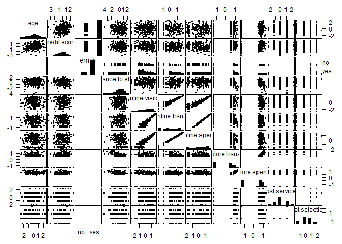
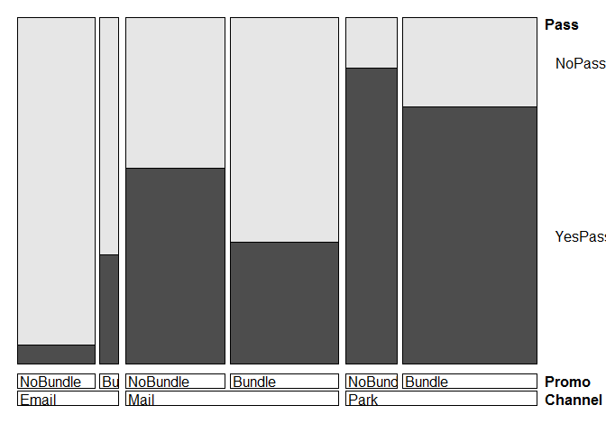

# R4maket_ch9
ksg  
2015년 9월 18일  

#9. Additional Linear Modeling Topics

  - 선형회기에는 다양한 방법이 있다. 이번장에서는 추가적인 선형회기를 알아본다
  - 공산성의 문제가 생길경우 (독립변인간 높은상관을 보임) 데이터를 교정한다
  - 예, 아니오로 피팅되는 모델 혹은 binary한 결과값이 나올때(물건구매) 로지스틱회기모델 사용한다
  - 샘플뿐 아니라 전체 개인의 선호나 반응을 찾는 모델에서 우리는 소비자 개인을 이해하고 행동의 다양성과 사람들의 제품에 대한 흥미를 알고자 한다. hierarchical linear models (HLM)을 소비자의 선호평점과 결합하여 알아보자.
  - 개인의 선호에 대한 hierarchical linear models은 베이지안 방법론을 측정된다.
  - hierarchical Bayesian (HB) methods, and we apply HB for ratings-based conjoint analysis.

##9.1 Handling Highly Correlated Variables

###9.1.1 An Initial Linear Model of Online Spend

  - 데이터 로딩 

```r
cust.df <- read.csv("http://goo.gl/PmPkaG")
summary(cust.df)
```

```
##     cust.id            age         credit.score   email    
##  Min.   :   1.0   Min.   :19.34   Min.   :543.0   no :186  
##  1st Qu.: 250.8   1st Qu.:31.43   1st Qu.:691.7   yes:814  
##  Median : 500.5   Median :35.10   Median :725.5            
##  Mean   : 500.5   Mean   :34.92   Mean   :725.5            
##  3rd Qu.: 750.2   3rd Qu.:38.20   3rd Qu.:757.2            
##  Max.   :1000.0   Max.   :51.86   Max.   :880.8            
##                                                            
##  distance.to.store  online.visits     online.trans      online.spend    
##  Min.   :  0.2136   Min.   :  0.00   Min.   :  0.000   Min.   :   0.00  
##  1st Qu.:  3.3383   1st Qu.:  0.00   1st Qu.:  0.000   1st Qu.:   0.00  
##  Median :  7.1317   Median :  6.00   Median :  2.000   Median :  37.03  
##  Mean   : 14.6553   Mean   : 28.29   Mean   :  8.385   Mean   : 170.32  
##  3rd Qu.: 16.6589   3rd Qu.: 31.00   3rd Qu.:  9.000   3rd Qu.: 177.89  
##  Max.   :267.0864   Max.   :606.00   Max.   :169.000   Max.   :3593.03  
##                                                                         
##   store.trans      store.spend      sat.service   sat.selection  
##  Min.   : 0.000   Min.   :  0.00   Min.   :1.00   Min.   :1.000  
##  1st Qu.: 0.000   1st Qu.:  0.00   1st Qu.:3.00   1st Qu.:2.000  
##  Median : 1.000   Median : 30.05   Median :3.00   Median :2.000  
##  Mean   : 1.323   Mean   : 47.58   Mean   :3.07   Mean   :2.401  
##  3rd Qu.: 2.000   3rd Qu.: 66.49   3rd Qu.:4.00   3rd Qu.:3.000  
##  Max.   :12.000   Max.   :705.66   Max.   :5.00   Max.   :5.000  
##                                    NA's   :341    NA's   :341
```
complete.cases(cust.df)
  - 다중회귀분석 실시(online.spend ~ 나머지변인 전부)
  - 고객ID와 온라인 구매가 0원인 사람을 제외한다.

```r
spend.m1 <- lm(online.spend ~ .,data=subset(cust.df[ , -1], online.spend > 0))
summary(spend.m1)
```

```
## 
## Call:
## lm(formula = online.spend ~ ., data = subset(cust.df[, -1], online.spend > 
##     0))
## 
## Residuals:
##      Min       1Q   Median       3Q      Max 
## -234.097   -8.828    0.519    9.956  227.238 
## 
## Coefficients:
##                    Estimate Std. Error t value Pr(>|t|)    
## (Intercept)        6.718948  33.537665   0.200   0.8413    
## age                0.422773   0.450825   0.938   0.3489    
## credit.score      -0.033698   0.043977  -0.766   0.4440    
## emailyes          -5.689283   5.806621  -0.980   0.3278    
## distance.to.store -0.043548   0.100539  -0.433   0.6651    
## online.visits     -0.072269   0.204061  -0.354   0.7234    
## online.trans      20.610744   0.667450  30.880   <2e-16 ***
## store.trans        0.135018   3.211943   0.042   0.9665    
## store.spend        0.001796   0.078732   0.023   0.9818    
## sat.service        5.638769   3.016181   1.870   0.0623 .  
## sat.selection     -4.370606   2.909073  -1.502   0.1338    
## ---
## Signif. codes:  0 '***' 0.001 '**' 0.01 '*' 0.05 '.' 0.1 ' ' 1
## 
## Residual standard error: 42.77 on 407 degrees of freedom
##   (214 observations deleted due to missingness)
## Multiple R-squared:  0.9831,	Adjusted R-squared:  0.9827 
## F-statistic:  2363 on 10 and 407 DF,  p-value: < 2.2e-16
```
  - online spend와 online transactions (coefficient = 20.6) 높은회귀계수인 
  - online spend와 online visits는 그렇지 않고  반대
  - 모델은 대부분의 변수가 모두 유용하다고본다. (R2 = 0.98) 1에가까움
  - 뭔가 이상함 : 그 이유는 온라인 전환은 온라인 방문과는 독립적이기 때문이다.
  - 그럼에도 어떻게 online spending를 잘 예측했을까? (R-squared:0.98)
  - 또한 알려준다 store.trans의 standard error가 크다, 그리고 그 측정치가 불확실하다. 
  - 문제를 알아보기 위해서 gpairs함수로 시각화를 해본다.
  - 편포와 높은상관을보이는 변인쌍 있음을 알수있다. 이를 교정해야한다.

```r
library(gpairs)
```

```
## Warning: package 'gpairs' was built under R version 3.2.2
```

```r
gpairs(cust.df)
```

```
## Loading required package: grid
## Loading required package: lattice
```

 

  
####Box-Cox transformation  
  - Box-Cox변환이란 데이터들이 등분산을 갖는 정규분포가 되도록 변환시키는 것
  - 데이터들이 등분산이고 정규분포라는 가정하에서 여러 이론들을 정립됨
  - Box-Cox Transformation으로 데이터를변환시키면 회귀분석, 가설검정, ANOVA 등이 적용가느 
  - 함수작성 : BoxCox.lambda(x) 람다값 찾음, BoxCox함수로 변환 scale()함수로 표준화

```r
#install.packages("forecast")
autoTransform <- function(x) {
  library(forecast)
  return(scale(BoxCox(x, BoxCox.lambda(x))))
  } 
```


  - 박스콕스 변환 실시
  - NA가 없는 데이터만 고객ID를 빼고 cust.df.bc 할당
  - 온라인구매금액이 있는 사람만 cust.df.bc 할당
  - email변수 빼고 나머지만 autoTransform 적용하여 cust.df.bc에 덥어쓰기 

```r
cust.df.bc <- cust.df[complete.cases(cust.df), -1] 
cust.df.bc <- subset(cust.df.bc, online.spend > 0) 
numcols <- which(colnames(cust.df.bc) != "email")  
cust.df.bc[ , numcols] <- lapply(cust.df.bc[ , numcols], autoTransform ) 
```

```
## Warning: package 'forecast' was built under R version 3.2.2
```

```
## Loading required package: zoo
## 
## Attaching package: 'zoo'
## 
## The following objects are masked from 'package:base':
## 
##     as.Date, as.Date.numeric
## 
## Loading required package: timeDate
```

```
## Warning: package 'timeDate' was built under R version 3.2.2
```

```
## This is forecast 6.1
```

  - 변환된 데이터 확인

```r
summary(cust.df.bc) 
```

```
##         age.V1          credit.score.V1   email     distance.to.store.V1
##  Min.   :-2.6028151   Min.   :-3.549645   no : 67   Min.   :-4.151249   
##  1st Qu.:-0.6102340   1st Qu.:-0.664190   yes:351   1st Qu.:-0.642231   
##  Median : 0.0319899   Median : 0.024254             Median : 0.110540   
##  Mean   : 0.0000000   Mean   : 0.000000             Mean   : 0.000000   
##  3rd Qu.: 0.6444580   3rd Qu.: 0.687857             3rd Qu.: 0.723209   
##  Max.   : 2.4751221   Max.   : 2.691592             Max.   : 2.235170   
##    online.visits.V1     online.trans.V1      online.spend.V1   
##  Min.   :-2.5478012   Min.   :-1.6105773   Min.   :-1.9847582  
##  1st Qu.:-0.6422584   1st Qu.:-0.9065743   1st Qu.:-0.7686352  
##  Median : 0.1265838   Median : 0.1092692   Median : 0.1358798  
##  Mean   : 0.0000000   Mean   : 0.0000000   Mean   : 0.0000000  
##  3rd Qu.: 0.8231873   3rd Qu.: 0.8739755   3rd Qu.: 0.8897866  
##  Max.   : 1.7768679   Max.   : 1.8204545   Max.   : 1.7784232  
##     store.trans.V1       store.spend.V1       sat.service.V1   
##  Min.   :-1.3303670   Min.   :-1.3373428   Min.   :-2.2411659  
##  1st Qu.:-1.3303670   1st Qu.:-1.3373428   1st Qu.:-0.0917797  
##  Median : 0.5382470   Median : 0.5997467   Median :-0.0917797  
##  Mean   : 0.0000000   Mean   : 0.0000000   Mean   : 0.0000000  
##  3rd Qu.: 0.7660742   3rd Qu.: 0.7674898   3rd Qu.: 1.1080508  
##  Max.   : 1.3605408   Max.   : 1.2717696   Max.   : 2.3654420  
##    sat.selection.V1  
##  Min.   :-1.6476883  
##  1st Qu.:-0.3270153  
##  Median :-0.3270153  
##  Mean   : 0.0000000  
##  3rd Qu.: 0.7455990  
##  Max.   : 2.5321752
```

```r
gpairs(cust.df.bc)
```

 

  - LM모델에 피팅(online.spend ~ 나머지 전부)
  - LM모델에 피팅(online.spend ~ online.trans)
  - R2와 P값이 큰차이가 없다면 심플한 모델이 더 좋음

```r
spend.m2 <- lm(online.spend ~ ., data=cust.df.bc)
summary(spend.m2)
```

```
## 
## Call:
## lm(formula = online.spend ~ ., data = cust.df.bc)
## 
## Residuals:
##      Min       1Q   Median       3Q      Max 
## -0.38976 -0.05409  0.00027  0.05591  0.26628 
## 
## Coefficients:
##                     Estimate Std. Error t value Pr(>|t|)    
## (Intercept)       -0.0059639  0.0108943  -0.547    0.584    
## age                0.0001875  0.0044821   0.042    0.967    
## credit.score      -0.0026632  0.0045185  -0.589    0.556    
## emailyes           0.0071023  0.0119316   0.595    0.552    
## distance.to.store -0.0020362  0.0048800  -0.417    0.677    
## online.visits     -0.0003913  0.0126165  -0.031    0.975    
## online.trans       0.9960378  0.0126687  78.622   <2e-16 ***
## store.trans       -0.0266674  0.0480675  -0.555    0.579    
## store.spend        0.0274099  0.0475888   0.576    0.565    
## sat.service        0.0059429  0.0052732   1.127    0.260    
## sat.selection      0.0030628  0.0052624   0.582    0.561    
## ---
## Signif. codes:  0 '***' 0.001 '**' 0.01 '*' 0.05 '.' 0.1 ' ' 1
## 
## Residual standard error: 0.08747 on 407 degrees of freedom
## Multiple R-squared:  0.9925,	Adjusted R-squared:  0.9923 
## F-statistic:  5410 on 10 and 407 DF,  p-value: < 2.2e-16
```

```r
spend.m3 <- lm(online.spend ~ online.trans, data=cust.df.bc)
summary(spend.m3)
```

```
## 
## Call:
## lm(formula = online.spend ~ online.trans, data = cust.df.bc)
## 
## Residuals:
##      Min       1Q   Median       3Q      Max 
## -0.38028 -0.05247  0.00063  0.05486  0.26863 
## 
## Coefficients:
##                Estimate Std. Error t value Pr(>|t|)    
## (Intercept)  -5.854e-17  4.259e-03     0.0        1    
## online.trans  9.962e-01  4.264e-03   233.6   <2e-16 ***
## ---
## Signif. codes:  0 '***' 0.001 '**' 0.01 '*' 0.05 '.' 0.1 ' ' 1
## 
## Residual standard error: 0.08707 on 416 degrees of freedom
## Multiple R-squared:  0.9924,	Adjusted R-squared:  0.9924 
## F-statistic: 5.459e+04 on 1 and 416 DF,  p-value: < 2.2e-16
```

  - anova() 함수로 모델을 비교해봄
  - 통계적으로 두 모델의 차이는 유의미하지않음(p값 0.8)

```r
anova(spend.m3, spend.m2)
```

```
## Analysis of Variance Table
## 
## Model 1: online.spend ~ online.trans
## Model 2: online.spend ~ age + credit.score + email + distance.to.store + 
##     online.visits + online.trans + store.trans + store.spend + 
##     sat.service + sat.selection
##   Res.Df    RSS Df Sum of Sq      F Pr(>F)
## 1    416 3.1539                           
## 2    407 3.1139  9  0.040001 0.5809 0.8129
```
  - 이를 공선성의 문제(collinearity)라함
  - 결정계수 R2값은 높아 회귀식의 설명력은 높음
  - 그러나 한변수의 P-value값이 커서 다른변수들이 유의하지 않ㅇ
  - 이는 표준오차의 증가를 야기시킴(즉, 회귀계수가 불안정함, 샘플에 따라 쉽게 바뀜)
  
###9.1.2 Remediating Collinearity 
 
  - 공선성의 정도는 variance inflation factor(VIF-분산팽창요인)로 진단함
  - VIF는 얼마나 표준오차가 발생하는지 상관이 없는 또는 다른 변인들과 회기와 성능을 비교하는 것이다.
  - 일반적을 VIF > 5.0 이면, 공선성의 교정이 필요함을 의미한다.
  - spend.m2 모델에서 online.visits, online.trans, store.trans, store.spend 공선성이 확인된다.

```r
library(car)
vif(spend.m2)
```

```
##               age      credit.score             email distance.to.store 
##          1.094949          1.112784          1.046874          1.297978 
##     online.visits      online.trans       store.trans       store.spend 
##          8.675817          8.747756        125.931383        123.435407 
##       sat.service     sat.selection 
##          1.515576          1.509377
```
  - <공선성 교정 3가지 방법>
  - 1) 높은 상관의 변인을 제외한다.
  - 2) 주성분의 추출을 통해 상관을 제거한다.(8장의 주성분 분석)
  - 3) 공선성에 둔감한 방법을 사용한다.(전통적인 회귀가 아닌, 랜덤포레스트-11장)
  - 기타) 현재 데이터를 믹스하여 새로운 변수를 만든다.(such as spend per transaction)
  - 1,2번의 접근을 실시해보자
  
### <공선성 교정> 
  - 높은상관의 변인제거
  - online visit은 좋은 예측지표가 됬다. 또한 email status, age도 상관이 발견됬다.

```r
spend.m4 <- lm(online.spend ~ . -online.trans -store.trans,data=cust.df.bc) 
summary(spend.m4)
```

```
## 
## Call:
## lm(formula = online.spend ~ . - online.trans - store.trans, data = cust.df.bc)
## 
## Residuals:
##      Min       1Q   Median       3Q      Max 
## -1.36373 -0.13135  0.05888  0.18476  1.03794 
## 
## Coefficients:
##                     Estimate Std. Error t value Pr(>|t|)    
## (Intercept)       -0.0923395  0.0435047  -2.123   0.0344 *  
## age               -0.0333779  0.0178813  -1.867   0.0627 .  
## credit.score      -0.0084524  0.0180637  -0.468   0.6401    
## emailyes           0.1099655  0.0476011   2.310   0.0214 *  
## distance.to.store  0.0001702  0.0189271   0.009   0.9928    
## online.visits      0.9295374  0.0174184  53.365   <2e-16 ***
## store.spend        0.0092463  0.0189552   0.488   0.6260    
## sat.service       -0.0121405  0.0211147  -0.575   0.5656    
## sat.selection      0.0048591  0.0211226   0.230   0.8182    
## ---
## Signif. codes:  0 '***' 0.001 '**' 0.01 '*' 0.05 '.' 0.1 ' ' 1
## 
## Residual standard error: 0.3511 on 409 degrees of freedom
## Multiple R-squared:  0.8791,	Adjusted R-squared:  0.8767 
## F-statistic: 371.6 on 8 and 409 DF,  p-value: < 2.2e-16
```

```r
vif(spend.m4)
```

```
##               age      credit.score             email distance.to.store 
##          1.081411          1.103586          1.033945          1.211607 
##     online.visits       store.spend       sat.service     sat.selection 
##          1.026148          1.215208          1.507866          1.509001
```
  - 2) 주성분의 추출
  - 주성분분석에서 직교개념=>새로운 상관없는 차원 생성=>공선성없음 
  - online.visits, online.trans 두개로부터 주성분을 하나 추출(pc.online)
  - store.trans, store.spend 두개로부터 주성분을 하나 추출(pc.store)

```r
pc.online <- prcomp(cust.df.bc[ , c("online.visits", "online.trans")])
cust.df.bc$online <- pc.online$x[ , 1]
summary(pc.online)
```

```
## Importance of components:
##                           PC1     PC2
## Standard deviation     1.3927 0.24573
## Proportion of Variance 0.9698 0.03019
## Cumulative Proportion  0.9698 1.00000
```

```r
pc.store <- prcomp(cust.df.bc[ , c("store.trans", "store.spend")])
cust.df.bc$store <- pc.store$x[ , 1]
summary(pc.store)
```

```
## Importance of components:
##                           PC1     PC2
## Standard deviation     1.4127 0.06604
## Proportion of Variance 0.9978 0.00218
## Cumulative Proportion  0.9978 1.00000
```

  - 추출한 주성분을 변수로 넣고 다시 선형회기 피팅
  - online 변수가 유의미한 변수로 나옴 

```r
spend.m5 <- lm(online.spend ~ email + age + credit.score 
               + distance.to.store + sat.service + sat.selection 
               + online + store, data=cust.df.bc)
summary(spend.m5)
```

```
## 
## Call:
## lm(formula = online.spend ~ email + age + credit.score + distance.to.store + 
##     sat.service + sat.selection + online + store, data = cust.df.bc)
## 
## Residuals:
##      Min       1Q   Median       3Q      Max 
## -0.83697 -0.08532  0.01288  0.09664  0.73327 
## 
## Coefficients:
##                     Estimate Std. Error  t value Pr(>|t|)    
## (Intercept)       -3.928e-02  2.410e-02   -1.630   0.1039    
## emailyes           4.678e-02  2.638e-02    1.773   0.0769 .  
## age               -1.695e-02  9.882e-03   -1.715   0.0871 .  
## credit.score      -3.649e-03  9.981e-03   -0.366   0.7148    
## distance.to.store -2.666e-05  1.051e-02   -0.003   0.9980    
## sat.service       -2.762e-03  1.167e-02   -0.237   0.8130    
## sat.selection      3.153e-03  1.167e-02    0.270   0.7872    
## online            -7.019e-01  6.933e-03 -101.247   <2e-16 ***
## store             -2.712e-03  7.455e-03   -0.364   0.7162    
## ---
## Signif. codes:  0 '***' 0.001 '**' 0.01 '*' 0.05 '.' 0.1 ' ' 1
## 
## Residual standard error: 0.1941 on 409 degrees of freedom
## Multiple R-squared:  0.9631,	Adjusted R-squared:  0.9623 
## F-statistic:  1333 on 8 and 409 DF,  p-value: < 2.2e-16
```

```r
vif(spend.m5)
```

```
##             email               age      credit.score distance.to.store 
##          1.039458          1.081430          1.103206          1.224019 
##       sat.service     sat.selection            online             store 
##          1.508487          1.509001          1.032362          1.228073
```

###9.2 Linear Models for Binary Outcomes: Logistic Regression

  - 로지스틱회귀의 핵심특징은 예측변인의 지수함수의 결과물로 확률로 연결된다는 것이다.
  - 고객이 물건을 구매할 확률 또는 프로모션에 응답할 확률등과 같은 관심사에 직접적인 모델이다
  - 종속변수가 0~1 범위의 값을 갖는 모델링을 하는데에 제한된다.
  - 종속변수의 값이 0.5보다 크면 사건이 발생 0.5보다 작으면 그렇지 않음
  - plogis()함수로 로지스틱회귀 방정식 계산할수 있음


```r
exp(0) / (exp(0) + 1) # computing logistic by hand; could use plogis()
```

```
## [1] 0.5
```

```r
plogis(-Inf) # infinitely low = likelihood 0
```

```
## [1] 0
```

```r
plogis(2) # moderate probability = 88% chance of outcome
```

```
## [1] 0.8807971
```

```r
plogis(-0.2) # weak likelihood
```

```
## [1] 0.450166
```

  - y발생할 상대적 가능성(odds ratio)에 로그를 취해서 얻어지는 값으로 결정되는 logit모델이라 함
  - R은 이 함수를 qloigs로 산출해준다.
  - 여기서 얻은 값을 로지스틱회귀모형의 사후확률이라하고 분석자가 선정한 값보다 크면 집단1, 작으면 집단2로 분류한다.

```r
log(0.88 / (1-0.88)) # moderate high likelihood
```

```
## [1] 1.99243
```

```r
qlogis(0.88) # equivalent to hand computation
```

```
## [1] 1.99243
```


###9.2.2 Data for Logistic Regression of Season Passes

  - 7장의 놀이공원 데이터 예재 : 시즌티켓 구매여부가 포함된 데이터임
  - 2가지 변인에 기초함 - 사전메일 받았는지, 프로모션 혜택을 제공하였는지(무료주차권)
  - 마케터는 번들(주차권)제공시 고객의 구매를 촉진하는지 궁금하다.
  - data 로딩

```r
pass.df <- read.csv("http://goo.gl/J8MH6A")
pass.df$Promo <- factor(pass.df$Promo, levels=c("NoBundle", "Bundle"))
summary(pass.df)
```

```
##   Channel          Promo           Pass     
##  Email: 633   NoBundle:1482   NoPass :1567  
##  Mail :1328   Bundle  :1674   YesPass:1589  
##  Park :1195
```

```r
head(pass.df)
```

```
##   Channel  Promo    Pass
## 1    Mail Bundle YesPass
## 2    Mail Bundle YesPass
## 3    Mail Bundle YesPass
## 4    Mail Bundle YesPass
## 5    Mail Bundle YesPass
## 6    Mail Bundle YesPass
```

  - 테이블 형태를 변형(카이스퀘어 분석 등에 용이하게끔)

```r
pass.tab <- c(242, 639, 38, 359, 284, 27, 449, 223, 83, 278, 49, 485)
dim(pass.tab) <- c(3,2,2)
class(pass.tab) <- "table"
dimnames(pass.tab) <- list(Channel=c("Mail", "Park", "Email"),
                           Promo=c("Bundle", "NoBundle"),
                           Pass=c("YesPass", "NoPass") )
pass.tab
```

```
## , , Pass = YesPass
## 
##        Promo
## Channel Bundle NoBundle
##   Mail     242      359
##   Park     639      284
##   Email     38       27
## 
## , , Pass = NoPass
## 
##        Promo
## Channel Bundle NoBundle
##   Mail     449      278
##   Park     223       49
##   Email     83      485
```


```r
table(pass.df)
```

```
## , , Pass = NoPass
## 
##        Promo
## Channel NoBundle Bundle
##   Email      485     83
##   Mail       278    449
##   Park        49    223
## 
## , , Pass = YesPass
## 
##        Promo
## Channel NoBundle Bundle
##   Email       27     38
##   Mail       359    242
##   Park       284    639
```

###9.2.5 Finalizing the Data
  - 테이블을 데이터프레임브로 변환할수 있음
  - vcdExtra패키지의 expand.dft()함수 사용

```r
#install.packages("vcdExtra")
library(vcdExtra)
```

```
## Warning: package 'vcdExtra' was built under R version 3.2.2
```

```
## Loading required package: vcd
```

```
## Warning: package 'vcd' was built under R version 3.2.2
```

```
## Loading required package: gnm
```

```
## Warning: package 'gnm' was built under R version 3.2.2
```

```
## 
## Attaching package: 'gnm'
## 
## The following object is masked from 'package:lattice':
## 
##     barley
```

```r
pass.df <- expand.dft(pass.tab)
str(pass.df)
```

```
## 'data.frame':	3156 obs. of  3 variables:
##  $ Channel: Factor w/ 3 levels "Email","Mail",..: 2 2 2 2 2 2 2 2 2 2 ...
##  $ Promo  : Factor w/ 2 levels "Bundle","NoBundle": 1 1 1 1 1 1 1 1 1 1 ...
##  $ Pass   : Factor w/ 2 levels "NoPass","YesPass": 2 2 2 2 2 2 2 2 2 2 ...
```

```r
head(pass.df)
```

```
##   Channel  Promo    Pass
## 1    Mail Bundle YesPass
## 2    Mail Bundle YesPass
## 3    Mail Bundle YesPass
## 4    Mail Bundle YesPass
## 5    Mail Bundle YesPass
## 6    Mail Bundle YesPass
```
  
  
  - table() 함수로 교차표 생성 가능 구매여부/프로모션 번들

```r
table(pass.df$Pass, pass.df$Promo)
```

```
##          
##           Bundle NoBundle
##   NoPass     755      812
##   YesPass    919      670
```


  - 회귀모형에서 번들의 긍정적인효과는 음의값을 의미한다.
  - 난해한 로직(노번들에서 부정적효과를 확인함)보다 쉽게 해석하기위해 변수 재할당

```r
pass.df$Promo <- factor(pass.df$Promo, levels=c("NoBundle", "Bundle"))
table(pass.df$Pass, pass.df$Promo)
```

```
##          
##           NoBundle Bundle
##   NoPass       812    755
##   YesPass      670    919
```

###9.2.6 Fitting a Logistic Regression Model
  - GLM은 정상분포가 아닌 변인들을 다룰 수 있다.
  - GLM은 구매회수, 웹사이트 방문시간, yes/no와 같은 변인을 다룬다.
  - GLM의 일반적 특징은 정규분포된 예측치로 비정규분포의 결과물을 산출하는 함수
  - GLM은 링크라고 알려진 함수를 사용해 정규분포된 예측치로 비정규분포의 결과물을 산출한다.
  - GML패키지는 다양한 함수를 제공한다. family인수에 입력해야한다.  
  - 이항결과를 산출하기 위해서 family=binomial 인수를 써야함
  - 인수를 넣지 않으면 logit 함수가 적용됨
  - 우리는 "번들 프로모션이 시즌권 판매에 효과가 있는가?"이다.

```r
pass.m1 <- glm(Pass ~ Promo, data=pass.df, family=binomial)
summary(pass.m1)
```

```
## 
## Call:
## glm(formula = Pass ~ Promo, family = binomial, data = pass.df)
## 
## Deviance Residuals: 
##    Min      1Q  Median      3Q     Max  
## -1.262  -1.097   1.095   1.095   1.260  
## 
## Coefficients:
##             Estimate Std. Error z value Pr(>|z|)    
## (Intercept) -0.19222    0.05219  -3.683 0.000231 ***
## PromoBundle  0.38879    0.07167   5.425 5.81e-08 ***
## ---
## Signif. codes:  0 '***' 0.001 '**' 0.01 '*' 0.05 '.' 0.1 ' ' 1
## 
## (Dispersion parameter for binomial family taken to be 1)
## 
##     Null deviance: 4375.0  on 3155  degrees of freedom
## Residual deviance: 4345.4  on 3154  degrees of freedom
## AIC: 4349.4
## 
## Number of Fisher Scoring iterations: 3
```
  - coefficient : 0.3888  / p밸류 : 5.81e-08 (번들은 시즌권 판매에 유의한 영향을 미쳤음)
  - 0.388값을 시즌권판매 관계 계산에 이용할수 있음 성공확률*비성공확률을 plogis함수에 직접 넣음

```r
plogis(0.3888) / (1-plogis(0.3888))
```

```
## [1] 1.475209
```
  - effect of Bundle is an estimated odds ratio of 1.475
  - 이는 번들제공시 시즌권을 살 확률이 147%라는 것이다. 즉, 번들이 구매 확률을 47% 증가 시켰다는 것을 의미한다. 
  - 쉽게 이를 계산하는 방법은 exp함수에 넣는것이다.

```r
exp(0.3888)
```

```
## [1] 1.475209
```

```r
exp(coef(pass.m1))
```

```
## (Intercept) PromoBundle 
##   0.8251232   1.4751962
```

  - We can obtain a confidence interval for the odds ratio using exp(confint(model))

```r
exp(confint(pass.m1))
```

```
## Waiting for profiling to be done...
```

```
##                2.5 %    97.5 %
## (Intercept) 0.744749 0.9138654
## PromoBundle 1.282055 1.6979776
```

###9.2.7 Reconsidering the Model

  - 추가적인 탐색을 통해 흥미로운 사실을 발견할 수있다.(채널변수)
  - 놀이공원(park)에서 직접 구매한 사람이 제일 많다.
  - 테이블을 시각화하는 좋은 방법은 모자이크플랏이다.
  - doubledecker 플랏(기존 모자이크플랏보다 좋음)으로 data확인

```r
table(pass.df$Pass, pass.df$Channel)
```

```
##          
##           Email Mail Park
##   NoPass    568  727  272
##   YesPass    65  601  923
```

```r
library(vcd)
doubledecker(table(pass.df))
```

 

  - 채널을 넣어서 다시 GLM돌려보자
  - 프로모션은 강하게 부정적인 기여를 한다.

```r
pass.m2 <- glm(Pass ~ Promo + Channel, data=pass.df, family=binomial)
summary(pass.m2)
```

```
## 
## Call:
## glm(formula = Pass ~ Promo + Channel, family = binomial, data = pass.df)
## 
## Deviance Residuals: 
##     Min       1Q   Median       3Q      Max  
## -1.9079  -0.9883   0.5946   0.7637   2.3272  
## 
## Coefficients:
##             Estimate Std. Error z value Pr(>|z|)    
## (Intercept) -2.07860    0.13167 -15.787  < 2e-16 ***
## PromoBundle -0.56022    0.09031  -6.203 5.54e-10 ***
## ChannelMail  2.17617    0.14651  14.854  < 2e-16 ***
## ChannelPark  3.72176    0.15964  23.313  < 2e-16 ***
## ---
## Signif. codes:  0 '***' 0.001 '**' 0.01 '*' 0.05 '.' 0.1 ' ' 1
## 
## (Dispersion parameter for binomial family taken to be 1)
## 
##     Null deviance: 4375.0  on 3155  degrees of freedom
## Residual deviance: 3490.2  on 3152  degrees of freedom
## AIC: 3498.2
## 
## Number of Fisher Scoring iterations: 4
```

  - compute the odds ratios and confidence intervals
  - 번들프로모션은 32–53 % 구매확률을 낮추는것과 관련된다.
  - 공원에서 판매는 30~56으로 더 높아졌다.

```r
exp(coef(pass.m2))
```

```
## (Intercept) PromoBundle ChannelMail ChannelPark 
##   0.1251054   0.5710846   8.8125066  41.3371206
```

```r
exp(confint(pass.m2))
```

```
## Waiting for profiling to be done...
```

```
##                   2.5 %     97.5 %
## (Intercept)  0.09577568  0.1606189
## PromoBundle  0.47793969  0.6810148
## ChannelMail  6.65770550 11.8328173
## ChannelPark 30.42959274 56.9295369
```
  - 이를 적절한 모델이라고 할수 있는가?
  - 번들플모션은 채널에 의해 차별적으로 영향을 미친다.
  - 번들-이메일간에 극적인 차이를 보이므로 상호작용효과를 보자.

```r
pass.m3 <- glm(Pass ~ Promo + Channel + Promo:Channel,
               data=pass.df, family=binomial)
summary(pass.m3)
```

```
## 
## Call:
## glm(formula = Pass ~ Promo + Channel + Promo:Channel, family = binomial, 
##     data = pass.df)
## 
## Deviance Residuals: 
##     Min       1Q   Median       3Q      Max  
## -1.9577  -0.9286   0.5642   0.7738   2.4259  
## 
## Coefficients:
##                         Estimate Std. Error z value Pr(>|z|)    
## (Intercept)              -2.8883     0.1977 -14.608  < 2e-16 ***
## PromoBundle               2.1071     0.2783   7.571 3.71e-14 ***
## ChannelMail               3.1440     0.2133  14.743  < 2e-16 ***
## ChannelPark               4.6455     0.2510  18.504  < 2e-16 ***
## PromoBundle:ChannelMail  -2.9808     0.3003  -9.925  < 2e-16 ***
## PromoBundle:ChannelPark  -2.8115     0.3278  -8.577  < 2e-16 ***
## ---
## Signif. codes:  0 '***' 0.001 '**' 0.01 '*' 0.05 '.' 0.1 ' ' 1
## 
## (Dispersion parameter for binomial family taken to be 1)
## 
##     Null deviance: 4375.0  on 3155  degrees of freedom
## Residual deviance: 3393.5  on 3150  degrees of freedom
## AIC: 3405.5
## 
## Number of Fisher Scoring iterations: 5
```
  - 채널과 프로모션의 상호작용은 통계적으로 유의미함
  - mail, in-park*프로모션 상호작용은 강하게 부적인 효과
  - odds ratios, promotion is only 2–11 % as effective through the mail and in-park channels as it is in email:


```r
exp(confint(pass.m3))
```

```
## Waiting for profiling to be done...
```

```
##                               2.5 %       97.5 %
## (Intercept)              0.03688720   0.08032263
## PromoBundle              4.78970184  14.31465957
## ChannelMail             15.54800270  35.97860059
## ChannelPark             64.74364028 173.57861021
## PromoBundle:ChannelMail  0.02795867   0.09102369
## PromoBundle:ChannelPark  0.03135437   0.11360965
```


