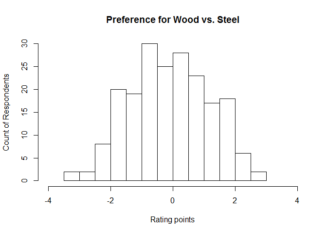
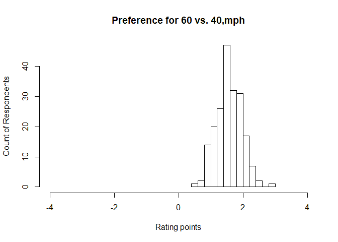
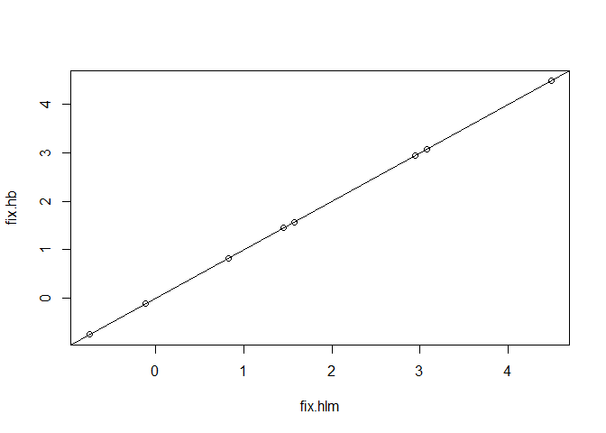

# CH9. hlm
ksg  
2015년 10월 9일  


###9.3.1 Some HLM Concepts
  - Hierarchical models은 고정효과와 무선효과를 구별한다. 
  
  - fixed effects(모든 응답에 동일한 효과를 갖는)
  - 일반회귀분석에서는 모든효과는 fixed effects이다.
  - 예를들어 7장에서 온라인구매금액은 큰관련성을 나이는 적은관련성을 보였다.
  - 이는 모든 샘플에 동일한 패턴으로 fixed effects를 예측한것이다.
  
  - random effects
  - 개별 또는 집단의 분포에 따라서 회기계수를 교정하는것을 말한다.
  - 개별 그리고 전체 샘플의 다른수준을 고려한 이런 모델을 multilevel models이라고 한다.
  - 모델의 서브셋이 있는것을 mixed effect모델이라고 한다. 
  - 개별응답에 최소 2가지 이상의 효과가 결합되어 전체 효과를 반영되는 것

  - nested model
  - mixed effects models의 최종적 변화(전체 샘플의 서브그룹에서만 발생한 변인의 효과)를 nested model이라고한다.
  - 2개의 다른 프로모션을 각각의 다른 가게에서 실시했을때 가게에따라 다른 랜덤효과가 발생한경우
  - 각각 다른가계에서 다른 프로모션을 실시한 경우 가게에 따라 다르게 발생한 sales intercepts은 무선효과이고 프로모션의 효가는 내재효과이다.

###9.3.2 Ratings-Based Conjoint Analysis for the Amusement Park
  - 놀이공원에서 새로운 롤러코스터를 만들기 위해 고개들에게 설문을 실시
  - 코스터 속도(40,50,60,70)
  - 높이(200,300,400)
  - 건축유형(나무, 금속)
  - 테마(용, 독수리)
  - 어떤 조합이 가장 인기가 있을지에 대해 알기위해서 고객선호 조사함
  - 질문 : 나무로 만들어진 400피트 높이의 최고속도는 50mph인 용테마의 롤러코스터에 대해서 1-10점을 평가를 해주시기바랍니다.
  - HML은 전체 집단의 고정효과와 개인별수준에 따른 무선효과를 측정함 


```r
conjoint.df <- read.csv("http://goo.gl/G8knGV")
conjoint.df$speed <- factor(conjoint.df$speed)
conjoint.df$height <- factor(conjoint.df$height)
summary(conjoint.df)
```

```
##     resp.id           rating       speed     height       const     
##  Min.   :  1.00   Min.   : 1.000   40: 800   200:1400   Steel:1400  
##  1st Qu.: 50.75   1st Qu.: 3.000   50:1200   300:1200   Wood :1800  
##  Median :100.50   Median : 5.000   60: 800   400: 600               
##  Mean   :100.50   Mean   : 5.268   70: 400                          
##  3rd Qu.:150.25   3rd Qu.: 7.000                                    
##  Max.   :200.00   Max.   :10.000                                    
##     theme     
##  Dragon:1600  
##  Eagle :1600  
##               
##               
##               
## 
```

```r
head(conjoint.df)
```

```
##   resp.id rating speed height const  theme
## 1       1      4    40    300 Steel Dragon
## 2       1      3    50    200  Wood Dragon
## 3       1      5    50    300  Wood Dragon
## 4       1      6    60    300  Wood  Eagle
## 5       1      4    60    400  Wood  Eagle
## 6       1      4    50    400 Steel  Eagle
```


  - 데이터구조 : 200명 / 4개 롤러코스터 속성에 따른 16개의 유형 

```r
set.seed(12814)
resp.id <- 1:200 # respondent ids
nques <- 16 # number of conjoint ratings per respondent
speed <- sample(as.factor(c("40", "50", "60", "70")), size=nques, replace=TRUE)
height <- sample(as.factor(c("200", "300", "400")), size=nques, replace=TRUE)
const <- sample(as.factor(c("Wood", "Steel")), size= nques, replace=TRUE)
theme <- sample(as.factor(c("Dragon", "Eagle")), size=nques, replace=TRUE)
```

  -create a model matrix for the combinations of features to rate.
  -multivariate random normal values for respondents’ preferences
  -model.matrix()함수는 디자인 속성의 리스트를 코딩된 값으로 변환
  -MASS패키지으 mvrnorm()함수를 사용해서 특정 선호 가중치를 각 응답에 부여

```r
profiles.df <- data.frame(speed, height, const, theme)
profiles.model <- model.matrix(~ speed + height + const + theme, data=profiles.df)
library(MASS) # a standard library in R
weights <- mvrnorm(length(resp.id),
                   mu=c(-3, 0.5, 1, 3, 2, 1, 0, -0.5),
                   Sigma=diag(c(0.2, 0.1, 0.1, 0.1, 0.2, 0.3, 1, 1)))
```

  - compile the simulated individual ratings
  - multiply the preference weights by the design matrix to get the total preference (utility) for each design adding some random noise with rnorm()
  - We convert the utility to a 10-point rating scale using cut()
  - add the respondent’s result to the overall data frame

```r
conjoint.df <- NULL 
for (i in seq_along(resp.id)) {
  utility <- profiles.model %*% weights[i, ] + rnorm(16) 
  rating <- as.numeric(cut(utility, 10)) 
  conjoint.resp <- cbind(resp.id=rep(i, nques), rating, profiles.df)
  conjoint.df <- rbind(conjoint.df, conjoint.resp)
}
```

###9.3.4 An Initial Linear Model

  - conjoint data to check : 1명이 16개씩,200명 3200개 응ㄷ

```r
summary(conjoint.df)
```

```
##     resp.id           rating       speed     height       const     
##  Min.   :  1.00   Min.   : 1.000   40: 800   200:1400   Steel:1400  
##  1st Qu.: 50.75   1st Qu.: 3.000   50:1200   300:1200   Wood :1800  
##  Median :100.50   Median : 5.000   60: 800   400: 600               
##  Mean   :100.50   Mean   : 5.268   70: 400                          
##  3rd Qu.:150.25   3rd Qu.: 7.000                                    
##  Max.   :200.00   Max.   :10.000                                    
##     theme     
##  Dragon:1600  
##  Eagle :1600  
##               
##               
##               
## 
```

```r
str(conjoint.df)
```

```
## 'data.frame':	3200 obs. of  6 variables:
##  $ resp.id: int  1 1 1 1 1 1 1 1 1 1 ...
##  $ rating : num  4 3 5 6 4 4 4 1 1 3 ...
##  $ speed  : Factor w/ 4 levels "40","50","60",..: 1 2 2 3 3 2 2 1 2 3 ...
##  $ height : Factor w/ 3 levels "200","300","400": 2 1 2 2 3 3 3 1 1 1 ...
##  $ const  : Factor w/ 2 levels "Steel","Wood": 1 2 2 2 2 1 1 1 2 2 ...
##  $ theme  : Factor w/ 2 levels "Dragon","Eagle": 1 1 1 2 2 2 1 1 2 2 ...
```

  - by()함수로 각 속성별 평정값의 평균을 확인할수 있음
  - 높이범위의 중간을 선호하는 응답 확인 (높이=300)

```r
by(conjoint.df$rating, conjoint.df$height, mean)
```

```
## conjoint.df$height: 200
## [1] 3.657857
## -------------------------------------------------------- 
## conjoint.df$height: 300
## [1] 7.254167
## -------------------------------------------------------- 
## conjoint.df$height: 400
## [1] 5.05
```
  
  - 위계적 회기모델이 아닌 일반선형회기분석 실시 lm함수사용
  - coefficients 는 선호와의 관련성을 나타낸다
  - intercept + speed70 + height300 (steel and dragon are included in the intercept)
  - 3.07+4.49+2.94 = 10.46 points on our 10-point rating scale
  - wood and eagle have negative values

```r
ride.lm <- lm(rating ~ speed + height + const + theme, data=conjoint.df)
summary(ride.lm)
```

```
## 
## Call:
## lm(formula = rating ~ speed + height + const + theme, data = conjoint.df)
## 
## Residuals:
##     Min      1Q  Median      3Q     Max 
## -5.8394 -1.3412 -0.0186  1.2798  6.9269 
## 
## Coefficients:
##             Estimate Std. Error t value Pr(>|t|)    
## (Intercept)  3.07307    0.08102  37.932  < 2e-16 ***
## speed50      0.82077    0.10922   7.515 7.35e-14 ***
## speed60      1.57443    0.12774  12.326  < 2e-16 ***
## speed70      4.48697    0.15087  29.740  < 2e-16 ***
## height300    2.94551    0.09077  32.452  < 2e-16 ***
## height400    1.44738    0.12759  11.344  < 2e-16 ***
## constWood   -0.11826    0.11191  -1.057    0.291    
## themeEagle  -0.75454    0.11186  -6.745 1.81e-11 ***
## ---
## Signif. codes:  0 '***' 0.001 '**' 0.01 '*' 0.05 '.' 0.1 ' ' 1
## 
## Residual standard error: 1.967 on 3192 degrees of freedom
## Multiple R-squared:  0.5039,	Adjusted R-squared:  0.5029 
## F-statistic: 463.2 on 7 and 3192 DF,  p-value: < 2.2e-16
```

  - “average”는 이산치의 영향을 받기 때문에 잘못된 결론을 이끌수있다.
  - 고객의 반은 우드를 반은 스틸을 선호한다면 어떻게 할것인가?
  - 그렇다면 2개 그룹에 어필하기 위게 다른 2개의 놀이기구를 건설하는것을 제안할수있다. 반면 건축자재에 대한 영향이 없다면 더 경제적인 것으로 결정할수 있다. 

###9.3.5 Hierarchical Linear Model with lme4
  - 위계적 회기모델에서는 개별수준효과(그룹별 효과)를 추가한다.
  - 가장 간단한 HML은 intercept 값에서의 변화를 허용한다. 개인차로 인한 무선효과는 절편항에 반영된다
  - HML에서 fixed effects를 구하는 동시에 응답별 intercept도 측정한다. 
  - 3가지 방법으로 HLM을 해보자 
  - 첫째, lme4 package의 lmer()함수로 위계적 모형을 측정해보자
  - 둘째, lmer()의 포뮬러로 특정 항의 random effects를 측정해보자
  - 셋째, 각각의 특정그룹에 랜덤 효과가 산출되는 그룹변인을 확인해보자
  - intercept only, + (1 | resp.id)
  - specify the random effect and grouping variable  (“|”) as + (predictors | group)


```r
library(lme4)
```

```
## Loading required package: Matrix
```

```r
ride.hlm1 <- lmer(rating ~ speed + height + const + theme + (1 | resp.id), data=conjoint.df)
summary(ride.hlm1)
```

```
## Linear mixed model fit by REML ['lmerMod']
## Formula: rating ~ speed + height + const + theme + (1 | resp.id)
##    Data: conjoint.df
## 
## REML criterion at convergence: 13324.2
## 
## Scaled residuals: 
##     Min      1Q  Median      3Q     Max 
## -3.3970 -0.6963  0.0006  0.6700  3.3689 
## 
## Random effects:
##  Groups   Name        Variance Std.Dev.
##  resp.id  (Intercept) 0.3352   0.5789  
##  Residual             3.5358   1.8804  
## Number of obs: 3200, groups:  resp.id, 200
## 
## Fixed effects:
##             Estimate Std. Error t value
## (Intercept)  3.07307    0.08759   35.08
## speed50      0.82077    0.10439    7.86
## speed60      1.57443    0.12209   12.90
## speed70      4.48697    0.14421   31.11
## height300    2.94551    0.08676   33.95
## height400    1.44738    0.12195   11.87
## constWood   -0.11826    0.10696   -1.11
## themeEagle  -0.75454    0.10692   -7.06
## 
## Correlation of Fixed Effects:
##            (Intr) sped50 sped60 sped70 hgh300 hgh400 cnstWd
## speed50    -0.329                                          
## speed60    -0.144  0.646                                   
## speed70    -0.088  0.482  0.602                            
## height300  -0.374 -0.311 -0.466 -0.381                     
## height400  -0.166 -0.529 -0.412 -0.174  0.428              
## constWood  -0.191 -0.437 -0.370 -0.278  0.234  0.547       
## themeEagle -0.178  0.183 -0.136 -0.270  0.181 -0.351 -0.563
```
 
  - estimated a unique intercept term adjustment for each respondent.
  - The output section labeled “Random effects” shows 3,200 total observations (survey questions) grouped into 200 respondents for which a random effect was estimated
  - fixef() is an easy way to extract just the fixed (population level) effects


```r
  fixef(ride.hlm1)
```

```
## (Intercept)     speed50     speed60     speed70   height300   height400 
##   3.0730724   0.8207718   1.5744257   4.4869715   2.9455084   1.4473848 
##   constWood  themeEagle 
##  -0.1182553  -0.7545428
```

  - 계산된 200명에 대한 랜덤이펙트는 intercepts에 반영된다.
  - ranef() 함수로 200명에 각각에 대한 수정된 절편을 확인

```r
head(ranef(ride.hlm1)$resp.id)
```

```
##   (Intercept)
## 1 -0.65085636
## 2 -0.04821158
## 3 -0.31186867
## 4 -0.12354218
## 5 -0.23653807
## 6  0.21544551
```
  
  - 각 응답의 complete effect는 전체 고정효과+개인별 무선효과로 구성된다
  - coef() 함수로 complete effect효과를 확인한다
  - 응답자1은 intercept is 3.07(fixef)−0.65(ranef) = 2.42(coef).

```r
head(coef(ride.hlm1)$resp.id)
```

```
##   (Intercept)   speed50  speed60  speed70 height300 height400  constWood
## 1    2.422216 0.8207718 1.574426 4.486971  2.945508  1.447385 -0.1182553
## 2    3.024861 0.8207718 1.574426 4.486971  2.945508  1.447385 -0.1182553
## 3    2.761204 0.8207718 1.574426 4.486971  2.945508  1.447385 -0.1182553
## 4    2.949530 0.8207718 1.574426 4.486971  2.945508  1.447385 -0.1182553
## 5    2.836534 0.8207718 1.574426 4.486971  2.945508  1.447385 -0.1182553
## 6    3.288518 0.8207718 1.574426 4.486971  2.945508  1.447385 -0.1182553
##   themeEagle
## 1 -0.7545428
## 2 -0.7545428
## 3 -0.7545428
## 4 -0.7545428
## 5 -0.7545428
## 6 -0.7545428
```

### 9.3.6 The Complete Hierarchical Linear Model

  - lme4 문법
  - 목표변인을 예측하는 모든 변인을 넣고 랜덤효과를 측정할때 (predictors | group).
  - 변인들의 하위항목들의 무선효과를 측정할때 (speed+ height + const + theme | resp.id)
  - random intercept만 측정할때 HLM은 8개의 모수와 200개의 무선효과를측정했다.
  - full model 은 8개의 고정효과*200개의 무선효과를 측정한다.(3200개의 관측치가 만들어진다)
  - 2가지 함의 : 계산이 느릴수 있다 / 모수가 많기 때문에 3200개의 관측값이 충분하지 않을수 있다.(안정적으로 수렴하는 모델을 만들기어렵다)
  - 첫번째 모델과 다른점은 롤러코스터의 4개 변인과 계산된 무선효과를 추가했다는 것이다. 또한 lmer()의 control인수로 maxfun의 iterations회수를 10000을 100000으로 바꿨다.(디폴트 10000)

```r
ride.hlm2 <- lmer(rating ~ speed + height + const + theme +(
  speed + height + const + theme | resp.id),
  data=conjoint.df,
  control=lmerControl(optCtrl=list(maxfun=100000)))
```
  
  - Fixed effects are extracted with fixef(): 고정효과는 모델1과 같다

```r
fixef(ride.hlm2)
```

```
## (Intercept)     speed50     speed60     speed70   height300   height400 
##   3.0730724   0.8207718   1.5744257   4.4869715   2.9455084   1.4473848 
##   constWood  themeEagle 
##  -0.1182553  -0.7545428
```

  - random effects using ranef(): 각집단(응답)에 대한 모수를 확인
  - 모델 1과 모수가 모두 다르다 

```r
head(ranef(ride.hlm2)$resp.id)
```

```
##   (Intercept)     speed50     speed60    speed70   height300     height400
## 1  -1.1199665 -0.20604229 -0.12508009  0.1029432  0.10742996 -5.040052e-05
## 2  -1.0104395  0.24975147 -0.08225811  0.1626263  0.05611116  1.073264e+00
## 3  -1.0352141 -0.21870654  0.31082354 -0.2928838  0.34166411 -1.136063e-01
## 4   0.8961741 -0.19646902 -0.17363471  0.3197387 -0.27530291 -6.283455e-01
## 5  -0.8543874 -0.01888495 -0.21511974  0.0799711  0.07395290  9.758201e-02
## 6  -0.2803530  0.03469352  0.40699570 -0.2941783  0.09092286  1.669378e-01
##    constWood themeEagle
## 1  0.2243120  0.5339058
## 2  1.5360585 -0.3070216
## 3  0.6040615  0.4485555
## 4 -0.7504901 -0.6407235
## 5  1.6138786 -0.7059147
## 6 -0.5971975  1.3923963
```

  - total coefficients per respondent with coef():

```r
head(coef(ride.hlm2)$resp.id)  
```

```
##   (Intercept)   speed50  speed60  speed70 height300 height400  constWood
## 1    1.953106 0.6147295 1.449346 4.589915  3.052938 1.4473344  0.1060567
## 2    2.062633 1.0705232 1.492168 4.649598  3.001620 2.5206490  1.4178032
## 3    2.037858 0.6020652 1.885249 4.194088  3.287173 1.3337785  0.4858062
## 4    3.969246 0.6243027 1.400791 4.806710  2.670206 0.8190393 -0.8687455
## 5    2.218685 0.8018868 1.359306 4.566943  3.019461 1.5449668  1.4956233
## 6    2.792719 0.8554653 1.981421 4.192793  3.036431 1.6143226 -0.7154528
##   themeEagle
## 1 -0.2206370
## 2 -1.0615644
## 3 -0.3059873
## 4 -1.3952663
## 5 -1.4604575
## 6  0.6378535
```

  - 196번 응답자의 결과로 모델에 따라 어떻게 변하였는지 확인해보자       
  - coefficients are indeed the sum of the fixed and random effects:

```r
fixef(ride.hlm2) + ranef(ride.hlm2)$resp.id[196, ]
```

```
##     (Intercept)   speed50  speed60  speed70 height300 height400 constWood
## 196    2.143067 0.7534514 1.271098 4.594389  2.949589  1.212743  2.580266
##     themeEagle
## 196  -2.192642
```

```r
coef(ride.hlm2)$resp.id[196, ]
```

```
##     (Intercept)   speed50  speed60  speed70 height300 height400 constWood
## 196    2.143067 0.7534514 1.271098 4.594389  2.949589  1.212743  2.580266
##     themeEagle
## 196  -2.192642
```

###9.3.7 Summary of HLM with lme4
  - 다양한 곽측치와 개인 또는 집단별 팩터가 있을때 HLM을 사용해라
  - HLM은 sample-level 과  group-level의 효과를 모두 측정한다.
  - 마케팅에서의 customer-level models은 store, country, geographic region, advertising campaign, advertising creative, channel, bundle, brand등 의 변인을 포함하여 HLM으로 측정되길 요구되기도한다.
  
##9.4 Bayesian Hierarchical Linear Models*  
  - Review the concepts of Bayesian linear models and MCMC estimation in Sect. 7.8
  - Review the concepts of HLM in Sects. 9.3 and 9.3.1
  
###9.4.1 Initial Linear Model with MCMCregress()*
  
  - 앞에서 사용한 데이터 그대로 사용함  

```r
summary(conjoint.df)
```

```
##     resp.id           rating       speed     height       const     
##  Min.   :  1.00   Min.   : 1.000   40: 800   200:1400   Steel:1400  
##  1st Qu.: 50.75   1st Qu.: 3.000   50:1200   300:1200   Wood :1800  
##  Median :100.50   Median : 5.000   60: 800   400: 600               
##  Mean   :100.50   Mean   : 5.268   70: 400                          
##  3rd Qu.:150.25   3rd Qu.: 7.000                                    
##  Max.   :200.00   Max.   :10.000                                    
##     theme     
##  Dragon:1600  
##  Eagle :1600  
##               
##               
##               
## 
```
  
  - using MCMCregress() 단순회귀 분석 실시
  - 예상대로 전체 효과는 고전적LM모델과 거의 동일하다.

```r
library(MCMCpack)
```

```
## Warning: package 'MCMCpack' was built under R version 3.2.2
```

```
## Loading required package: coda
## ##
## ## Markov Chain Monte Carlo Package (MCMCpack)
## ## Copyright (C) 2003-2015 Andrew D. Martin, Kevin M. Quinn, and Jong Hee Park
## ##
## ## Support provided by the U.S. National Science Foundation
## ## (Grants SES-0350646 and SES-0350613)
## ##
```

```r
set.seed(97439)
ride.mc1 <- MCMCregress(rating ~ speed + height + const + theme, data=conjoint.df)
summary(ride.mc1)
```

```
## 
## Iterations = 1001:11000
## Thinning interval = 1 
## Number of chains = 1 
## Sample size per chain = 10000 
## 
## 1. Empirical mean and standard deviation for each variable,
##    plus standard error of the mean:
## 
##                Mean      SD  Naive SE Time-series SE
## (Intercept)  3.0729 0.08112 0.0008112      0.0008112
## speed50      0.8208 0.11061 0.0011061      0.0011126
## speed60      1.5754 0.12889 0.0012889      0.0012889
## speed70      4.4873 0.15002 0.0015002      0.0015002
## height300    2.9444 0.09122 0.0009122      0.0009337
## height400    1.4461 0.12934 0.0012934      0.0013367
## constWood   -0.1187 0.11310 0.0011310      0.0011310
## themeEagle  -0.7533 0.11308 0.0011308      0.0011308
## sigma2       3.8705 0.09737 0.0009737      0.0009737
## 
## 2. Quantiles for each variable:
## 
##                2.5%     25%     50%      75%   97.5%
## (Intercept)  2.9175  3.0175  3.0722  3.12754  3.2349
## speed50      0.6027  0.7470  0.8225  0.89443  1.0331
## speed60      1.3230  1.4872  1.5766  1.66176  1.8302
## speed70      4.1944  4.3855  4.4850  4.59031  4.7802
## height300    2.7640  2.8834  2.9450  3.00725  3.1190
## height400    1.1920  1.3582  1.4442  1.53329  1.7048
## constWood   -0.3403 -0.1953 -0.1190 -0.04138  0.1023
## themeEagle  -0.9714 -0.8301 -0.7522 -0.67797 -0.5303
## sigma2       3.6839  3.8039  3.8683  3.93464  4.0691
```

9.4.2 Hierarchical Linear Model with MCMChregress()*

  - hierarchical model using MCMChregress(fixed, random, group, data, r, R)
  - fixed : formula for fixed effects at the higher level that are the same for all respondents
  - random : formula for random effects that are estimated for each respondent
  - group : name of the column with identifiers that group observations for the random effects
  - data : the data frame with observations
  - r, R : pooling arguments. We’ll just set them for now; see below for detail
  
  - 고정효과 : rating ~ speed + height + const + theme
  - 무선효과 : ~ speed + height + const + theme (개별모든 값에 대한 효과)


```r
set.seed(97439)
ride.mc2 <- MCMChregress(fixed = rating ~ speed + height + const + theme, 
                         random = ~ speed + height + const + theme,
                         group="resp.id", data=conjoint.df, r=8, R=diag(8))
```

```
## 
## Running the Gibbs sampler. It may be long, keep cool :)
## 
## **********:10.0%
## **********:20.0%
## **********:30.0%
## **********:40.0%
## **********:50.0%
## **********:60.0%
## **********:70.0%
## **********:80.0%
## **********:90.0%
## **********:100.0%
```


  - To improve estimation, the MCMC model pools information across respondents, allowing estimates
to be more or less similar to one another based on the data. If several respondents
dislike a feature, it’s more likely (but not certain) that another randomly selected
respondent will also dislike it; this expected similarity is used to improve estimates
given sparse data.

  - R, r값은 풀링의 수준을 조정하는 인수이다.
  - 일반적으로 r값은 파라미터수와 같게, R은 모델의 값이 따르는 대각행렬의 수와 같도록함
  - 알고리즘이 최적의 풀링 수준을 결정해준다.
  - 베이지안 HLM을 실시할 계획이라면 풀링에 대해서 공부를 더 해라 (9.6)


```r
str(ride.mc2)
```

```
## List of 2
##  $ mcmc  : mcmc [1:1000, 1:1674] 3.04 2.87 2.9 3.06 2.98 ...
##   ..- attr(*, "dimnames")=List of 2
##   .. ..$ : NULL
##   .. ..$ : chr [1:1674] "beta.(Intercept)" "beta.speed50" "beta.speed60" "beta.speed70" ...
##   ..- attr(*, "mcpar")= num [1:3] 1001 10991 10
##  $ Y.pred: num [1:3200] 4.94 2.69 5.73 6.24 4.67 ...
```

  - MCMChregress의 결과는 2개의 리스트로 저장됨
  - ride.mc2$mcmc contains 1,674 columns
  - 첫째 아이템은 사후확률의 모수로부터 나온것
  - 8개 회귀계수 셋과 개별속성 선호에 대한 200개값 1600개
  - 거기에 더해서 few more that describe the overall population distribution
  - 각각의 파라미터는 각각 응답에 대한 사후확률로부터 1000번 측정되었다
  - first 8 columns, estimated coefficients for the overall, populationlevel preferences
  - 결과는 거의 같다. 그럼에도 불구하고 몇분씩 기다려가며 왜 이짓을했나?
  - 그이유는 in the coefficients it estimated for individual respondents.


```r
summary(ride.mc2$mcmc[ ,1:8])
```

```
## 
## Iterations = 1001:10991
## Thinning interval = 10 
## Number of chains = 1 
## Sample size per chain = 1000 
## 
## 1. Empirical mean and standard deviation for each variable,
##    plus standard error of the mean:
## 
##                     Mean     SD Naive SE Time-series SE
## beta.(Intercept)  3.0739 0.1694 0.005356       0.005457
## beta.speed50      0.8168 0.1398 0.004422       0.004422
## beta.speed60      1.5691 0.1618 0.005117       0.005569
## beta.speed70      4.4849 0.1862 0.005889       0.005889
## beta.height300    2.9474 0.1235 0.003904       0.003681
## beta.height400    1.4578 0.1796 0.005680       0.005680
## beta.constWood   -0.1128 0.1952 0.006172       0.005615
## beta.themeEagle  -0.7542 0.1857 0.005871       0.005871
## 
## 2. Quantiles for each variable:
## 
##                     2.5%     25%     50%      75%   97.5%
## beta.(Intercept)  2.7389  2.9594  3.0764  3.18818  3.4099
## beta.speed50      0.5421  0.7251  0.8114  0.91274  1.0801
## beta.speed60      1.2604  1.4636  1.5725  1.68365  1.8804
## beta.speed70      4.1213  4.3599  4.4834  4.60792  4.8599
## beta.height300    2.7114  2.8642  2.9501  3.03263  3.1779
## beta.height400    1.0898  1.3429  1.4589  1.58500  1.8017
## beta.constWood   -0.5219 -0.2464 -0.1105  0.01628  0.2698
## beta.themeEagle  -1.0999 -0.8745 -0.7571 -0.63284 -0.3609
```

  - 196응답과 관련된 사후확률 요약값을 보자. 
  - 196응답자는 나무롤러코스터를 좋아함, 스틸보다 2.5점 높음
  - 반면 독수리테마를 싫어함 평균보다 1.4점 낮음
  - 이는 전체 평균값과 상반된 결과임
  - 그녀는 용 - 나무 - 200높이 - 50속도조합을 좋아함
  - 예를 들어 최고선호 평점과 동일한 코스터가 이미 놀이공원에 있음
  - 그리고 제품라인 확장을 해야한다면, 이 자료를 참고할수 있다.


```r
summary(ride.mc2$mcmc[ , grepl(".196", colnames(ride.mc2$mcmc), fixed=TRUE)])
```

```
## 
## Iterations = 1001:10991
## Thinning interval = 10 
## Number of chains = 1 
## Sample size per chain = 1000 
## 
## 1. Empirical mean and standard deviation for each variable,
##    plus standard error of the mean:
## 
##                       Mean     SD Naive SE Time-series SE
## b.(Intercept).196 -1.03806 0.6780  0.02144        0.02144
## b.speed50.196      0.44049 0.5434  0.01718        0.01718
## b.speed60.196      0.10442 0.6335  0.02003        0.02003
## b.speed70.196      0.03807 0.7167  0.02266        0.02357
## b.height300.196   -0.35414 0.5441  0.01721        0.01797
## b.height400.196   -0.55132 0.7357  0.02327        0.02327
## b.constWood.196    2.57915 0.8370  0.02647        0.02647
## b.themeEagle.196  -1.41955 0.8220  0.02599        0.02599
## 
## 2. Quantiles for each variable:
## 
##                     2.5%     25%      50%       75%  97.5%
## b.(Intercept).196 -2.358 -1.5051 -1.04955 -0.560096 0.2484
## b.speed50.196     -0.617  0.0772  0.43020  0.785476 1.5038
## b.speed60.196     -1.116 -0.3015  0.09268  0.520582 1.3024
## b.speed70.196     -1.330 -0.4398  0.02173  0.535568 1.4501
## b.height300.196   -1.397 -0.7228 -0.35641  0.009468 0.7580
## b.height400.196   -1.994 -1.0493 -0.57508 -0.044254 0.8956
## b.constWood.196    1.072  1.9835  2.53838  3.141001 4.2232
## b.themeEagle.196  -3.033 -1.9355 -1.44426 -0.881212 0.1661
```

  - MCMC 결과물은 onfidence of estimates을 제공한다.
  - 그러나 대신 사분위값을 사용하기를 추천한다.
  - 전체 측정값을 사분위에 집중해서 다시보자
  - speed70값은  4.12–4.86 in 95 % of the draws from the posterior distribution. 
  - 이를 모수의 신용구간이라고 표현한다.
  - 베이지안통계의 장점은 신용구간이 즉시 나온다는것이다. 논의나 가설에 의존하지않고 


```r
summary(ride.mc2$mcmc[ ,1:8])
```

```
## 
## Iterations = 1001:10991
## Thinning interval = 10 
## Number of chains = 1 
## Sample size per chain = 1000 
## 
## 1. Empirical mean and standard deviation for each variable,
##    plus standard error of the mean:
## 
##                     Mean     SD Naive SE Time-series SE
## beta.(Intercept)  3.0739 0.1694 0.005356       0.005457
## beta.speed50      0.8168 0.1398 0.004422       0.004422
## beta.speed60      1.5691 0.1618 0.005117       0.005569
## beta.speed70      4.4849 0.1862 0.005889       0.005889
## beta.height300    2.9474 0.1235 0.003904       0.003681
## beta.height400    1.4578 0.1796 0.005680       0.005680
## beta.constWood   -0.1128 0.1952 0.006172       0.005615
## beta.themeEagle  -0.7542 0.1857 0.005871       0.005871
## 
## 2. Quantiles for each variable:
## 
##                     2.5%     25%     50%      75%   97.5%
## beta.(Intercept)  2.7389  2.9594  3.0764  3.18818  3.4099
## beta.speed50      0.5421  0.7251  0.8114  0.91274  1.0801
## beta.speed60      1.2604  1.4636  1.5725  1.68365  1.8804
## beta.speed70      4.1213  4.3599  4.4834  4.60792  4.8599
## beta.height300    2.7114  2.8642  2.9501  3.03263  3.1779
## beta.height400    1.0898  1.3429  1.4589  1.58500  1.8017
## beta.constWood   -0.5219 -0.2464 -0.1105  0.01628  0.2698
## beta.themeEagle  -1.0999 -0.8745 -0.7571 -0.63284 -0.3609
```


###9.4.3 Inspecting Distribution of Preference*

 - 나무와 철재 중 무엇을 선호하는가를 알고자함
 - 200컬럼의 모든 회기계수를 산출하고
 - 개인차를 나타내는b.constWood와 전체의 선호에 대한 값인  beta.constWood를 더하
 - Because we have 1,000 sets of estimates from the MCMC draws, we compute the total (individual plus population mean) for each of the 1,000 draws from the posterior distribution, and summarize those totals. (Do not summarize first and then add.)

```r
ride.constWood <- summary(ride.mc2$mcmc[ , grepl("b.constWood",
                                                 colnames(ride.mc2$mcmc))]
                          +ride.mc2$mcmc[ , "beta.constWood"])
```


  - ride.constWood는 개인별 우드와 스틸에 대한손호 수준에 대한 사후확률을 포함
  - We plot these to see the distribution of individuals’ preferences for wood coasters:

```r
hist(ride.constWood$statistics[,1],
     main="Preference for Wood vs. Steel",
     xlab="Rating points", ylab="Count of Respondents", xlim=c(-4,4))
```

 

  - compare the distribution of preference for 60 mph speed (versus baseline 40mph)

```r
ride.speed60 <- summary(ride.mc2$mcmc[,grepl("b.speed60",
                                             colnames(ride.mc2$mcmc))]
                        + ride.mc2$mcmc[,"beta.speed60"])

hist(ride.speed60$statistics[,1],
     main="Preference for 60 vs. 40,mph",
     xlab="Rating points", ylab="Count of Respondents", xlim=c(-4,4))
```

 

  - The resulting charts are shown in Fig. 9.3. In the first, we see a wide range across individuals in preference of wood versus steel construction; some respondents have negative preference for wood, and thus prefer steel, while others prefer wood. 
  - The magnitude is very strong for some, corresponding to a difference in rating of up to
4 points. 
  - By comparison, in the second chart, preference for 60 mph coasters over 40 mph is less diverse; all respondents prefer the faster speed.

  - This degree of variation among respondents is known as heterogeneity, and in addition to estimating the parameters (coefficients) for the population (beta.<predictor name> as we saw above), MCMChregress() also estimates their variance and covariance across the population of respondents. 
  - The results are named VCV.<predictor name>.<predictor name> in the output, where “VCV” abbreviates variance covariance. When the two predictor names are the same, this gives the variance estimate for a single parameter; when they are different, it is the covariance of two parameters.

  - population mean and variance of the wood and 60 mph parameters:

```r
summary(ride.mc2$mcmc[,c("beta.constWood", "VCV.constWood.constWood",
                         "beta.speed60","VCV.speed60.speed60")])
```

```
## 
## Iterations = 1001:10991
## Thinning interval = 10 
## Number of chains = 1 
## Sample size per chain = 1000 
## 
## 1. Empirical mean and standard deviation for each variable,
##    plus standard error of the mean:
## 
##                            Mean     SD Naive SE Time-series SE
## beta.constWood          -0.1128 0.1952 0.006172       0.005615
## VCV.constWood.constWood  2.3458 0.3749 0.011855       0.014056
## beta.speed60             1.5691 0.1618 0.005117       0.005569
## VCV.speed60.speed60      0.5782 0.1351 0.004273       0.004939
## 
## 2. Quantiles for each variable:
## 
##                            2.5%     25%     50%     75%  97.5%
## beta.constWood          -0.5219 -0.2464 -0.1105 0.01628 0.2698
## VCV.constWood.constWood  1.7028  2.0760  2.3155 2.57251 3.1834
## beta.speed60             1.2604  1.4636  1.5725 1.68365 1.8804
## VCV.speed60.speed60      0.3559  0.4797  0.5664 0.66069 0.8711
```


##9.5 A Quick Comparison of Frequentist & Bayesian HLMs*


  - To compare the models  ride.hlm2 and ride.mc2 models 
  - First fixed effects from each, then we plot them add a 45◦ line to see how closely they align

```r
fix.hlm <- fixef(ride.hlm2)
fix.hb <- colMeans(ride.mc2$mcmc[ , 1:8])
plot(fix.hlm, fix.hb)
abline(0,1)
```

 

  - 196번 응답자 랜덤효과 

```r
ranef(ride.hlm2)$resp.id[196, ]
```

```
##     (Intercept)     speed50   speed60   speed70   height300  height400
## 196  -0.9300057 -0.06732034 -0.303328 0.1074173 0.004080907 -0.2346414
##     constWood themeEagle
## 196  2.698521  -1.438099
```

```r
colMeans(ride.mc2$mcmc[ , grepl(".196", colnames(ride.mc2$mcmc),
                                fixed=TRUE)])
```

```
## b.(Intercept).196     b.speed50.196     b.speed60.196     b.speed70.196 
##       -1.03806213        0.44049447        0.10441996        0.03807113 
##   b.height300.196   b.height400.196   b.constWood.196  b.themeEagle.196 
##       -0.35414215       -0.55131679        2.57914806       -1.41954714
```

